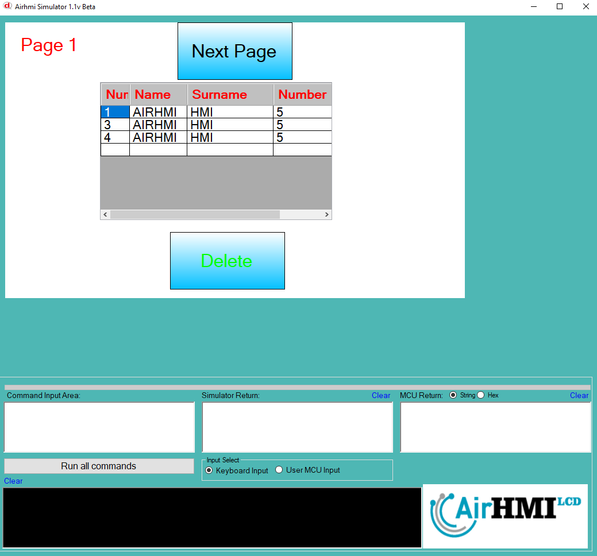
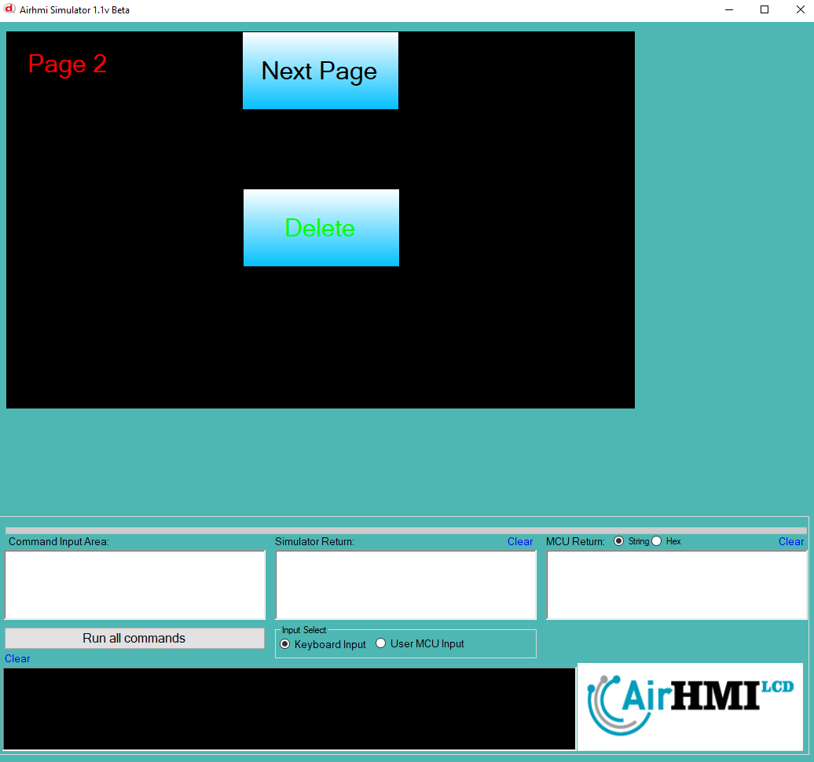
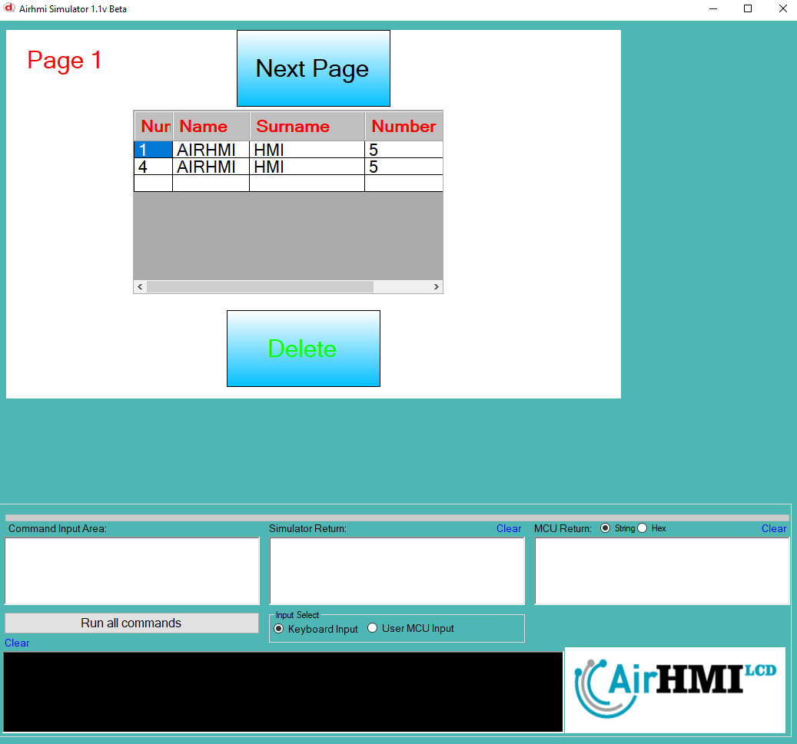

# ListViewDeleteX Özelliği


ListView'de istedğimiz satırı bu komut ile silebiliriz. 

```
ListViewDeleteX("ListView1" ,1 );  // 1. satırı sil.
```

ListView nesnesi statik dir. Her sayfadan erişilibilinir. 

## Program İlk Açılış Görüntüsü

## Herki ListView 1. Satısı siliyoruz. 

## Sonraki Sayfaya geçiyoruz. 1. Satırı siliyoruz. 

## Birinci sayfaya tekrar dönüyoruz. ListView de 2 adet satır silinmiş oldu. 


