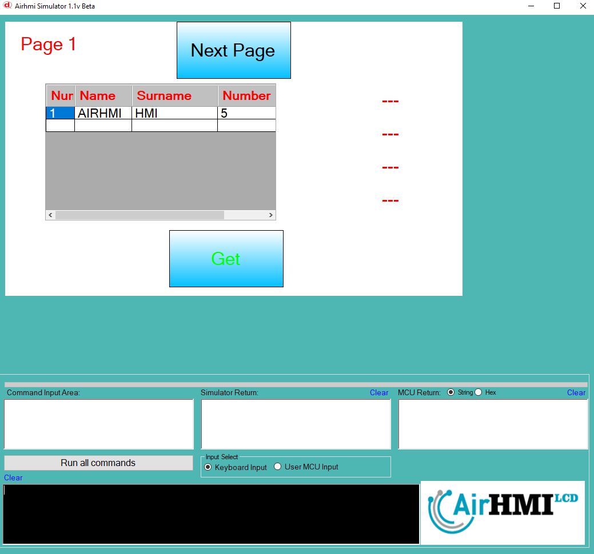
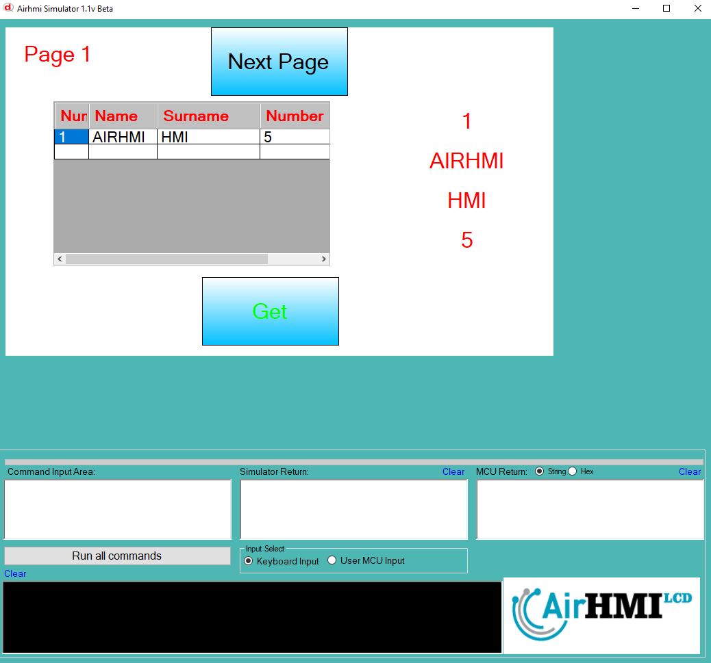
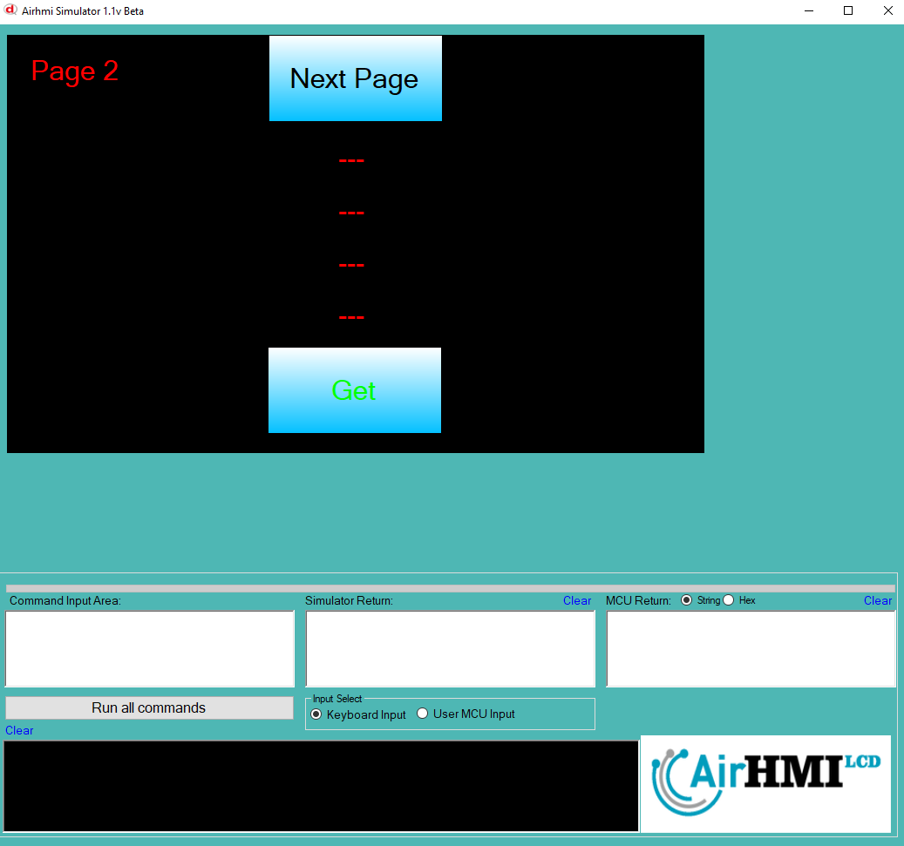
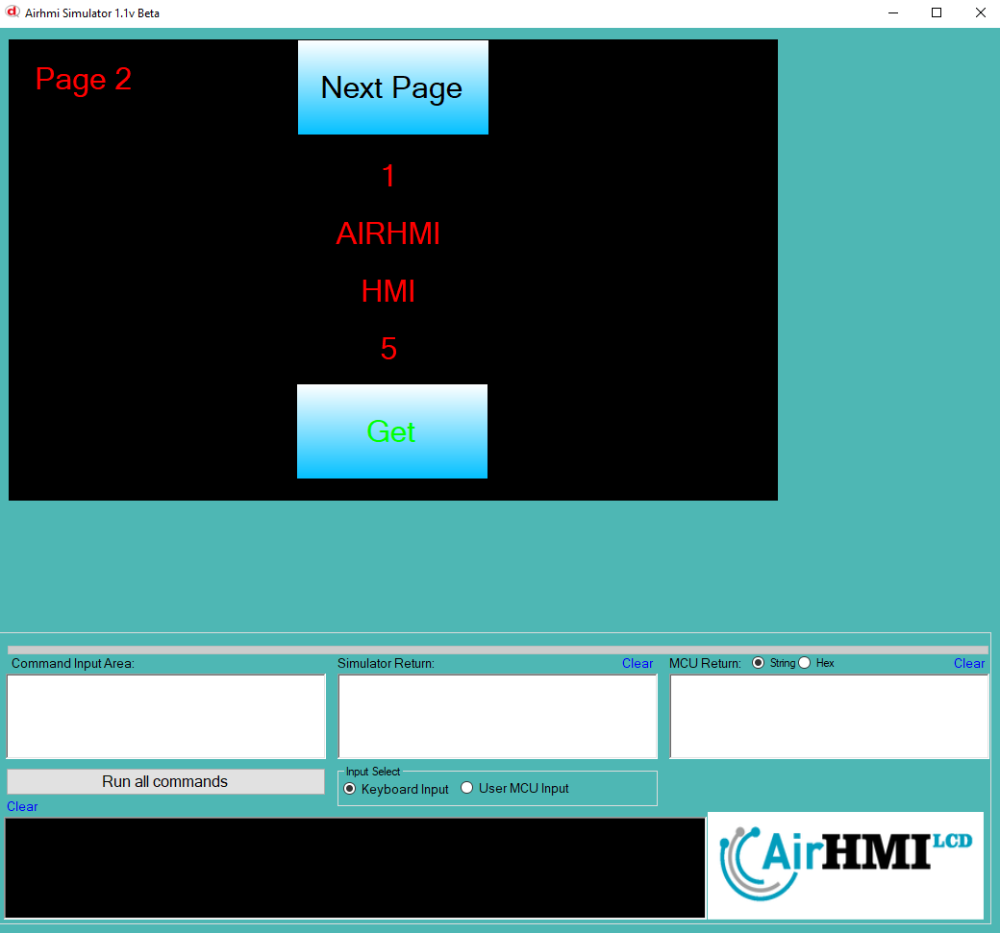

# ListView Get XY Özelliği

ListView airhmi de veri tabanı olarak kullanılır. 
ListView den isteğidiğimiz bir alandan veri alabiliriz. Listeden aldığımız veriyi label a set ediyoruz.

```
char data[20];

ListViewGetXY("ListView1" ,0 , 0 , data);
LabelSet("ELabelBox5" ,"Text" , data );

ListViewGetXY("ListView1" ,0, 1 , data);
LabelSet("ELabelBox6" ,"Text" , data );

ListViewGetXY("ListView1" ,0 , 2 , data);
LabelSet("ELabelBox7" ,"Text" , data );

ListViewGetXY("ListView1" ,0 , 3 , data);
LabelSet("ELabelBox8" ,"Text" , data );
```

ListView nesnesi statik dir. Her sayfadan erişilibilinir. 

## Program İlk Açılış Görüntüsü

## ListView den verileri alıp label a set ediyoruz. 

## Sonraki Sayfaya geçiyoruz. 

## Listview den verileri 2. sayfadan da alıyoruz. 


