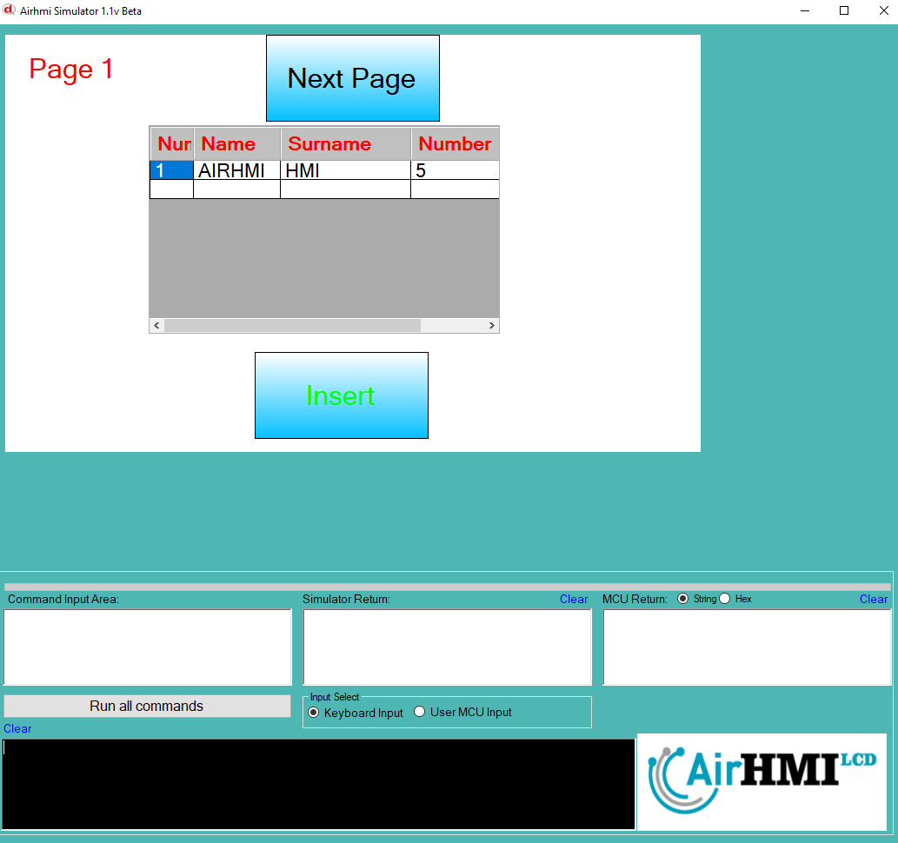
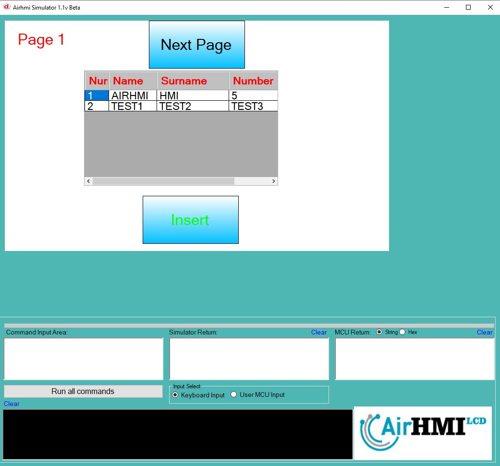
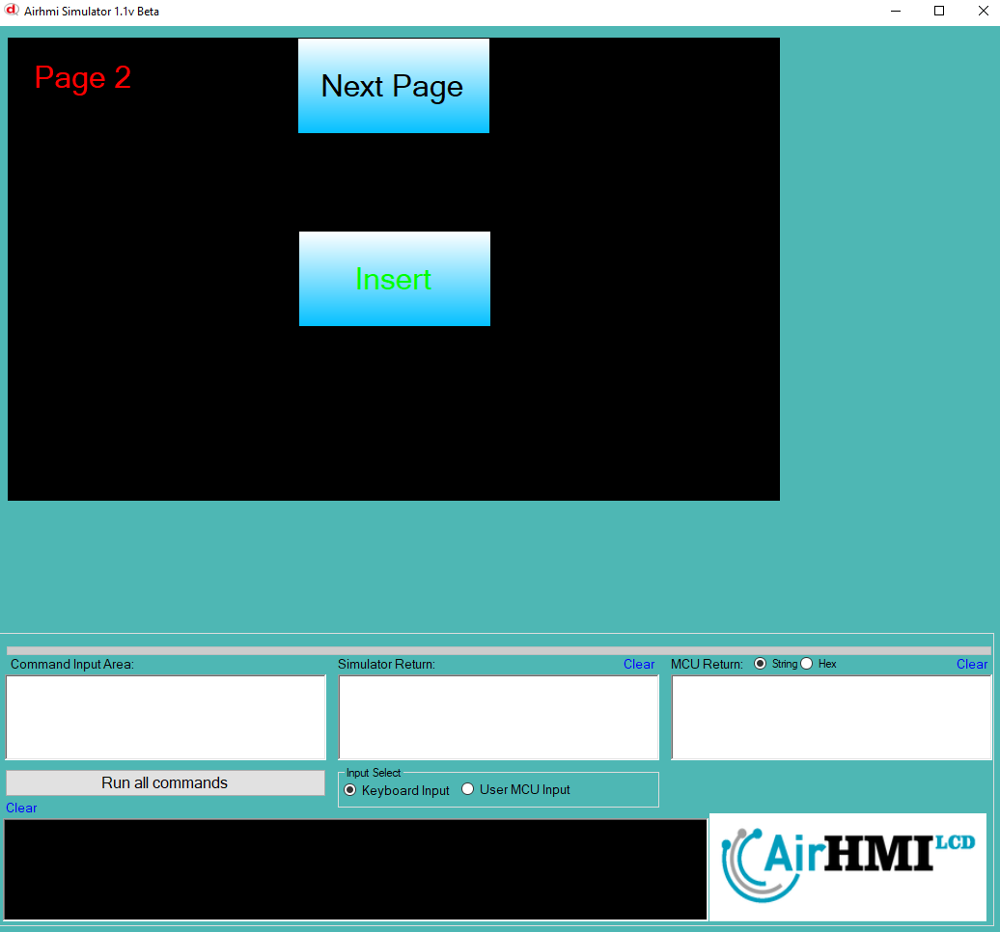
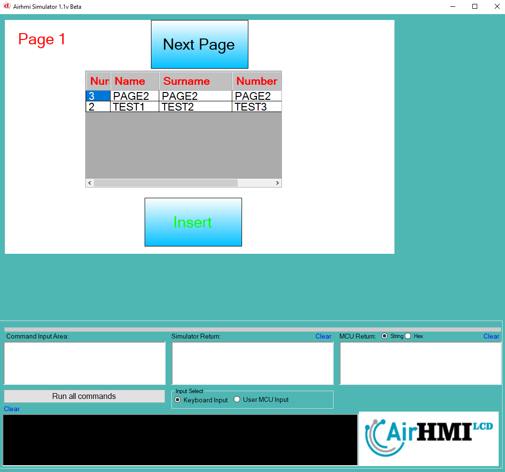

# ListView Set XY Özelliği


ListView e istediğimiz bir alanı güncellemek için kullanılır. ListViewSetXY fonksiyonuna satır numarası ve satır numarası vererek doğrudan erişebiliriz. 

```
ListViewSetXY("ListView1" ,0 , 0 , "3");
ListViewSetXY("ListView1" ,0 , 1 , "PAGE2");
ListViewSetXY("ListView1" ,0 , 2 , "PAGE2");
ListViewSetXY("ListView1" ,0 , 3 , "PAGE2");
```

ListView nesnesi statik dir. Her sayfadan erişilibilinir. 

## Program İlk Açılış Görüntüsü

## Herki ListView e birinci sayfadan veri ekliyoruz.

## Sonraki Sayfaya geçiyoruz. ListView e ikinci sayfadan veri ekliyoruz. 

## Birinci sayfaya tekrar dönüyoruz. ListView e eklenen tüm verileri görebiliyoruz. 


