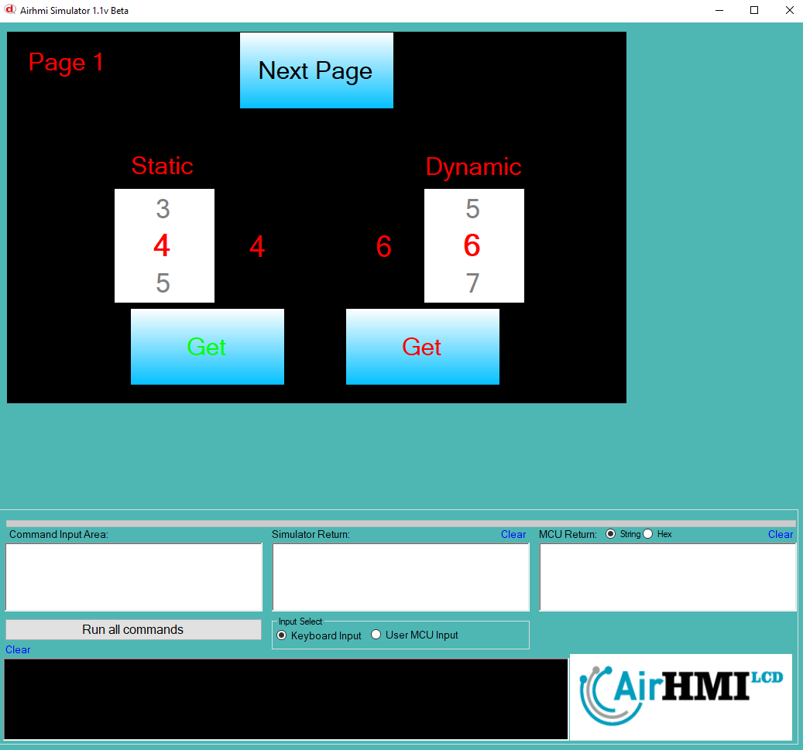
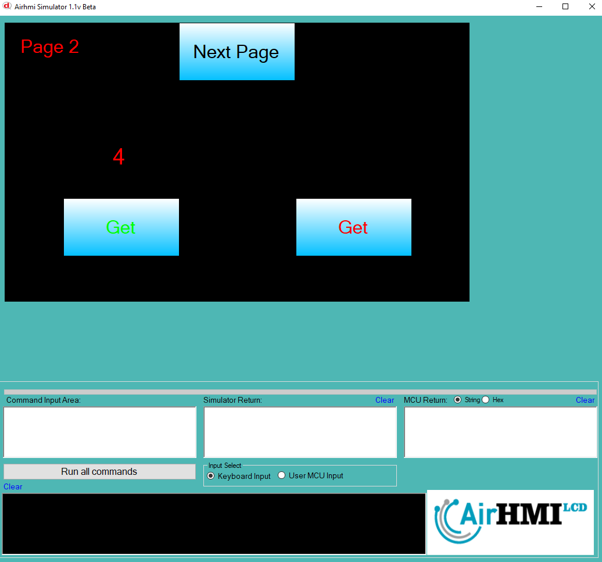

# ListWheel Value Get Özelliği

Bu dokümanda, statik ve dinamik olmak üzere iki farklı ListWheel Value Get durumları üzerinde etkili olan faktörler incelenmiştir.
Statik ListWheel, her sayfadan tüm özelliklerine ulaşılıp değiştirilebilen ListWheel'dir. **Static(false)** yani dinamik ListWheel'lar ise sayfaya özgüdür.
Sayfa değiştiği zaman hiçbir özelliği tutulmaz. Sayfa değişip tekrar aynı sayfaya gidildiği zaman ListWheel ilk hali ile baştan oluşturulur. 

## 📌 1. ListWheel Tanımı
- **🟢 Statik ListWheel**: Static özelliği **true** olan ListWheel'dir. Value Get özelliği **hem aynı sayfadan hem de diğer sayfalardan** alınabilir.
- **🔵 Dinamik ListWheel**: Static özelliği **false** olan ListWheel'dir. Value Get özelliği **yalnızca aynı sayfada** alınabilir, diğer sayfalardan erişilemez.

## 🔍 2. ListWheel Value Get Durumları
### 🏠 Aynı Sayfada Olası Senaryolar
- Kullanıcı **statik ListWheel Value Get** ile değeri alabilir.
- Kullanıcı **dinamik ListWheel Value Get** ile değeri alabilir.

### 🔄 Farklı Sayfadan Olası Senaryolar
- Kullanıcı **statik ListWheel Value Get** ile değeri alabilir.
- Kullanıcı **dinamik ListWheel Value Get** ile değeri alamaz.

## 🎯 3. Sonuç
✔️ Aynı sayfada **her iki ListWheel Value Get durumu kullanılabilir**.  
✔️ **Statik ListWheel Value Get** diğer sayfalardan alınabilir.  
✔️ **Dinamik ListWheel Value Get** yalnızca oluşturulduğu sayfada alınabilir.  

Bu bilgiler ışığında, **Value Get değişikliklerinin beklenen sonuçları doğru şekilde ele alınmalıdır.** 🚀

## Program İlk Açılış Görüntüsü

## Her iki ListWheel'in de Value değeri alınıyor.

## Sonraki sayfaya geçiyoruz. ListWheel Value değerini alıyoruz.
- **Statik olan ListWheel'in değerini alabiliyoruz.**  
- **Dinamik olan ListWheel'in değerine erişilemiyor.**

## Birinci sayfaya tekrar dönüyoruz. 

