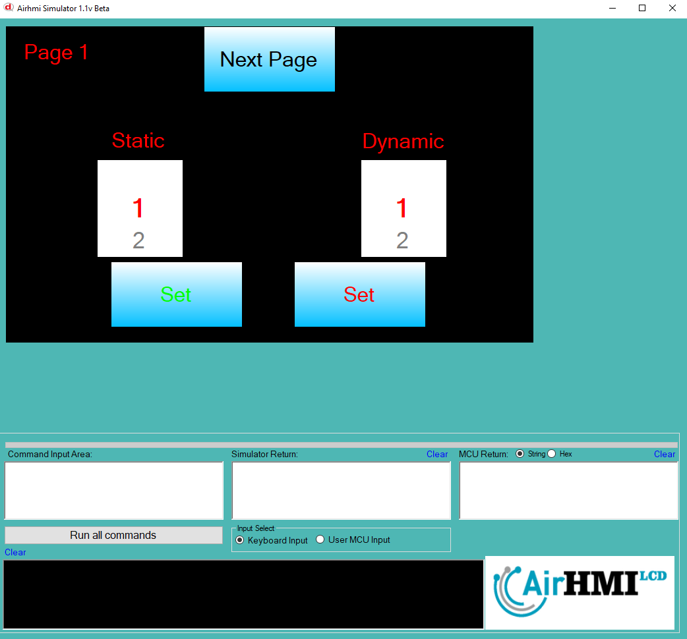
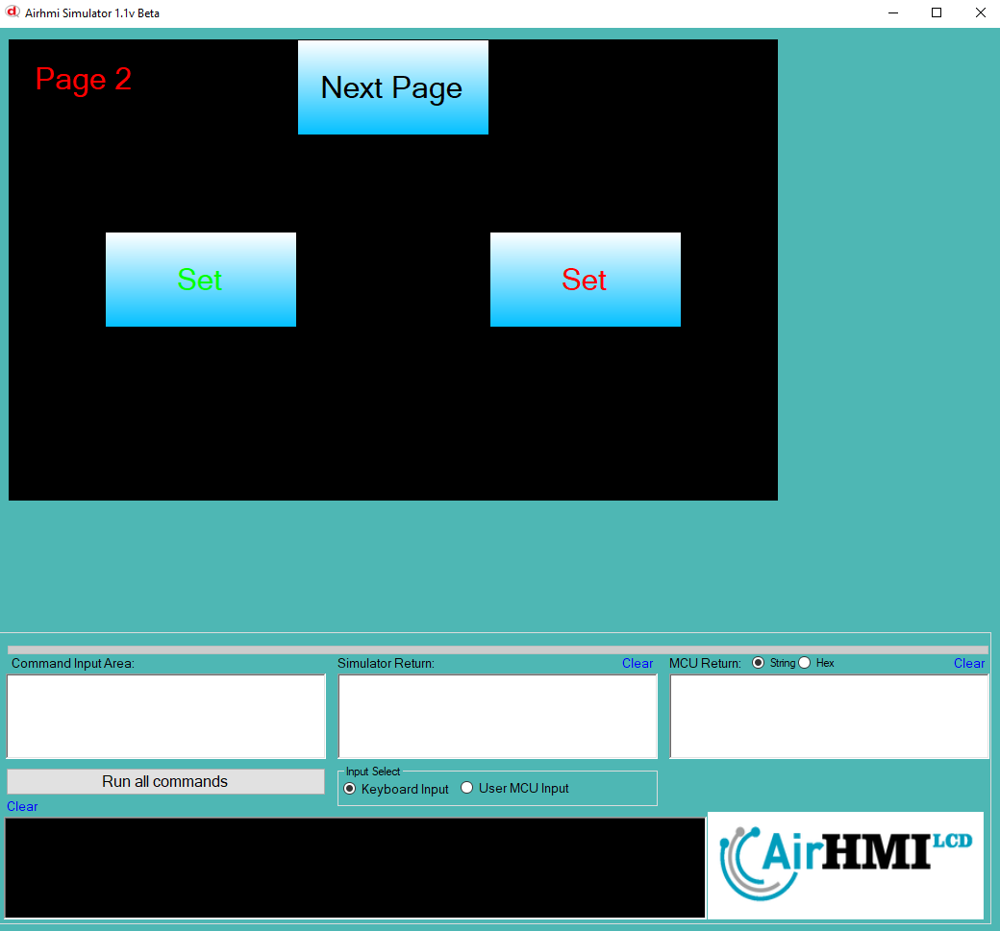

# ListWheel Value Set Özelliği

Bu dokümanda, statik ve dinamik olmak üzere iki farklı ListWheel Value Set durumları üzerinde etkili olan faktörler incelenmiştir.
Statik ListWheel, her sayfadan tüm özelliklerine ulaşılıp değiştirilebilen ListWheel'dır. **Static(false)** yani dinamik ListWheel'lar ise sayfaya özgüdür.
Sayfa değiştiği zaman hiçbir özelliği tutulmaz. Sayfa değişip tekrar aynı sayfaya gidildiği zaman ListWheel ilk hali ile baştan oluşturulur. 

## 📌 1. ListWheel Tanımı
- **🟢 Statik ListWheel**: Static özelliği **true** olan ListWheel'dir. Value Set özelliği **hem aynı sayfadan hem de diğer sayfalardan** değiştirilebilir.
- **🔵 Dinamik ListWheel**: Static özelliği **false** olan ListWheel'dir. Value Set özelliği **yalnızca aynı sayfada** değiştirilebilir, diğer sayfalardan değiştirilemez.

## 🔍 2. ListWheel Value Set Durumları
### 🏠 Aynı Sayfada Olası Senaryolar
- Kullanıcı **statik ListWheel Value Set** yapabilir.
- Kullanıcı **dinamik ListWheel Value Set** yapabilir.

### 🔄 Farklı Sayfadan Olası Senaryolar
- Kullanıcı **statik ListWheel Value Set** yapabilir.
- Kullanıcı **dinamik ListWheel Value Set** ile değiştiremez.

## 🎯 3. Sonuç
✔️ Aynı sayfada **her iki ListWheel Value Set durumu değiştirilebilir**.  
✔️ **Statik ListWheel Value Set** diğer sayfalardan değiştirilebilir.  
✔️ **Dinamik ListWheel Value Set** yalnızca oluşturulduğu sayfada değiştirilebilir.  

Bu bilgiler ışığında, **Value Set değişikliklerinin beklenen sonuçları doğru şekilde ele alınmalıdır.** 🚀

## Program İlk Açılış Görüntüsü

## Her iki ListWheel'in de Value değeri değiştiriliyor.

## Sonraki sayfaya geçiyoruz. ListWheel Value değerini değiştiriyoruz.

## Birinci sayfaya tekrar dönüyoruz. 
- **Statik olan ListWheel'in değeri değişmiştir.**  
- **Dinamik olan ListWheel ise ilk değerini alır.**

