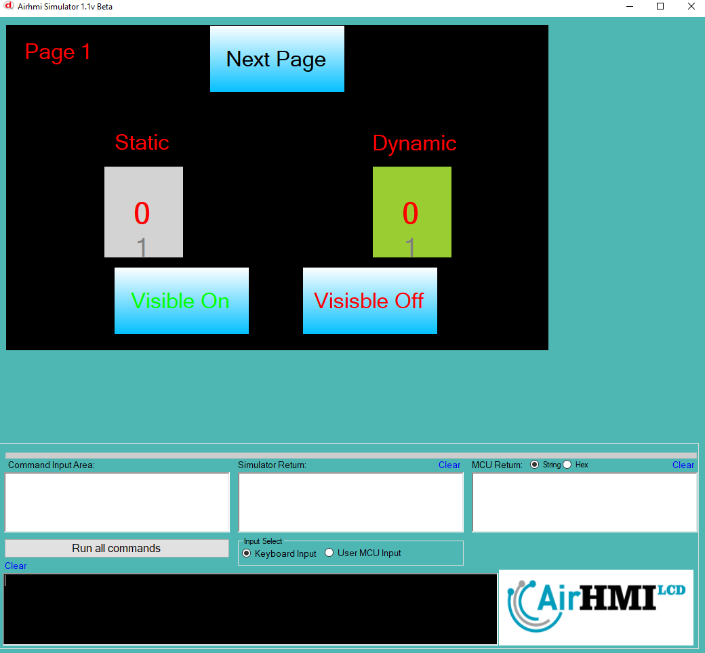
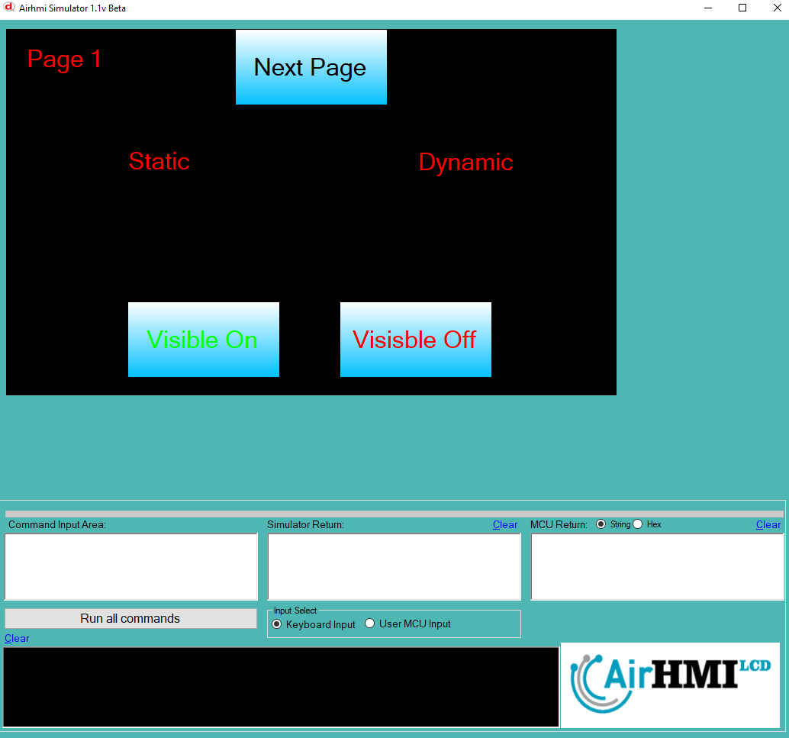
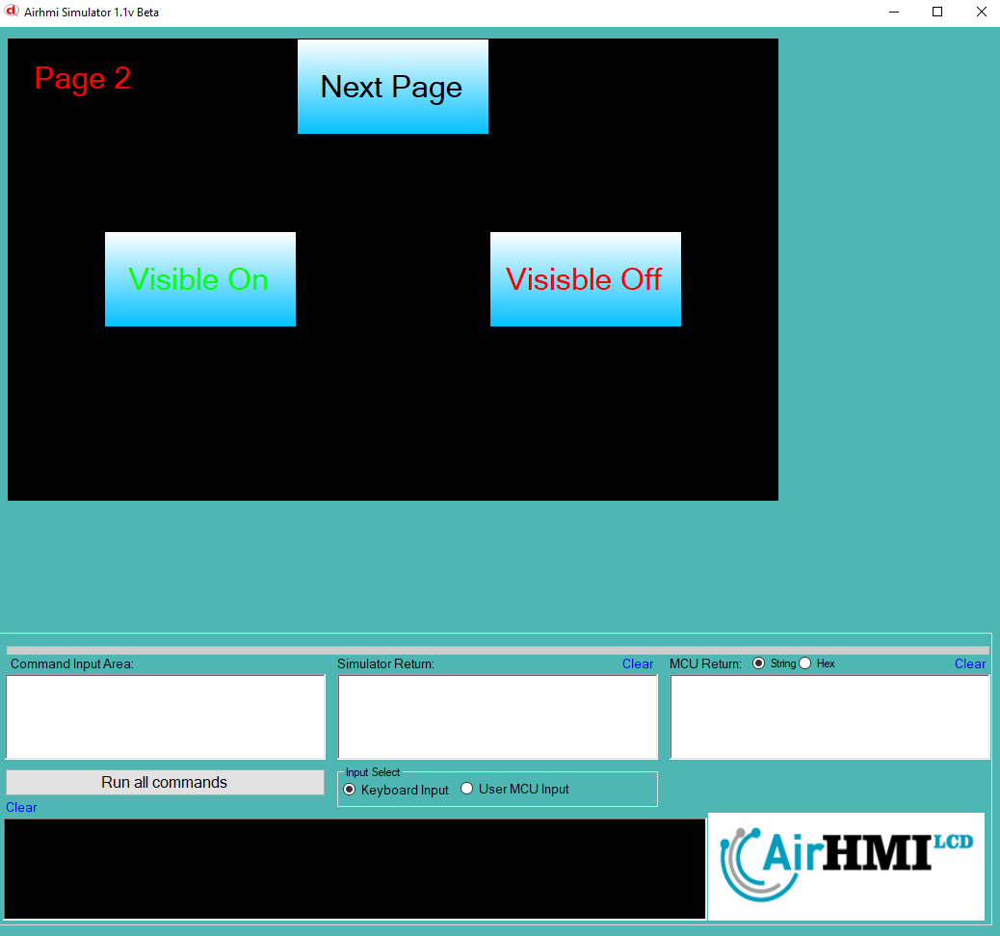
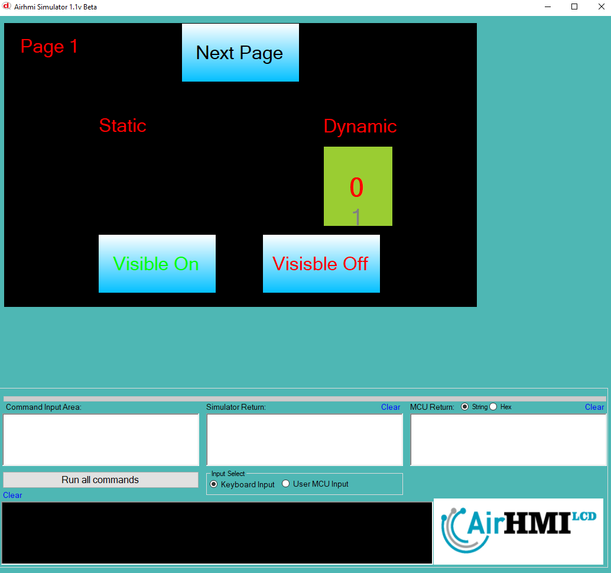

# ListWheel Görünürlük Özelliği

Bu dokümanda, statik ve dinamik olmak üzere iki farklı ListWheel görünürlük durumları üzerinde etkili olan faktörler incelenmiştir.
Statik ListWheel'ler her sayfadan tüm özelliklerine ulaşılıp değiştirilebilen ListWheellardır. Static(false) yani dinamik ListWheellar ise sayfaya özgüdür.
Sayfa değiştiği zaman hiçbir özelliği tutulmaz. Sayfa değişip tekrar aynı sayfaya gidildiği zaman ListWheel ilk hali ile baştan meydana getirilir. 

## 📌 1. ListWheelların Tanımı
- **🟢 Statik ListWheel**: Static özelliği true olan ListWheel'dir. Görünürlük (`Visible`) özelliği **hem aynı sayfadan hem de diğer sayfalardan** değiştirilebilir.
- **🔵 Dinamik ListWheel**: Statik özelliği false olan ListWheel'dir. Görünürlük (`Visible`) özelliği **yalnızca aynı sayfada** değiştirilebilir, diğer sayfalardan değiştirilemez.

## 🔍 2. ListWheel Görünürlük Durumları
### 🏠 Aynı Sayfada Olası Senaryolar
- Kullanıcı **statik ListWheel görünürlüğünü** `true` veya `false` yapabilir.
- Kullanıcı **dinamik ListWheel görünürlüğünü** `true` veya `false` yapabilir.
- **Her iki ListWheel da görünür olabilir.**
- **Her iki ListWheel da gizlenebilir.**

### 🔄 Farklı Sayfadan Olası Senaryolar
- Kullanıcı **statik ListWheel görünürlüğünü** `true` veya `false` yapabilir.
- Kullanıcı **dinamik ListWheel görünürlüğünü değiştiremez.**
- **Statik ListWheel**, farklı sayfadan gizlenirse, aynı sayfaya dönüldüğünde **görünmez** olur.
- **Dinamik ListWheel görünürlük durumu korunur.**

## 📊 3. Olasılıklar Tablosu

| Senaryo | Statik ListWheel (Visible) | Dinamik ListWheel (Visible) | Açıklama |
|---------|------------------------|------------------------|-----------|
| ✅ 1 | `true`  | `true`  | Her iki ListWheel da görünür. |
| ✅ 2 | `true`  | `false` | Statik ListWheel görünür, dinamik ListWheel gizli. |
| ✅ 3 | `false` | `true`  | Statik ListWheel gizli, dinamik ListWheel görünür. |
| ✅ 4 | `false` | `false` | Her iki ListWheel da gizli. |
| ✅ 5 | `false` (Dışarıdan değiştirildi) | `true` | Farklı sayfada statik ListWheel kapatıldı, dinamik ListWheel etkilenmedi. |
| ✅ 6 | `true`  | `true` (Dışarıdan değiştirilemedi) | Statik ListWheel değiştirildi, dinamik ListWheel aynı kaldı. |

## 🎯 4. Sonuç
✔️ Aynı sayfada **her iki ListWheel görünürlük durumu değiştirilebilir**.  
✔️ **Statik ListWheel görünürlüğü** diğer sayfalardan değiştirilebilir.  
✔️ **Dinamik ListWheel görünürlüğü** yalnızca oluşturulduğu sayfada değiştirilebilir.  

Bu bilgiler ışığında, **görünürlük değişikliklerinin beklenen sonuçları doğru şekilde ele alınmalıdır.** 🚀

