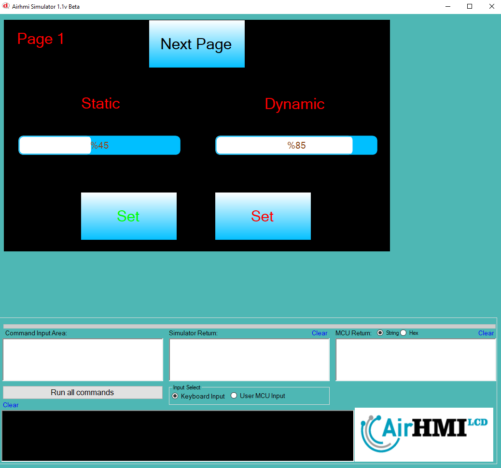
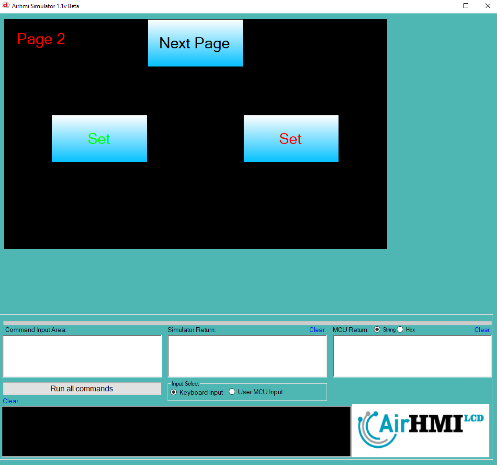
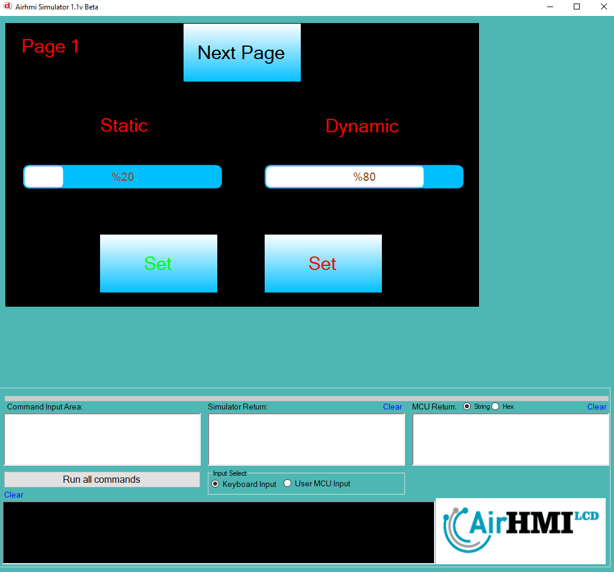

# GRAPH_AddValue Özelliği

Bu dokümanda, statik ve dinamik olmak üzere iki farklı GRAPH_AddValue durumları üzerinde etkili olan faktörler incelenmiştir.
Statik Graph, her sayfadan tüm özelliklerine ulaşılıp değiştirilebilen Graph'dır. **Static(false)** yani dinamik Graph'lar ise sayfaya özgüdür.
Sayfa değiştiği zaman hiçbir özelliği tutulmaz. Sayfa değişip tekrar aynı sayfaya gidildiği zaman Graph ilk hali ile baştan oluşturulur. 

```
GraphSet("Graph1" ,"Value" , "45");
```

## 📌 1. Graph Tanımı
- **🟢 Statik Graph**: Static özelliği **true** olan Graph'dir. Value Set özelliği **hem aynı sayfadan hem de diğer sayfalardan** değiştirilebilir.
- **🔵 Dinamik Graph**: Static özelliği **false** olan Graph'dir. Value Set özelliği **yalnızca aynı sayfada** değiştirilebilir, diğer sayfalardan değiştirilemez.

## 🔍 2. GRAPH_AddValue Durumları
### 🏠 Aynı Sayfada Olası Senaryolar
- Kullanıcı **statik GRAPH_AddValue** yapabilir.
- Kullanıcı **dinamik GRAPH_AddValue** yapabilir.

### 🔄 Farklı Sayfadan Olası Senaryolar
- Kullanıcı **statik GRAPH_AddValue** yapabilir.
- Kullanıcı **dinamik GRAPH_AddValue** ile değiştiremez.

## 🎯 3. Sonuç
✔️ Aynı sayfada **her iki GRAPH_AddValue durumu değiştirilebilir**.  
✔️ **Statik GRAPH_AddValue** diğer sayfalardan değiştirilebilir.  
✔️ **Dinamik GRAPH_AddValue** yalnızca oluşturulduğu sayfada değiştirilebilir.  

Bu bilgiler ışığında, **Value Set değişikliklerinin beklenen sonuçları doğru şekilde ele alınmalıdır.** 🚀

## Program İlk Açılış Görüntüsü


## Her iki Graph'in de Value değeri değiştiriliyor.


## Sonraki sayfaya geçiyoruz. Graph Value değerini değiştiriyoruz.


## Birinci sayfaya tekrar dönüyoruz. 
- **Statik olan Graph'in değeri değişmiştir.**  
- **Dinamik olan Graph ise ilk değerini alır.**

