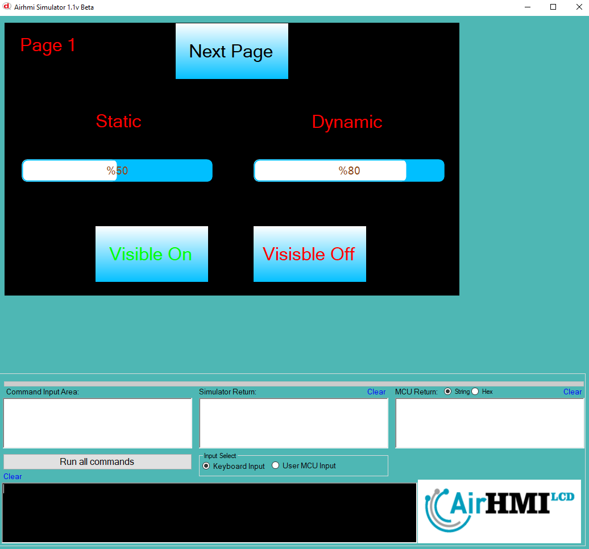
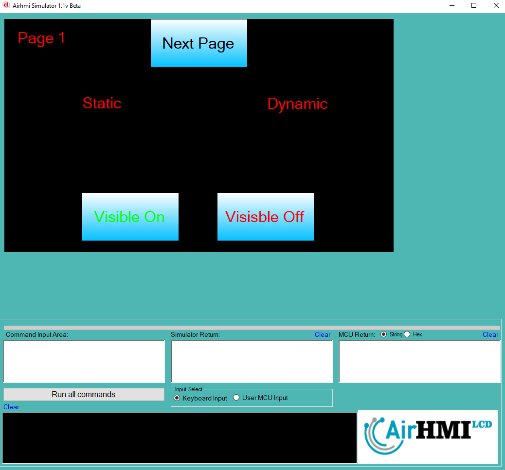
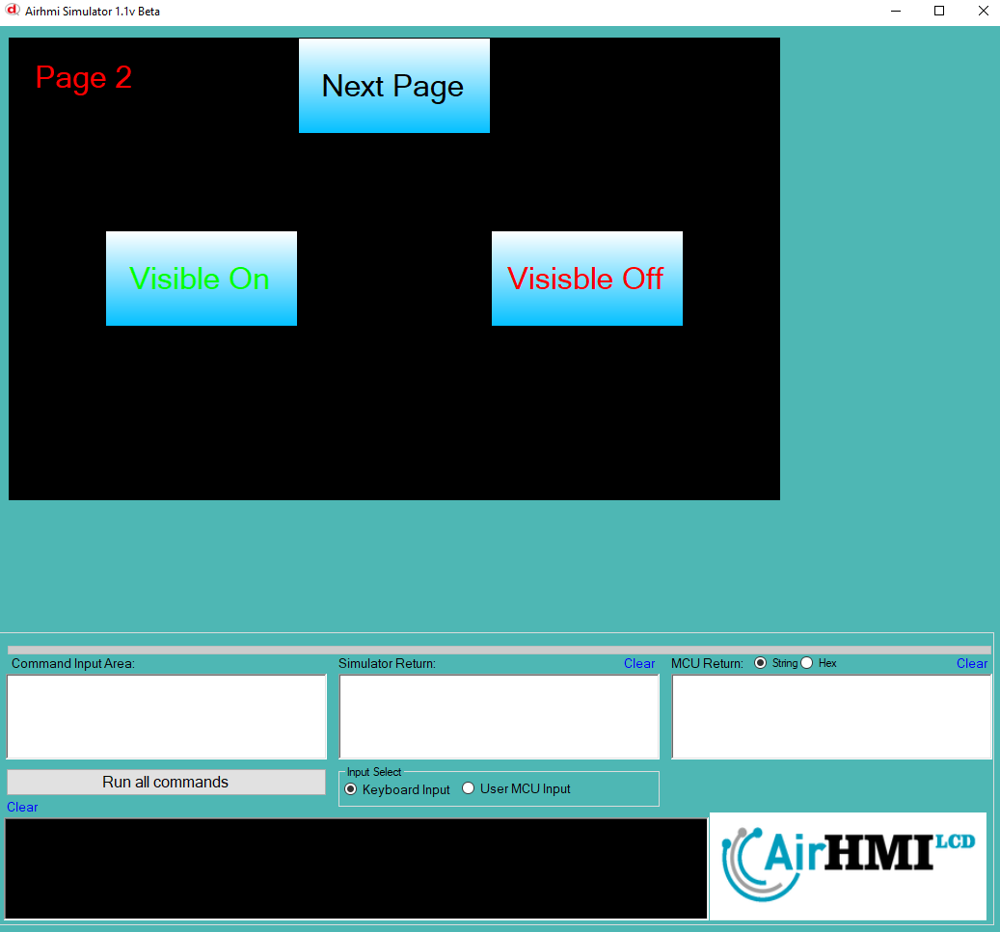
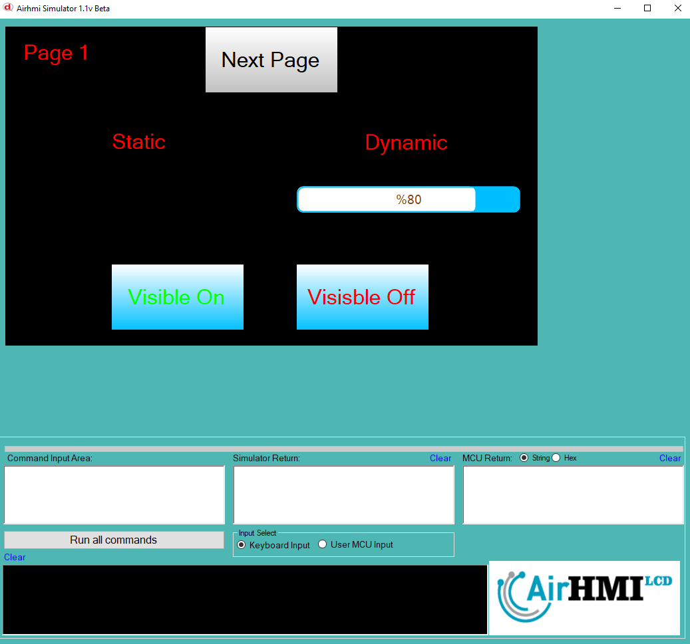

# ProgressBar Görünürlük Özelliği

Bu dokümanda, statik ve dinamik olmak üzere iki farklı ProgressBar'ın görünürlük durumları üzerinde etkili olan faktörler incelenmiştir.
Statik ProgressBarlar her sayfadan tüm özelliklerine ulaşılıp değiştirilebilen ProgressBarlardır. Static(false) yani dinamik ProgressBarlar ise sayfaya özgüdür.
Sayfa değiştiği zaman hiçbir özelliği tutulmaz. Sayfa değişip tekrar aynı sayfaya gidildiği zaman ProgressBar ilk hali ile baştan meydana getirilir. 

## 📌 1. ProgressBarların Tanımı
- **🟢 Statik ProgressBar**: Static özelliği true olan ProgressBar'dır. Görünürlük (`Visible`) özelliği **hem aynı sayfadan hem de diğer sayfalardan** değiştirilebilir.
- **🔵 Dinamik ProgressBar**: Statik özelliği false olan ProgressBar'dır. Görünürlük (`Visible`) özelliği **yalnızca aynı sayfada** değiştirilebilir, diğer sayfalardan değiştirilemez.

## 🔍 2. ProgressBar Görünürlük Durumları
### 🏠 Aynı Sayfada Olası Senaryolar
- Kullanıcı **statik ProgressBar'ın görünürlüğünü** `true` veya `false` yapabilir.
- Kullanıcı **dinamik ProgressBar'ın görünürlüğünü** `true` veya `false` yapabilir.
- **Her iki ProgressBar da görünür olabilir.**
- **Her iki ProgressBar da gizlenebilir.**

### 🔄 Farklı Sayfadan Olası Senaryolar
- Kullanıcı **statik ProgressBar'ın görünürlüğünü** `true` veya `false` yapabilir.
- Kullanıcı **dinamik ProgressBar'ın görünürlüğünü değiştiremez.**
- **Statik ProgressBar**, farklı sayfadan gizlenirse, aynı sayfaya dönüldüğünde **görünmez** olur.
- **Dinamik ProgressBar'ın görünürlük durumu korunur.**

## 📊 3. Olasılıklar Tablosu

| Senaryo | Statik ProgressBar (Visible) | Dinamik ProgressBar (Visible) | Açıklama |
|---------|------------------------|------------------------|-----------|
| ✅ 1 | `true`  | `true`  | Her iki ProgressBar da görünür. |
| ✅ 2 | `true`  | `false` | Statik ProgressBar görünür, dinamik ProgressBar gizli. |
| ✅ 3 | `false` | `true`  | Statik ProgressBar gizli, dinamik ProgressBar görünür. |
| ✅ 4 | `false` | `false` | Her iki ProgressBar da gizli. |
| ✅ 5 | `false` (Dışarıdan değiştirildi) | `true` | Farklı sayfada statik ProgressBar kapatıldı, dinamik ProgressBar etkilenmedi. |
| ✅ 6 | `true`  | `true` (Dışarıdan değiştirilemedi) | Statik ProgressBar değiştirildi, dinamik ProgressBar aynı kaldı. |

## 🎯 4. Sonuç
✔️ Aynı sayfada **her iki ProgressBar'ın görünürlük durumu değiştirilebilir**.  
✔️ **Statik ProgressBar'ın görünürlüğü** diğer sayfalardan değiştirilebilir.  
✔️ **Dinamik ProgressBar'ın görünürlüğü** yalnızca oluşturulduğu sayfada değiştirilebilir.  

Bu bilgiler ışığında, **görünürlük değişikliklerinin beklenen sonuçları doğru şekilde ele alınmalıdır.** 🚀

