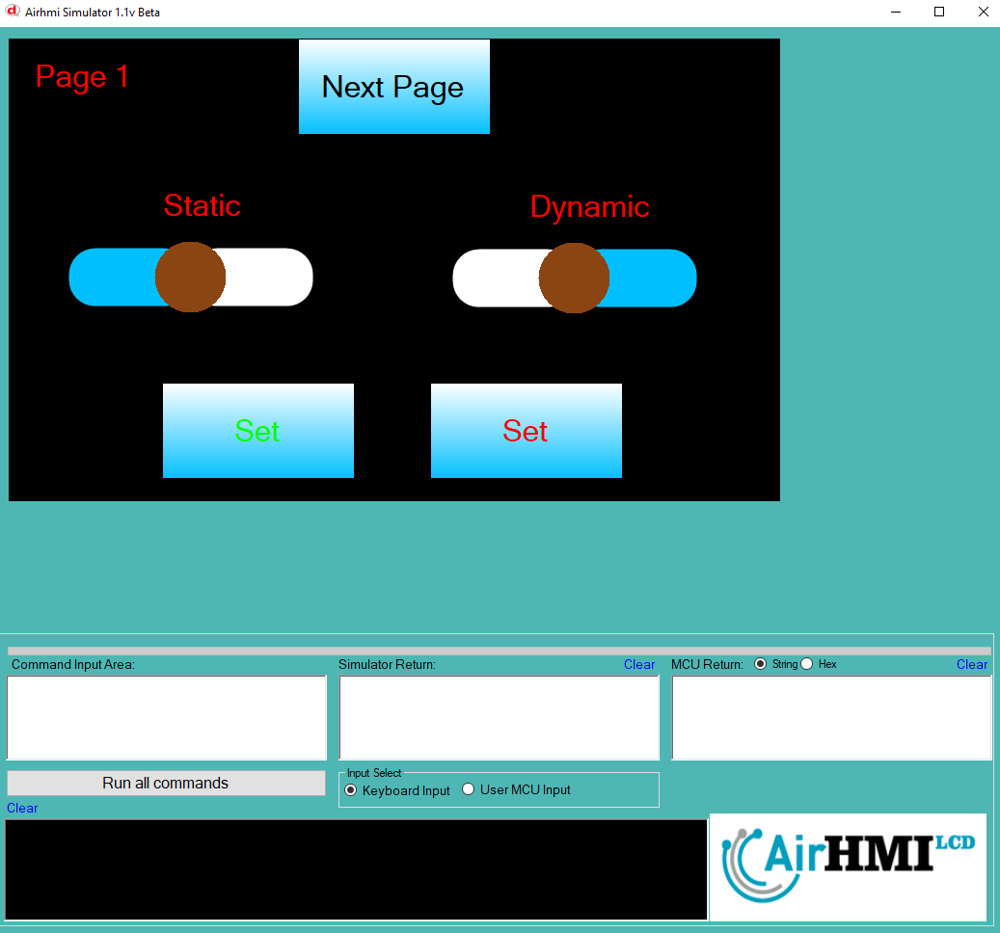
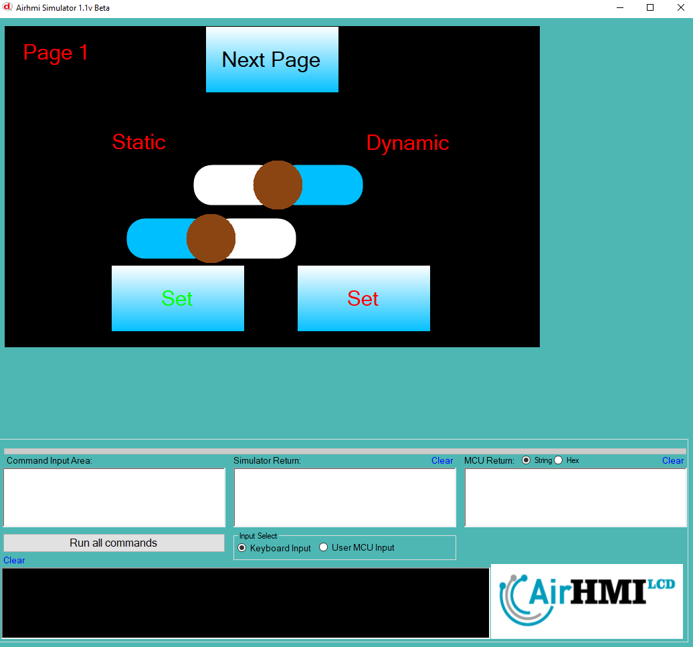
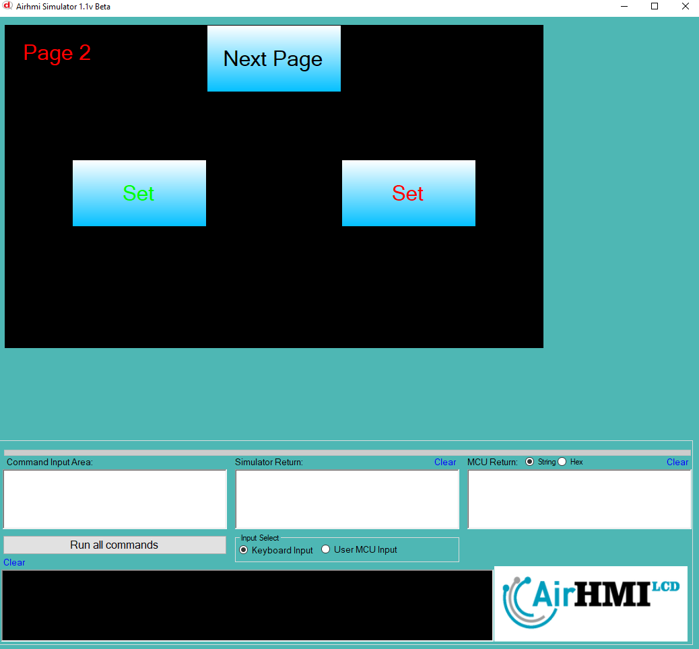
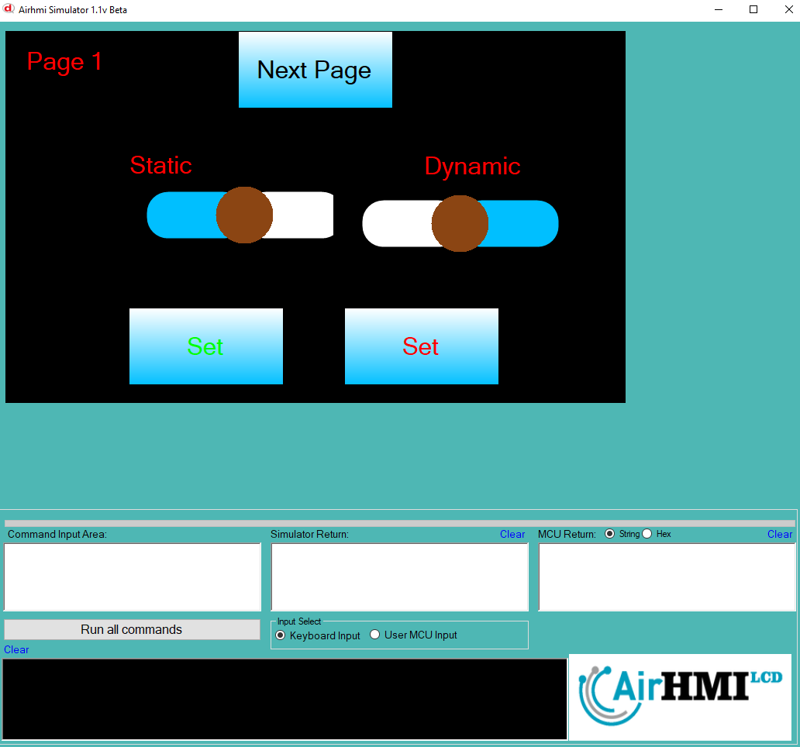

# Slider Left Top Özelliği

Sliderun ekran üzerindeki konumunu değiştirme işlemdir. 
Bu dokümanda, statik ve dinamik olmak üzere iki farklı Sliderun Text özelliği üzerinde etkili olan faktörler incelenmiştir.
Statik Sliderlar her sayfadan tüm özelliklerine ulaşılıp değiştirilebilen Sliderlardır. Static(false) yani dinamik Sliderlar ise sayfaya özgüdür.
Sayfa değiştiği zaman hiçbir özelliği tutulmaz. Sayfa değişip tekrar aynı sayfaya gidildiği zaman Slider ilk hali ile baştan meydana getirilir. 

## 📌 1. Sliderların Tanımı
- **🟢 Statik Slider**: Static özelliği true olan Sliderdur. Left ve Top özelliği **hem aynı sayfadan hem de diğer sayfalardan** değiştirilebilir.
- **🔵 Dinamik Slider**: Statik özelliği false olan Sliderdur. Left ve Top özelliği **yalnızca aynı sayfada** değiştirilebilir, diğer sayfalardan değiştirilemez.

## 🔍 2. Slider Left ve Top Değiştirme Durumları
### 🏠 Aynı Sayfada Olası Senaryolar
- Kullanıcı **statik Sliderun Left ve Top değerini** değiştirebilir.
- Kullanıcı **dinamik Sliderun Left ve Top değerini** değiştirebilir.

### 🔄 Farklı Sayfadan Olası Senaryolar
- Kullanıcı **statik Sliderun Left ve Top değerini** değiştirebilir.
- Kullanıcı **dinamik Sliderun Left ve Top değerini değiştiremez.**
- **Statik Slider**, farklı sayfadan Left ve Top değerini değiştirirsek, aynı sayfaya dönüldüğünde **yeni değiştirilen text değeri gelir.**
- **Dinamik Sliderun Left ve Top değerini değiştirsek bile etki etmez.**

## 🎯 4. Sonuç
✔️ Aynı sayfada **her iki Sliderun Left ve Top değerini değiştirilebilir**.  
✔️ **Statik Sliderun Left ve Top değerini** diğer sayfalardan değiştirilebilir.  
✔️ **Dinamik Sliderun Left ve Top değerini** yalnızca oluşturulduğu sayfada değiştirilebilir.  

