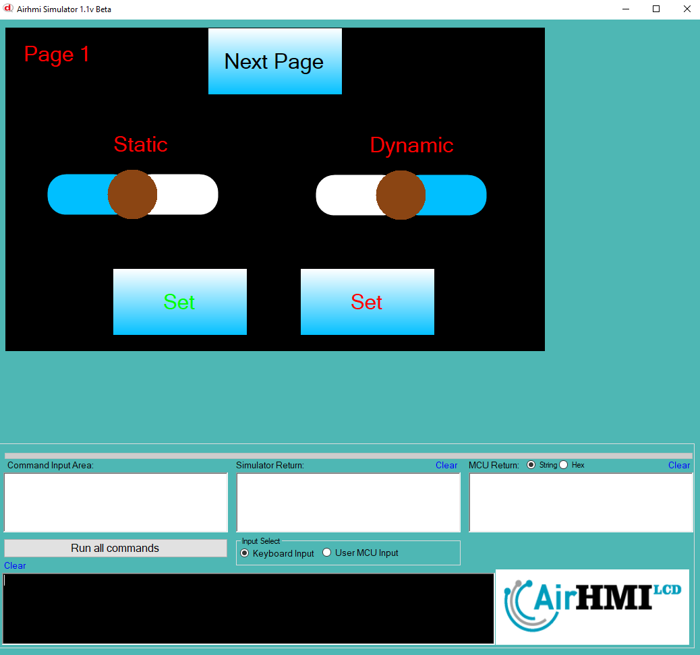
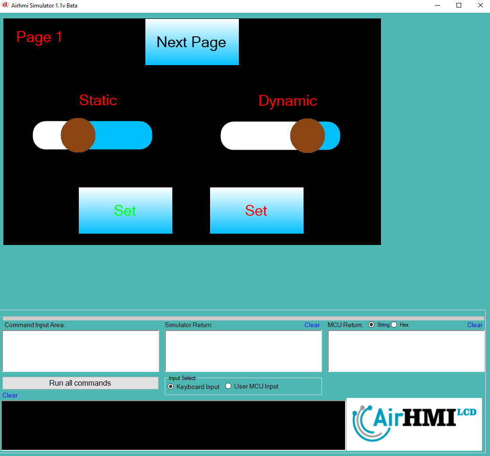
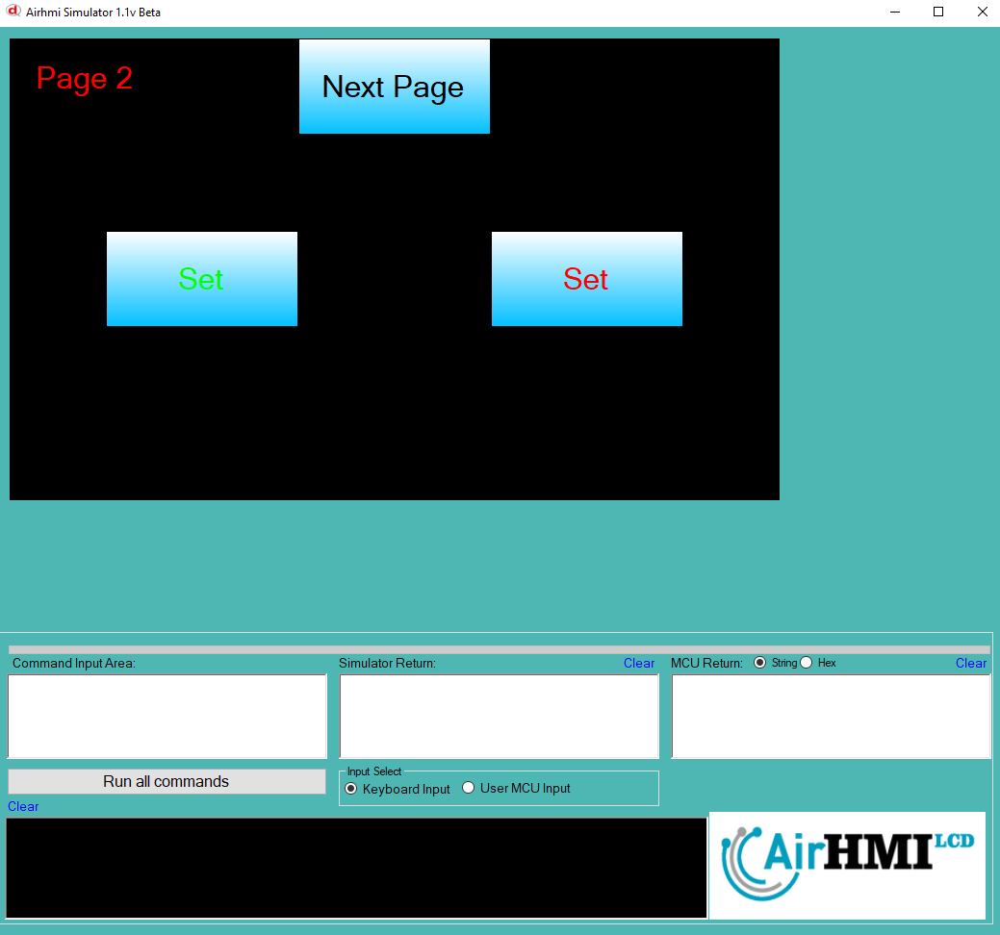
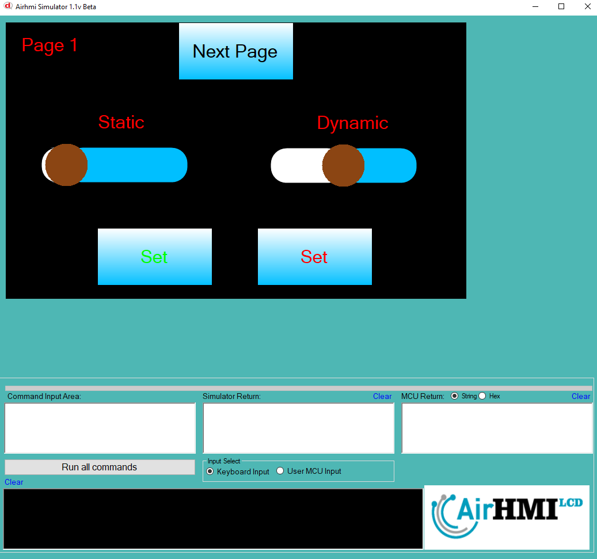

# Slider Value Set Özelliği

Bu dokümanda, statik ve dinamik olmak üzere iki farklı Slider Value Set durumları üzerinde etkili olan faktörler incelenmiştir.
Statik Slider, her sayfadan tüm özelliklerine ulaşılıp değiştirilebilen Slider'dır. **Static(false)** yani dinamik Slider'lar ise sayfaya özgüdür.
Sayfa değiştiği zaman hiçbir özelliği tutulmaz. Sayfa değişip tekrar aynı sayfaya gidildiği zaman Slider ilk hali ile baştan oluşturulur. 

```
SliderSet("Slider1" ,"Value" , "45");
```

## 📌 1. Slider Tanımı
- **🟢 Statik Slider**: Static özelliği **true** olan Slider'dir. Value Set özelliği **hem aynı sayfadan hem de diğer sayfalardan** değiştirilebilir.
- **🔵 Dinamik Slider**: Static özelliği **false** olan Slider'dir. Value Set özelliği **yalnızca aynı sayfada** değiştirilebilir, diğer sayfalardan değiştirilemez.

## 🔍 2. Slider Value Set Durumları
### 🏠 Aynı Sayfada Olası Senaryolar
- Kullanıcı **statik Slider Value Set** yapabilir.
- Kullanıcı **dinamik Slider Value Set** yapabilir.

### 🔄 Farklı Sayfadan Olası Senaryolar
- Kullanıcı **statik Slider Value Set** yapabilir.
- Kullanıcı **dinamik Slider Value Set** ile değiştiremez.

## 🎯 3. Sonuç
✔️ Aynı sayfada **her iki Slider Value Set durumu değiştirilebilir**.  
✔️ **Statik Slider Value Set** diğer sayfalardan değiştirilebilir.  
✔️ **Dinamik Slider Value Set** yalnızca oluşturulduğu sayfada değiştirilebilir.  

Bu bilgiler ışığında, **Value Set değişikliklerinin beklenen sonuçları doğru şekilde ele alınmalıdır.** 🚀

## Program İlk Açılış Görüntüsü


## Her iki Slider'in de Value değeri değiştiriliyor.


## Sonraki sayfaya geçiyoruz. Slider Value değerini değiştiriyoruz.


## Birinci sayfaya tekrar dönüyoruz. 
- **Statik olan Slider'in değeri değişmiştir.**  
- **Dinamik olan Slider ise ilk değerini alır.**

