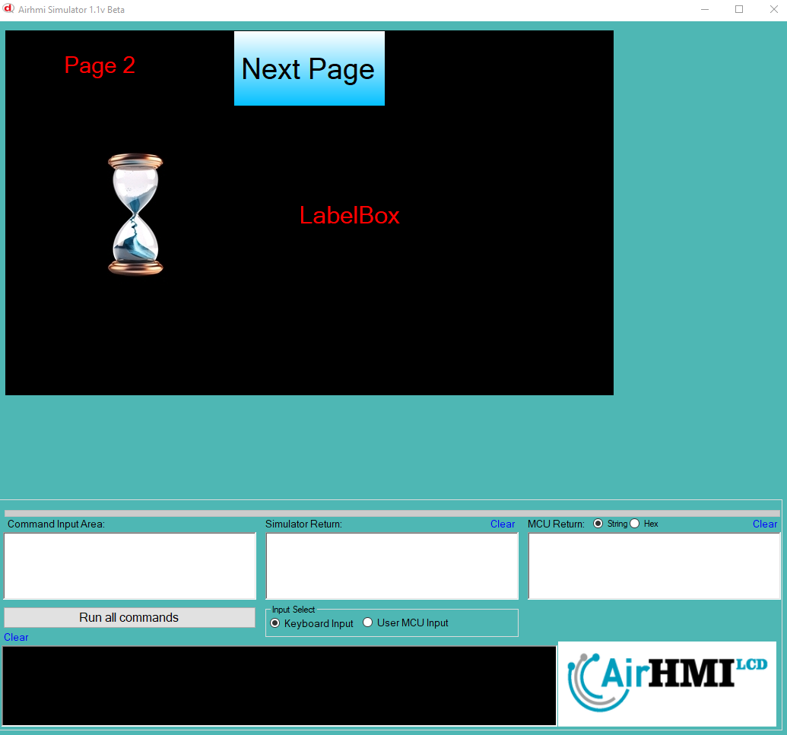

# Private Timer Özelliği

Private timer'lar yalnızca içinde tanımlandıkları veya çalıştırıldıkları sayfa üzerinde aktif olur ve bu sayfa açık olduğu sürece işlevini sürdürür. 
Kullanıcı başka bir sayfaya geçtiğinde veya uygulama içinde farklı bir ekrana yönlendirildiğinde, ilgili Private timer otomatik olarak durur ve 
çalışmasını sonlandırır. Ancak, kullanıcı tekrar aynı sayfaya döndüğünde, Private timer otomatik olarak yeniden başlar ve çalışmasına kaldığı 
yerden devam eder veya belirlenen başlangıç koşullarına göre sıfırdan başlatılır. Bu özellik, her sayfanın bağımsız bir zamanlayıcıya sahip 
olmasını sağlarken, farklı ekranlar arasında gereksiz işlem yükünü önleyerek sistem kaynaklarının daha verimli kullanılmasına olanak tanır.

## Private Timer, bu sayfada aktif olarak çalışarak hem Label'i güncelliyor hem de seri porta veri gönderiyor.

## Private Timer sayfa 2 de çalışmıyor.

