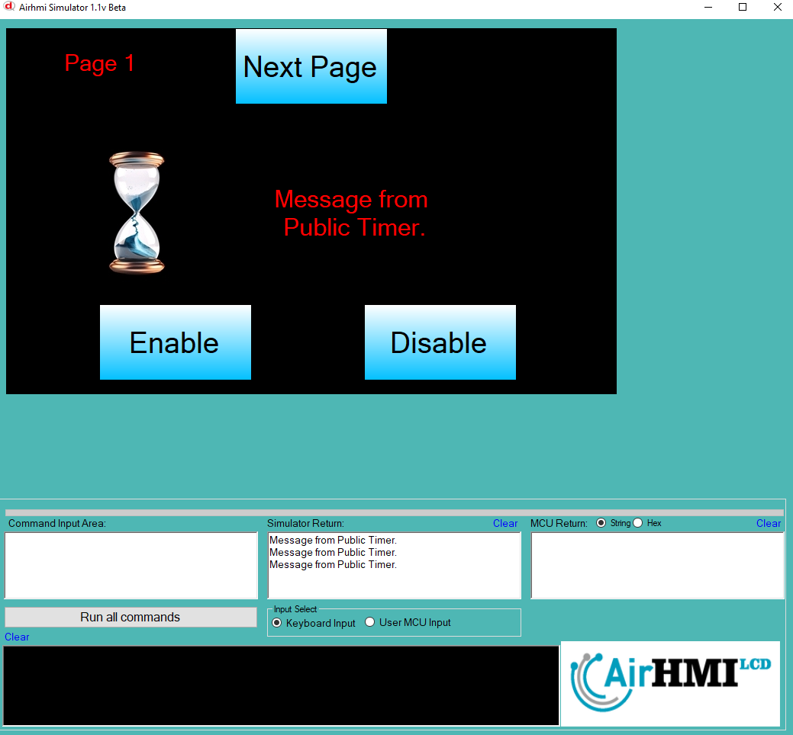

# Timer Enable Özelliği

# TimerSet Fonksiyonu ile Timer Kontrolü

HMI sisteminde kullanılan timer'ların etkinleştirilmesi (enable) veya devre dışı bırakılması (disable) **TimerSet** fonksiyonu ile gerçekleştirilir. Bu fonksiyonun genel yapısı şu şekildedir:

```c
TimerSet("ETimer1", "Enable", "True");
```

## Fonksiyon Parametreleri

1. **"ETimer1"**: İlk parametre, kontrol edilmek istenen timer'ın adını belirtir. Burada **ETimer1** adlı bir timer hedeflenmiştir.
2. **"Enable"**: İkinci parametre, timer'ın etkinleştirme veya devre dışı bırakma işlemi için kullanılacağını ifade eder.
3. **"True"**: Üçüncü parametre, timer'ın etkin olup olmayacağını belirler. `"True"` değeri girildiğinde timer çalışmaya başlar, `"False"` değeri girildiğinde ise timer durdurulur.

Bu fonksiyon, HMI sisteminde **timer’ları başlatmak veya durdurmak için kullanılan temel bir kontrol mekanizmasıdır**. Kullanıcı belirli bir işlem gerçekleştiğinde (örneğin, bir butona basıldığında) **timer'ı aktif hale getirebilir**, yine aynı şekilde belirli bir koşul oluştuğunda **timer'ı devre dışı bırakabilir**.

## Örnek Kullanımlar

**Timer'ı Durdurmak:**

```c
TimerSet("ETimer1", "Enable", "False");
```

Bu komut çalıştırıldığında, **ETimer1** adlı timer durdurulur ve artık zaman ölçümü veya işlem tetiklemesi yapmaz.

## Kullanım Senaryoları

- **Animasyon veya belirli bir işlemi periyodik olarak çalıştırmak için timer'ı başlatmak**
- **Kullanıcı belirli bir işlem gerçekleştirdiğinde (örneğin, butona bastığında) timer'ı devre dışı bırakmak**
- **Belirli bir süre boyunca sürekli veri gönderen bir işlemde, sürenin dolmasıyla timer'ı durdurmak**
- **Sayfa değişimlerine bağlı olarak timer'ı kontrol etmek**

Bu sayede **TimerSet() fonksiyonu**, HMI ekranında **zamanlama işlemlerinin yönetilmesini sağlayarak** kullanıcıya dinamik bir kontrol imkanı sunar.





