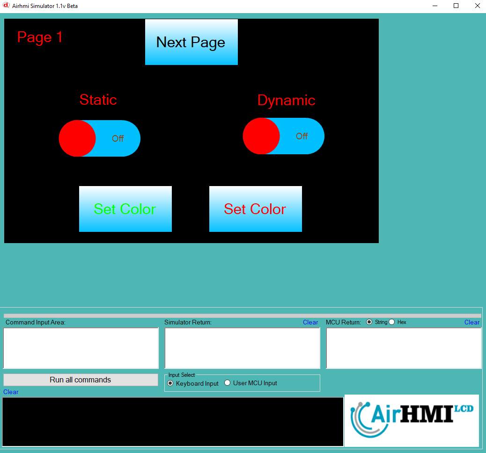
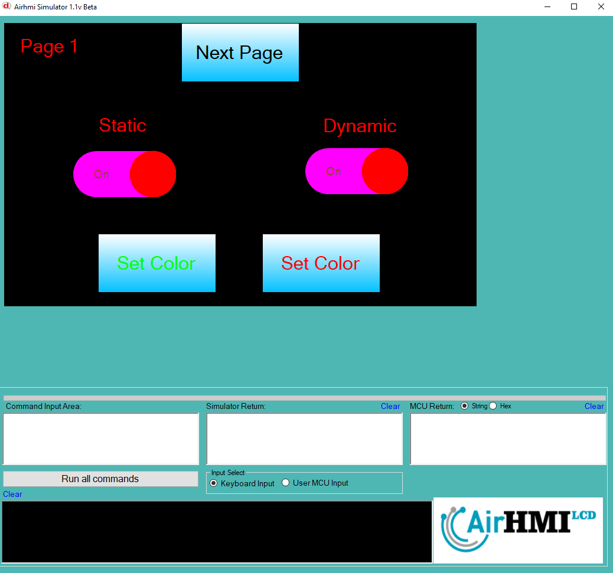
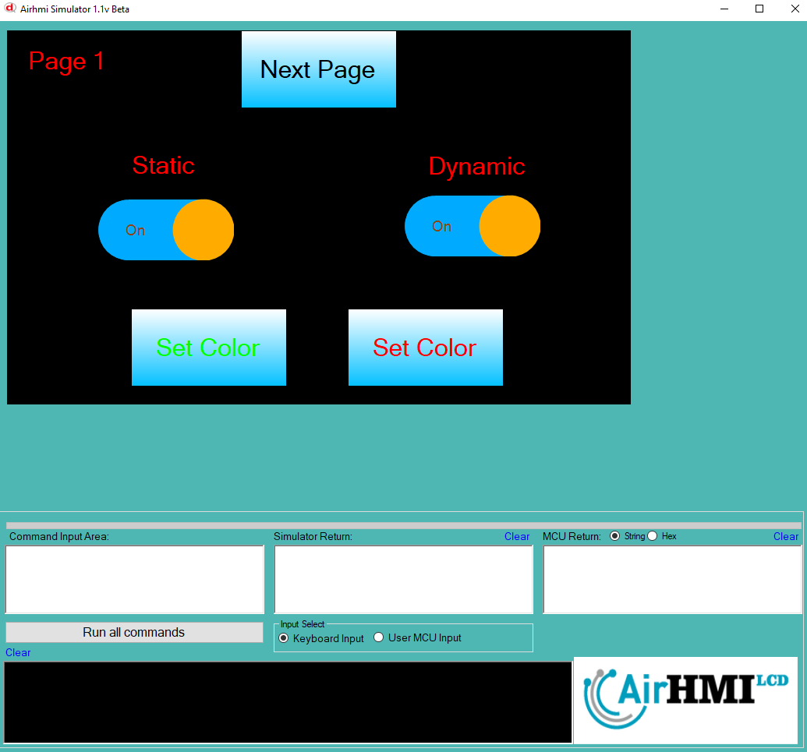
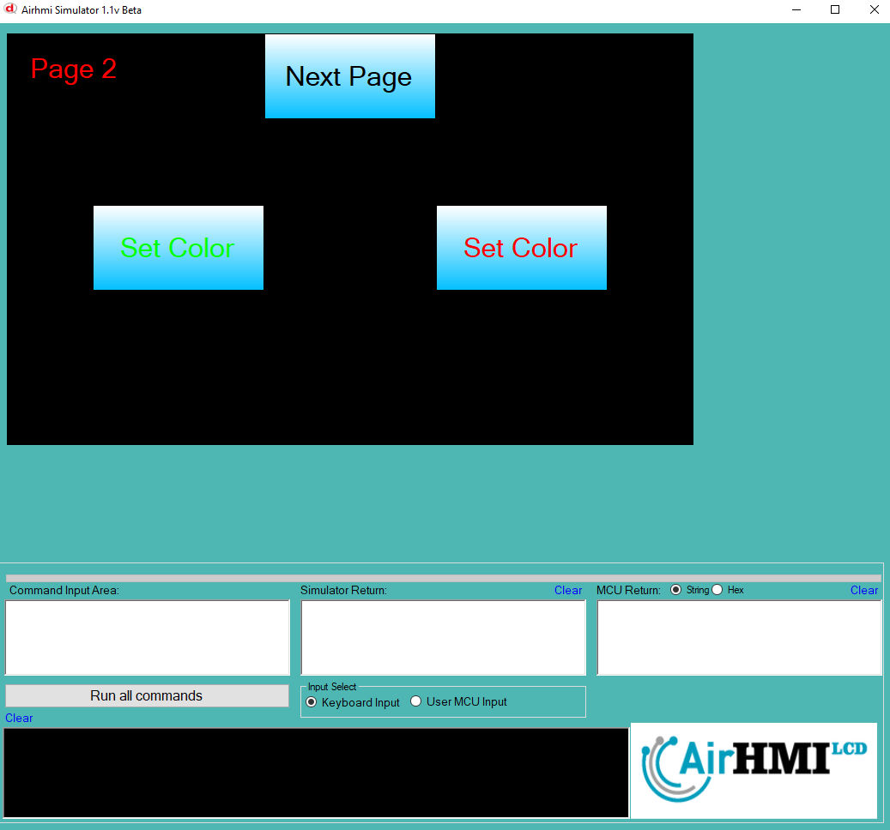
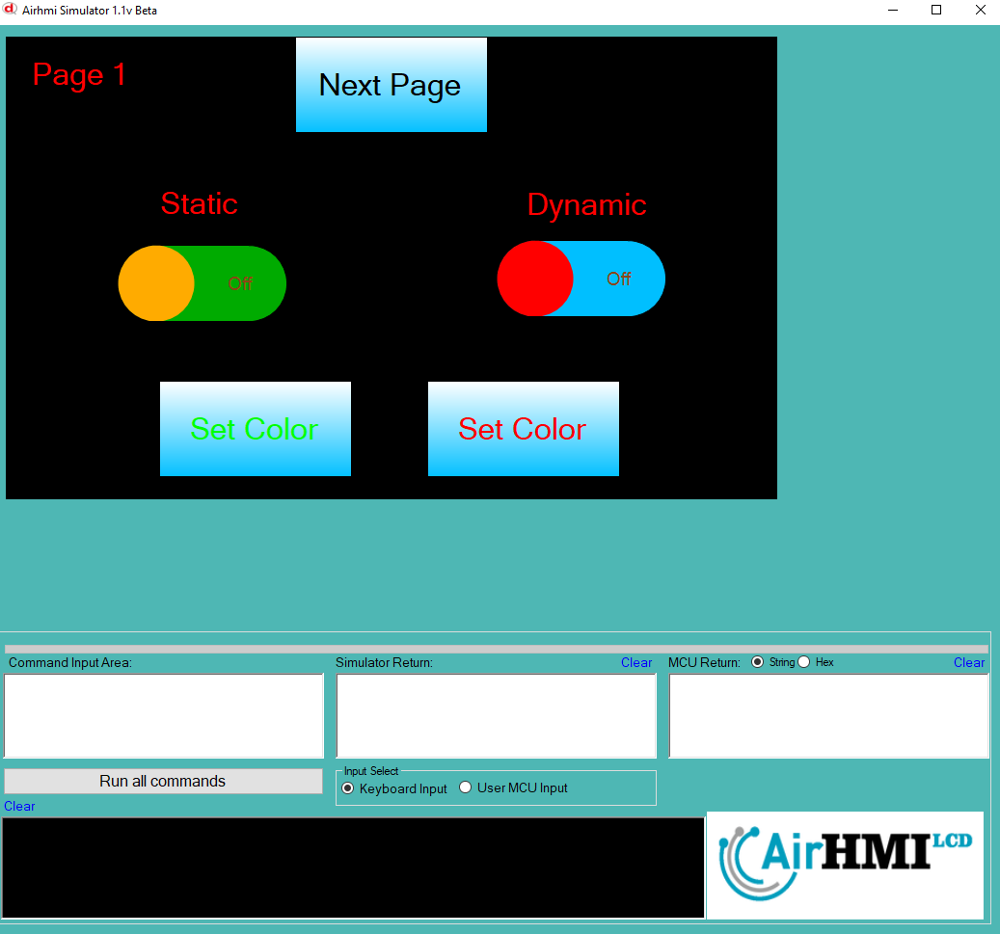

# Toggle Color Özelliği

Toggle nesnesinde 3 adet renk değiştirilecek alan vardır. Bunlardan bir tanesi yuvarlak olan kısımdır. 
ikincis ise off durumu resmidir. üçüncüsü ise on olma durumu resmidir. 

Şu fonksiyonlar ile ayarlanır:

ToggleSet("Toggle1" ,"Color" , "#FFAB00");   // "Toggle1" isimli bileşenin orta yuvarlak rengini turuncuya ayarla.

ToggleSet("Toggle1" ,"COLOR_OFF","#00AB00"); // "Toggle1" kapalı (OFF) durumdayken yeşil renkte olacak şekilde ayarla.

ToggleSet("Toggle1" ,"COLOR_ON" , "#00ABFF");// "Toggle1" açık (ON) durumdayken mavi renkte olacak şekilde ayarla.

Bu dokümanda, statik ve dinamik olmak üzere iki farklı Toggle rengi özelliği üzerinde etkili olan faktörler incelenmiştir.
Statik Togglelar her sayfadan tüm özelliklerine ulaşılıp değiştirilebilen Togglelardır. Static(false) yani dinamik Togglelar ise sayfaya özgüdür.
Sayfa değiştiği zaman hiçbir özelliği tutulmaz. Sayfa değişip tekrar aynı sayfaya gidildiği zaman Toggle ilk hali ile baştan meydana getirilir. 

## 📌 1. Toggleların Tanımı
- **🟢 Statik Toggle**: Static özelliği true olan Toggle dır. Color özelliği **hem aynı sayfadan hem de diğer sayfalardan** değiştirilebilir.
- **🔵 Dinamik Toggle**: Statik özelliği false olan Toggle dır. Color  özelliği **yalnızca aynı sayfada** değiştirilebilir, diğer sayfalardan değiştirilemez.

## 🔍 2. Toggle Color Değiştirme Durumları
### 🏠 Aynı Sayfada Olası Senaryolar
- Kullanıcı **statik Toggle Color değerini** değiştirebilir.
- Kullanıcı **dinamik Toggle Color değerini** değiştirebilir.

### 🔄 Farklı Sayfadan Olası Senaryolar
- Kullanıcı **statik Toggle Color değerini** değiştirebilir.
- Kullanıcı **dinamik Toggle Color değerini değiştiremez.**
- **Statik Toggle**, farklı sayfadan Color değerini değiştirirsek, aynı sayfaya dönüldüğünde **yeni değiştirilen Color değeri gelir.**
- **Dinamik Toggle Color değerini değiştirsek bile etki etmez.**

## 🎯 4. Sonuç
✔️ Aynı sayfada **her iki Toggle Color değerini değiştirilebilir**.  
✔️ **Statik Toggle Color değerini** diğer sayfalardan değiştirilebilir.  
✔️ **Dinamik Toggle Color değerini** yalnızca oluşturulduğu sayfada değiştirilebilir.  

