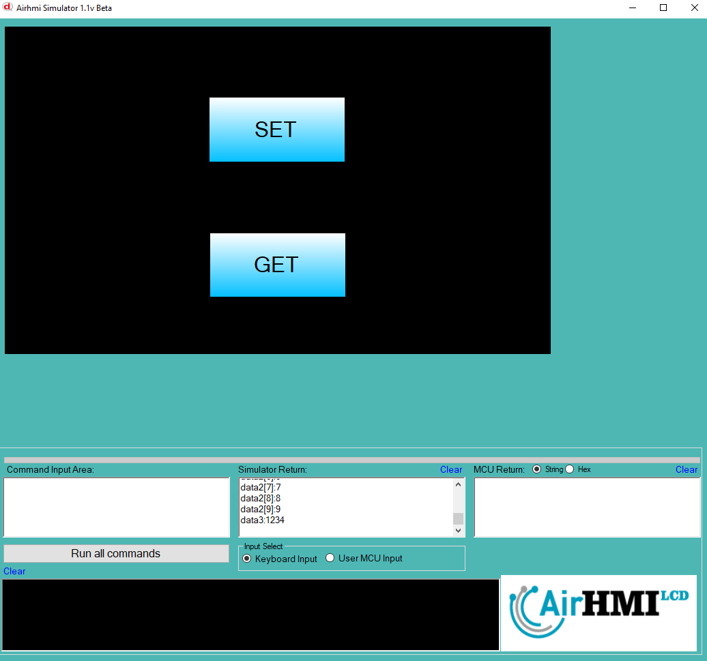

# AIRHMI Sisteminde Yapı (Struct) Kullanımı ve Veri Saklama

Bu belge, **AIRHMI (Human-Machine Interface)** sisteminde yapı (struct) tanımlamak, bu yapıya veri atamak, saklamak ve daha sonra geri çağırarak kullanmak için kullanılan fonksiyonları açıklamaktadır.

## 1. Yapı (Struct) Tanımlama ve Saklama

### **1.1 Yapı Tanımlama**

AIRHMI sisteminde **verileri grup halinde saklamak** için `struct` kullanılır.

```c
#include "stk.h"
#include "stdio.h"

typedef struct 
{
    int data1[10];
    int data2[10];
    char data3[10];
} data_t;
```
- **`data1[10]`** → 10 elemanlı bir `int` dizisi.
- **`data2[10]`** → 10 elemanlı bir `int` dizisi.
- **`data3[10]`** → 10 karakter uzunluğunda bir `char` dizisi (**string saklamak için**).

Bu yapı, ilişkili verileri **tek bir değişkenle yönetmek** için kullanılır.

### **1.2 Yapıya Veri Atama ve Kaydetme**

```c
data_t data;

sprintf(data.data3, "%s", "1234");

int i = 0;
for(i=0; i<10; i++)
{
    data.data1[i] = i;
    data.data2[i] = i;
}
```
- **`data3`** dizisine `"1234"` stringi atanır.
- **`data1` ve `data2` dizileri** 0-9 arası sayılarla doldurulur.

### **1.3 Yapıyı Bellekte Saklama (`StructSet`)**

```c
StructSet("data", &data, sizeof(data_t));
```
- `"data"` adlı yapı belleğe kaydedilir.
- `sizeof(data_t)` ile **kaç byte** saklanacağını hesaplar.

---

## 2. Yapıyı Geri Çağırma ve Kullanma

### **2.1 Bellekten Yapıyı Geri Yükleme (`StructGet`)**

```c
data_t data;
StructGet("data", &data);
```
- `"data"` adlı yapı bellekte varsa, saklanan değerleri geri yükler.

### **2.2 Yapı Verilerini Ekrana Yazdırma**

```c
int i = 0;
for(i=0; i<10; i++)
{
    printf("data1[%d]:%d \n", i, data.data1[i]);
}

for(i=0; i<10; i++)
{
    printf("data2[%d]:%d \n", i, data.data2[i]);
}

printf("data3:%s \n", data.data3);
```
- **`data1` ve `data2` dizileri** bellekte saklanmış verileri ekrana yazdırır.
- **`data3` stringi** bellekte saklanan değeri gösterir.

---


Bu yapı sayesinde, **AIRHMI sistemlerinde kompleks veriler yönetilebilir, kaydedilebilir ve tekrar çağrılabilir.** 🚀



