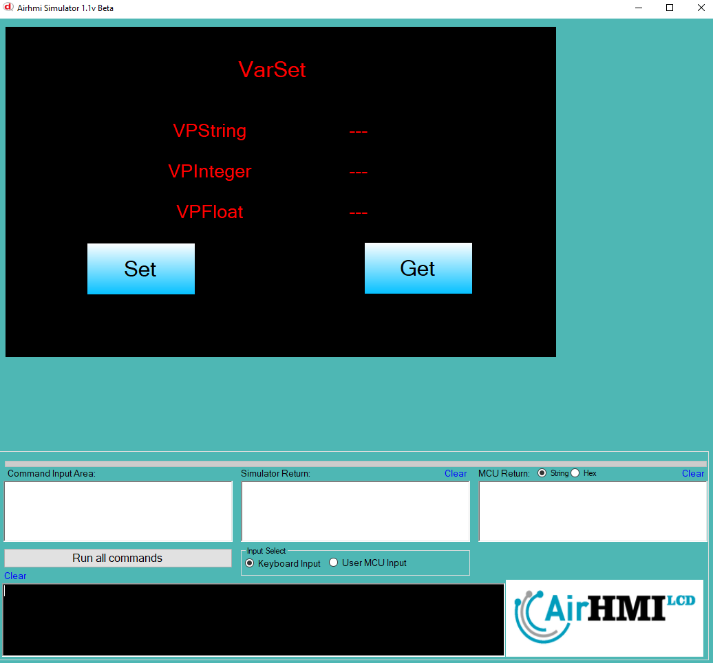

# AIRHMI Ekranında Değişken Tanımlama ve Veri Saklama

Bu belge, **AIRHMI (Human-Machine Interface)** ekranında değişken tanımlamak, bu değişkenlere farklı veri tiplerinde değerler atamak ve bu değerleri AIRHMI etiketlerine (Label) yansıtmak için kullanılan yapıyı açıklamaktadır.

## Kodun İşlevi

### 1. Değişken Tanımlama ve Saklama

AIRHMI sisteminde değişkenler `VarSeti`, `VarSet` ve `VarSetf` fonksiyonları kullanılarak tanımlanabilir ve saklanabilir.

#### a) Tam Sayı (Integer) Değişken Tanımlama
```c
#include "stk.h"

int i = 5;
VarSeti("VPInteger", i);
```
- `"VPInteger"` adında bir **integer** değişken oluşturur ve içine `5` değerini saklar.

#### b) Metin (String) Değişken Tanımlama
```c
#include "stk.h"

char *data = "AIRHMI";
VarSet("VPString", data);
```
- `"VPString"` adında bir **string (char *)** değişken oluşturur ve `"AIRHMI"` değerini saklar.

#### c) Ondalıklı Sayı (Float/Double) Değişken Tanımlama
```c
#include "stk.h"

double k = 8.5;
VarSetf("VPFloat", k);
```
- `"VPFloat"` adında bir **double/float** değişken oluşturur ve `8.5` değerini saklar.

## 2. Değişkenleri Alma ve AIRHMI Label Bileşenlerine Atama

AIRHMI sisteminde saklanan değişkenler `VarGet` fonksiyonu ile alınarak, etiketlere (`LabelSeti`, `LabelSets`, `LabelSetf`) aktarılabilir.

#### a) Tam Sayı (Integer) Değerini Alma ve Label'a Atama
```c
#include "stk.h"
#include "stdio.h"

int i;

VarGet("VPInteger", &i);
LabelSeti("ELabelBox6", i);
```
- `"VPInteger"` değişkeninde saklanan **integer** değeri `i` değişkenine atar.
- `LabelSeti("ELabelBox6", i);` ile bu değeri `ELabelBox6` etiketine yazdırır.

#### b) Metin (String) Değerini Alma ve Label'a Atama
```c
#include "stk.h"
#include "stdio.h"

char data[100];

VarGet("VPString", data);
LabelSets("ELabelBox5", data);
```
- `"VPString"` değişkeninde saklanan **string** veriyi `data` dizisine alır.
- `LabelSets("ELabelBox5", data);` ile bu veriyi `ELabelBox5` etiketine aktarır.

#### c) Ondalıklı Sayı (Float) Değerini Alma ve Label'a Atama
```c
#include "stk.h"
#include "stdio.h"

float k;

VarGet("VPFloat", &k);
LabelSetf("ELabelBox7", k);
```
- `"VPFloat"` değişkeninde saklanan **float** değeri `k` değişkenine atar.
- `LabelSetf("ELabelBox7", k);` ile bu değeri `ELabelBox7` etiketine yazdırır.

## 3. Genel Özet
Bu kod sayesinde **AIRHMI ekranında farklı veri tiplerinde değişkenler** tanımlanabilir, saklanabilir ve HMI'nin farklı bileşenlerinde kullanılmak üzere çağrılabilir.

| Değişken | Saklanan Değer | Label Bileşeni |
|----------|---------------|---------------|
| `"VPInteger"` | Tam sayı (`int`) | `ELabelBox6` |
| `"VPString"` | Metin (`char[]`) | `ELabelBox5` |
| `"VPFloat"` | Ondalıklı sayı (`float`) | `ELabelBox7` |

Bu yapı, HMI sisteminin **veri yönetimi** ve **değişken takibi** için önemli bir bileşen olarak çalışır.





