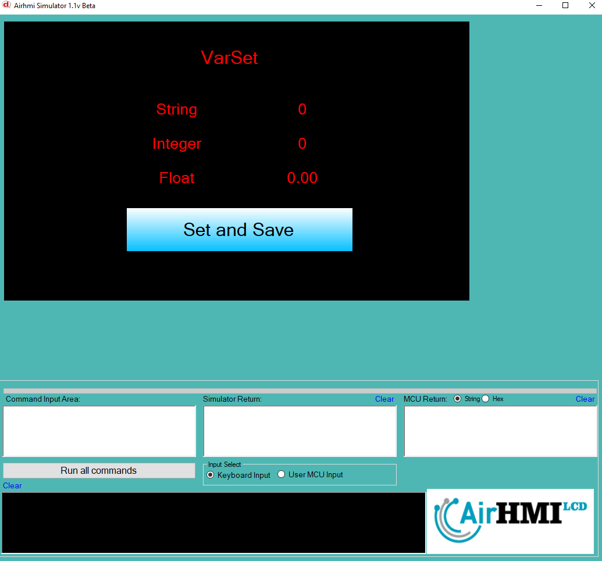

# HMI Ekranında Değişken Tanımlama, Saklama ve Geri Yükleme

Bu belge, **HMI (Human-Machine Interface)** ekranında değişken tanımlamak, bu değişkenlere farklı veri tiplerinde değerler atamak, kalıcı hafızaya kaydetmek ve sistem yeniden başlatıldığında geri yüklemek için kullanılan yapıyı açıklamaktadır.

## Kodun İşlevi

### 1. Değişken Tanımlama, Saklama ve Kalıcı Hafızaya Kaydetme

HMI sisteminde değişkenler `VarSeti`, `VarSet`, `VarSetf` fonksiyonları kullanılarak tanımlanabilir ve `VariableSave` fonksiyonu ile **kalıcı hafızaya** kaydedilebilir.

#### a) Tam Sayı (Integer) Değişken Tanımlama ve Kaydetme
```c
#include "stk.h"

int i = 5;
VarSeti("VPInteger", i);
VariableSave("VPInteger");
```
- `"VPInteger"` adında bir **integer** değişken oluşturulur ve içine `5` değeri atanır.
- `VariableSave("VPInteger");` ile değişken **kalıcı hafızaya** kaydedilir.
- Sistem yeniden başlatıldığında bu değer korunur.

#### b) Metin (String) Değişken Tanımlama ve Kaydetme
```c
#include "stk.h"

char *data = "AIRHMI";
VarSet("VPString", data);
VariableSave("VPString");
```
- `"VPString"` adında bir **string** değişken oluşturulur ve içine `"AIRHMI"` değeri atanır.
- `VariableSave("VPString");` ile değişken **kalıcı hafızaya** kaydedilir.
- Sistem yeniden başlatıldığında bu değer korunur.

#### c) Ondalıklı Sayı (Float/Double) Değişken Tanımlama ve Kaydetme
```c
#include "stk.h"

double k = 8.5;
VarSetf("VPFloat", k);
VariableSave("VPFloat");
```
- `"VPFloat"` adında bir **double/float** değişken oluşturulur ve içine `8.5` değeri atanır.
- `VariableSave("VPFloat");` ile değişken **kalıcı hafızaya** kaydedilir.
- Sistem yeniden başlatıldığında bu değer korunur.

## 2. Değişkenlerin Kalıcı Hafızadan Geri Yüklenmesi

Kalıcı hafızaya kaydedilen değişkenler sistem yeniden başlatıldığında `VarGet` fonksiyonları ile tekrar kullanılabilir.

#### a) Tam Sayı (Integer) Değerini Geri Yükleme
```c
#include "stk.h"
#include "stdio.h"

int i;

VarGet("VPInteger", &i);
LabelSeti("ELabelBox6", i);
```
- `VarGet("VPInteger", &i);` ile `VPInteger` değişkeni geri yüklenir.
- `LabelSeti("ELabelBox6", i);` ile değer `ELabelBox6` etiketine aktarılır.

#### b) Metin (String) Değerini Geri Yükleme
```c
#include "stk.h"
#include "stdio.h"

char data[100];

VarGet("VPString", data);
LabelSets("ELabelBox5", data);
```
- `VarGet("VPString", data);` ile `VPString` değişkeni geri yüklenir.
- `LabelSets("ELabelBox5", data);` ile değer `ELabelBox5` etiketine aktarılır.

#### c) Ondalıklı Sayı (Float) Değerini Geri Yükleme
```c
#include "stk.h"
#include "stdio.h"

float k;

VarGet("VPFloat", &k);
LabelSetf("ELabelBox7", k);
```
- `VarGet("VPFloat", &k);` ile `VPFloat` değişkeni geri yüklenir.
- `LabelSetf("ELabelBox7", k);` ile değer `ELabelBox7` etiketine aktarılır.

## 3. Genel Özet
Bu kod sayesinde **HMI ekranında farklı veri tiplerinde değişkenler** tanımlanabilir, **kalıcı hafızaya kaydedilebilir** ve sistem yeniden başlatıldığında bu değişkenler geri yüklenebilir.

| Değişken | Saklanan Değer | Kalıcı Hafızaya Kaydedildi mi? | Label Bileşeni |
|----------|---------------|----------------|---------------|
| `"VPInteger"` | Tam sayı (`int`) | ✅ | `ELabelBox6` |
| `"VPString"` | Metin (`char[]`) | ✅ | `ELabelBox5` |
| `"VPFloat"` | Ondalıklı sayı (`float`) | ✅ | `ELabelBox7` |

Bu yapı, **HMI sistemlerinde güç kesintisi veya yeniden başlatma sonrası değişkenlerin korunmasını sağlar** ve **kritik verilerin kaybolmasını önler**.



