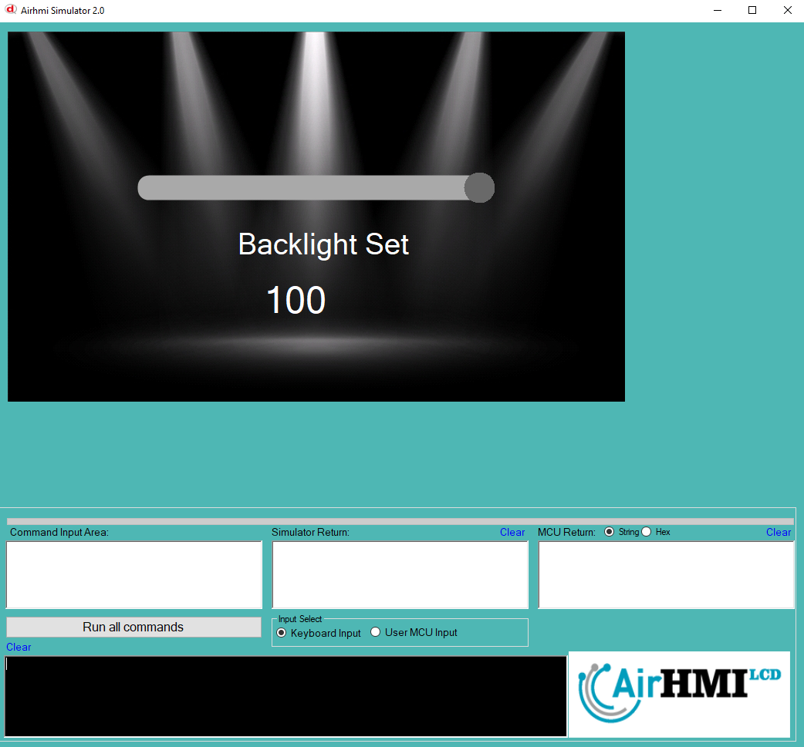

# Airhmi Backlight Demo Uygulama

Bu kod, HMI ekranında arka ışık (backlight) seviyesini bir slider ile ayarlamak için kullanılıyor.

```
BacklightSet(atoi(data) );
```

Bu satırda, BacklightSet() fonksiyonuyla arka ışık parlaklığı ayarlanıyor.

atoi(data): data değişkeni string formatında olduğu için atoi() fonksiyonu ile integer (tam sayı) formata çevriliyor.
Eğer slider değeri 50 ise, atoi(data) 50 olacak ve BacklightSet(50); çağrılacak.
Bu da HMI ekranının arka ışığını %50 seviyesine ayarlar.





