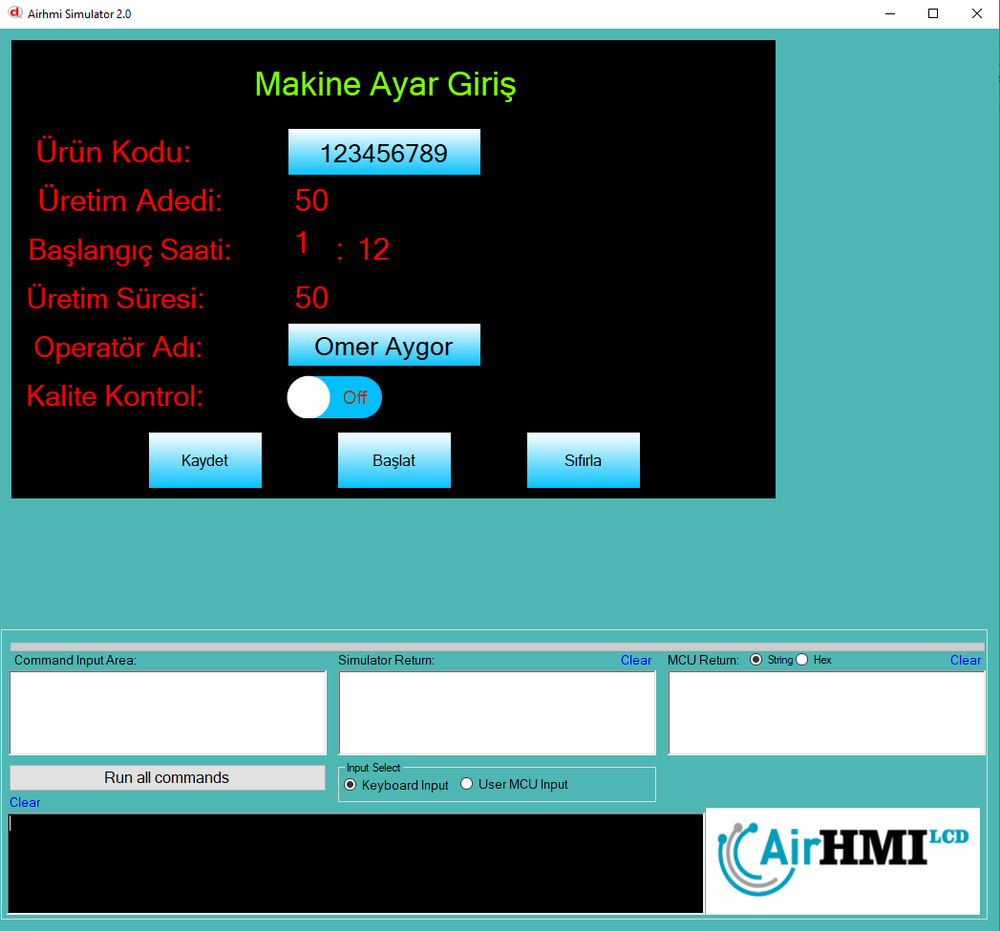

# Bigi Girş Yöntemleri

Bu örnekte, kullanıcının klavye yardımıyla ekrana bilgi girmesi için kullanılabilecek yöntemler açıklanmıştır.
Sürükle-bırak yöntemiyle bir Label ve LabelBox objesine, numeric veya alphanumeric klavye özelliği ekleyerek kullanıcıdan veri alınabilir.

Buna ek olarak, kodlama altyapısı kullanılarak Button, TransparentShape gibi nesneler aracılığıyla da klavye açma özelliği kazandırılabilir.

```
#include "stk.h"
#include "stdio.h"

char text[100];
char data[100];

// Buton üzerindeki mevcut metni al
ButtonGet("EButton4", "Text", text);

// Klavyeyi çağır: alfanümerik, 30 saniye timeout, maksimum 30 karakter, başlık belirterek
KeypadAlphaExt(text, data, 30000, 30, "Operatör Adı");

// Giriş yapılan veriyi tekrar butonun üzerine yaz
ButtonSet("EButton4", "Text", data);

```

## Fonksiyonun Amacı ve Kullanımı:
KeypadAlphaExt fonksiyonu sayesinde klavye penceresine;

Zaman aşımı süresi (timeout)

Maksimum karakter sınırı

Başlık metni

gibi parametreler atanabilir. Bu sayede kullanıcıya daha kontrollü ve gelişmiş bir bilgi giriş deneyimi sunulur.

```
#include "stk.h"
#include "stdio.h"


char LabelData[100];
char data[100];

LabelGet("ELabel8" , "Text" ,  LabelData);

// KeypadAlphaExt(char *inData, char *outData , int timeout , int maxCharacter )
KeypadNumExt(LabelData, data , 30000, 4 , "Basınç");

LabelSets("ELabel8" , data);

```

KeypadNumExt ile de numerik klavye yi özelleştirmiş oluyoruz. 




