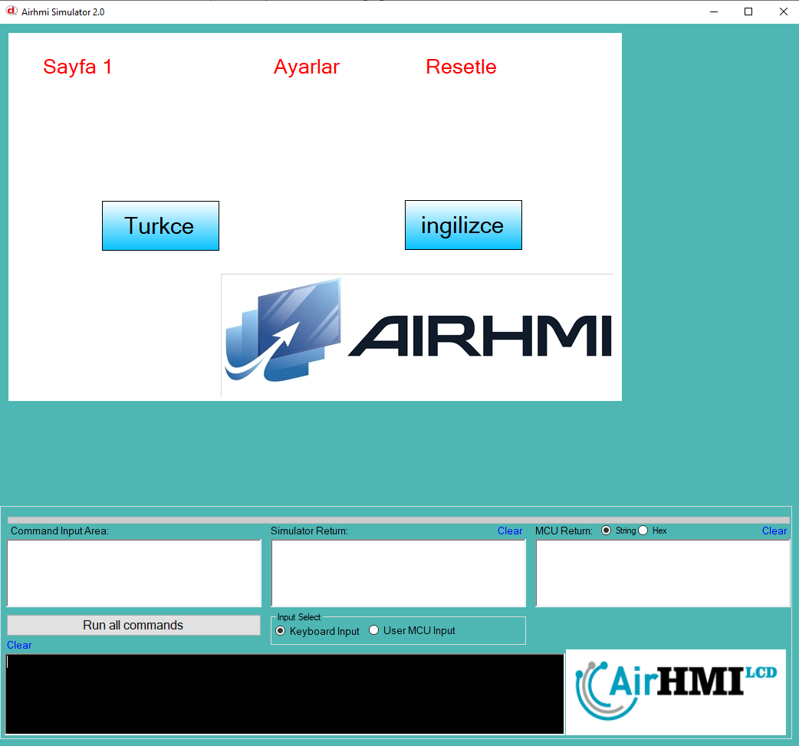
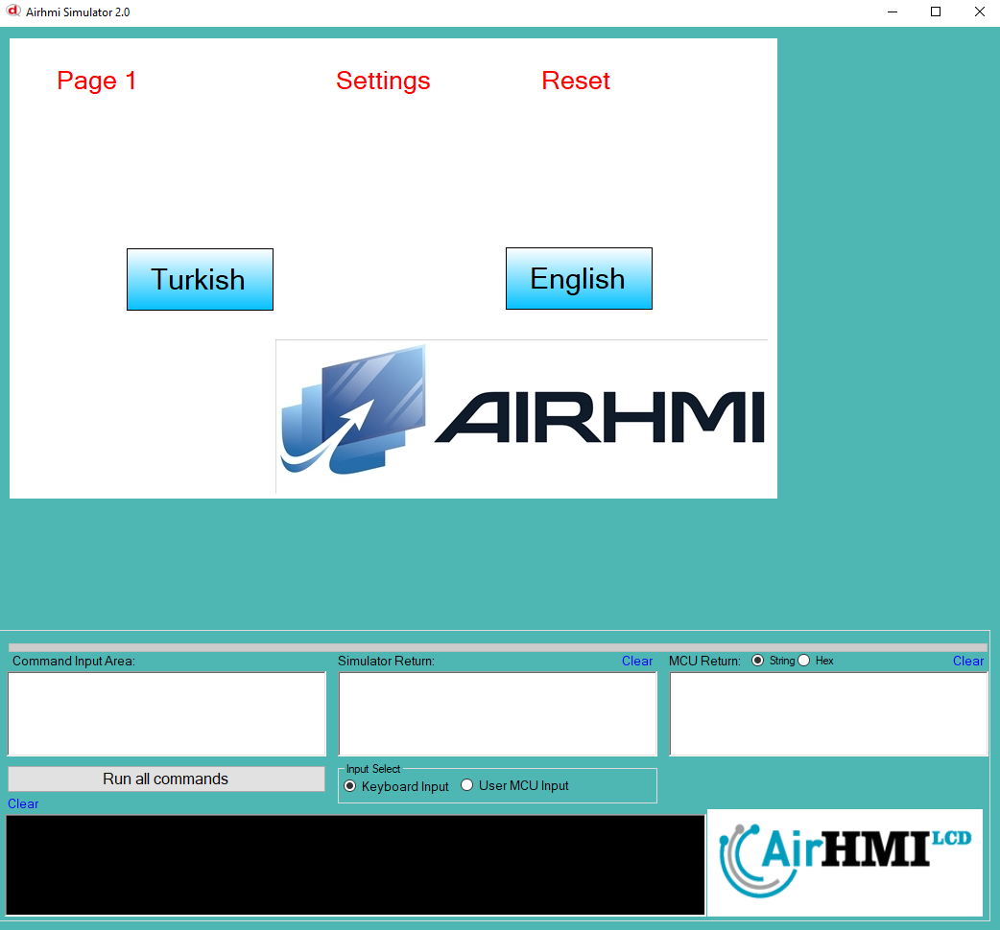

# Dil Desteği

LanguageSet() fonksiyonu, AirHMI ortamında kullanılan dil ayarını belirleyerek ekran üzerindeki metinleri buna göre günceller.

Kod Açıklaması:
```
void LanguageSet()
{
    int language;

    VarGet("language" , &language );
```
VarGet("language", &language);
"language" değişkeninin değerini alır.
VarGet() fonksiyonu AirHMI sistemindeki değişkenleri almak için kullanılır.
Eğer language = 0 ise, sistem dili Türkçe, aksi takdirde İngilizce olur.

```
if( language == 0 ) // Türkçe
{
    LabelSet("ELabelBox1" ,"Text" ,"Sayfa 1");
    LabelSet("ELabelBox2" ,"Text" ,"Ayarlar");
    LabelSet("ELabelBox3" ,"Text" ,"Resetle");
    
    ButtonSet("EButton1" ,"Text" , "Turkce" );
    ButtonSet("EButton2" ,"Text" , "ingilizce" );
}
```

Eğer language = 0 ise, Türkçe dil seçeneği aktif olur.

LabelSet() fonksiyonları, ekranda bulunan ELabelBox1, ELabelBox2, ELabelBox3 etiketlerinin (label) metinlerini Türkçeye çevirir.

ButtonSet() fonksiyonları, düğme (buton) metinlerini "Türkçe" ve "İngilizce" olarak ayarlar.

```
    else
    {
        LabelSet("ELabelBox1" ,"Text" ,"Page 1");
        LabelSet("ELabelBox2" ,"Text" ,"Settings");
        LabelSet("ELabelBox3" ,"Text" ,"Reset");    
        
        ButtonSet("EButton1" ,"Text" , "Turkish" );
        ButtonSet("EButton2" ,"Text" , "English" );
    }
}
```

Eğer language != 0 ise, İngilizce dil seçeneği aktif olur.

LabelSet() fonksiyonları etiketleri İngilizceye çevirir.

ButtonSet() fonksiyonları düğme metinlerini "Turkish" ve "English" olarak ayarlar.

## Fonksiyonun Amacı ve Kullanımı:
LanguageSet(), sistemin dil ayarını belirler ve kullanıcı arayüzünü (UI) bu dile uygun şekilde günceller.

VarGet("language", &language); ile sistemde kayıtlı dil ayarı okunur.

Eğer dil değişirse, ilgili buton ve etiketler güncellenir.

Bu kod, AirHMI cihazlarında dil değiştirme işlemi için temel bir yapı sunar. Kullanıcı, dili değiştirdiğinde bu fonksiyon çağrılarak arayüz anında güncellenebilir.







