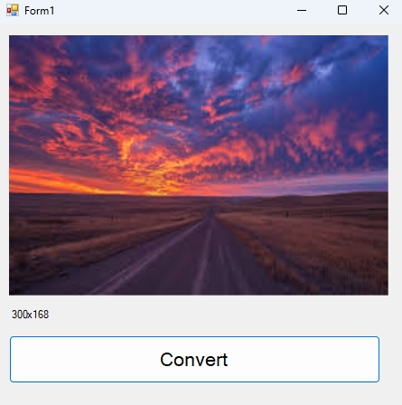
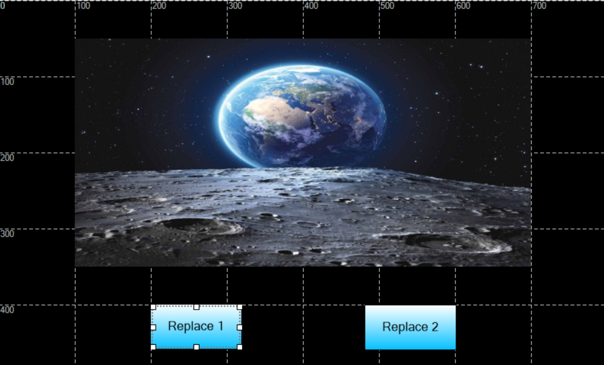

# Image Replace Özelliği

Ekrandaki image nesnesinin resmini sd karta attığımız bir resim ile değiştirme işlemi yapar.

```
ImageSet("EImage1","Image_File_Replace","D:\\2.raw");

```

Resimlerinizi Converter klasörü içerisindeki uygulama ile raw formatına dönüştürmeniz gerekir. 
Ekranda tanımlamış olduğunuz resmin boyutları ile aynı olmalıdır. 





