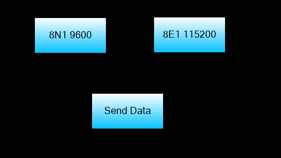

# 6.16 UartInit



## Açıklama

UartInit fonksiyonu, UART (seri port) iletişimini yapılandırmak için kullanılır. Bu fonksiyon ile baud rate, data bit sayısı, stop bit sayısı ve parity ayarlarını belirleyebilirsiniz.

## Fonksiyon

```c
void UartInit(baudrate, databits, stopbits, parity)
```

## Parametreler

| Parametre | Açıklama | Değerler |
|-----------|----------|----------|
| baudrate | Baud rate hızı | 1200, 2400, 4800, 9600, 14400, 19200, 38400, 57600, 115200 |
| databits | Data bit sayısı | 5, 6, 7, 8 |
| stopbits | Stop bit sayısı | 1, 2 |
| parity | Parity ayarı | 0=None, 1=Odd, 2=Even |

## Örnek Kodlar

```c
// Standart: 9600, 8N1 (8 data, no parity, 1 stop)
UartInit(9600, 8, 1, 0);

// 115200 baud, 8 data, 1 stop, even parity
UartInit(115200, 8, 1, 2);

// 19200 baud, 7 data, 2 stop, odd parity
UartInit(19200, 7, 2, 1);

// Modbus RTU standart: 9600, 8E1
UartInit(9600, 8, 1, 2);
```
