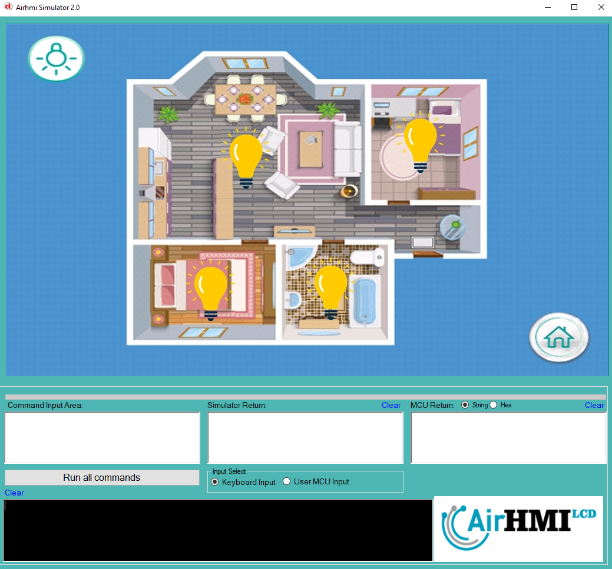
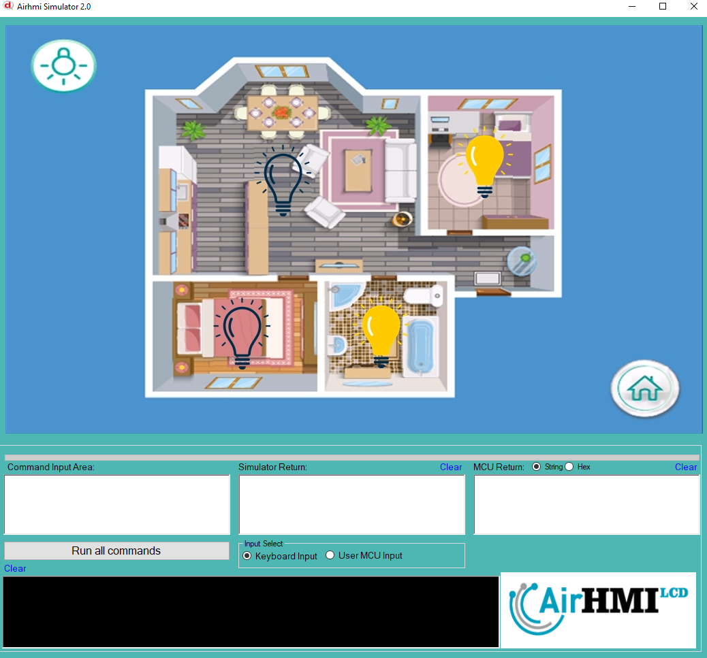
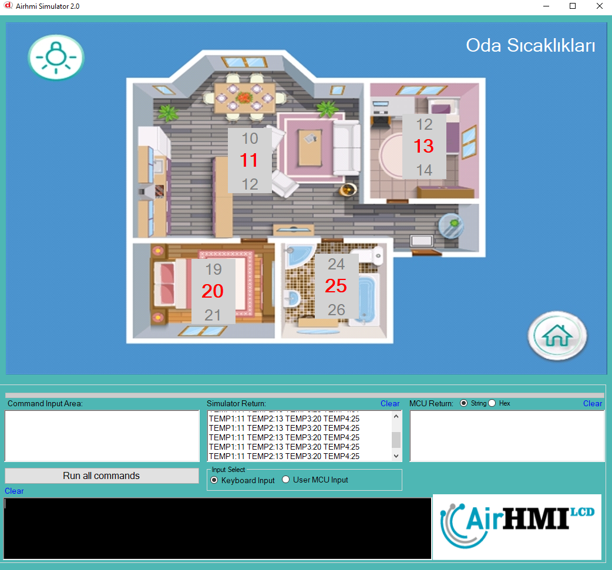

## HMI Tabanlı Akıllı Ev Uygulaması  

Geliştirdiğimiz **HMI Smart Home** uygulaması, akıllı ev sistemlerini kullanıcı dostu bir arayüzle yönetmeyi sağlayan bir otomasyon çözümüdür. Kullanıcılar, evlerindeki aydınlatma, ısıtma-soğutma, güvenlik kameraları ve diğer akıllı cihazları merkezi bir dokunmatik ekran üzerinden kolayca kontrol edebilirler.  

Uygulama, **HMI (Human-Machine Interface)** teknolojisi sayesinde sezgisel bir deneyim sunarak, kullanıcıların sistemleri hızlı ve güvenli bir şekilde yönetmesini sağlar. **Esnek yapılandırma seçenekleri** sayesinde farklı cihazlarla entegrasyon sağlanabilir ve kişisel tercihlere göre özelleştirilebilir.  

### Öne çıkan özellikler:  
- ✅ **Dokunmatik Kontrol:** Akıllı ev cihazlarını kolayca yönetme.  
- ✅ **Gerçek Zamanlı İzleme:** Sensör ve cihaz verilerini anlık takip etme.  
- ✅ **Uzaktan Erişim:** Mobil ve bilgisayar üzerinden kontrol imkânı.  
- ✅ **Otomasyon Senaryoları:** Belirlenen koşullara göre otomatik çalışan sistemler.  
- ✅ **Enerji Verimliliği:** Gereksiz enerji tüketimini önleyerek tasarruf sağlama.  

Bu uygulama, modern ev otomasyonu ihtiyacını karşılamak için **güvenilir, hızlı ve kullanıcı dostu** bir çözüm sunmaktadır. 🚀

