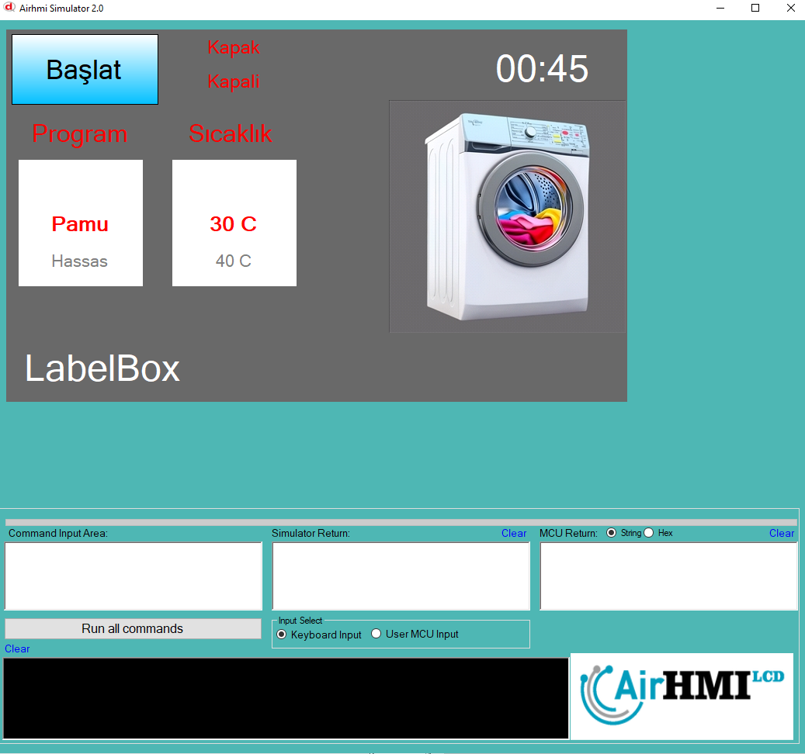

# Çamaşır Makinesi Kontrol Sistemi 
Bu proje, SmartIO Modbus kullanarak çamaşır makinesi kontrolü sağlayan bir HMI (Human Machine Interface) uygulaması geliştirmeyi amaçlamaktadır. AirHMI platformu kullanılarak tasarlanan sistem, kullanıcının çamaşır programını seçmesini, kapak durumunu kontrol etmesini, yıkama işlemlerini otomatik olarak yönetmesini ve gerçek zamanlı bilgi almasını sağlar.

📌 Proje Bileşenleri
1️⃣ Kapak Durumu Kontrolü
SmartIO Modbus’un 1. dijital girişi kapak durumunu takip eder.
Kapak açık veya kapalı olarak ekranda gösterilir.
Kapak kapalı olmadan yıkama başlatılamaz.
2️⃣ Program Seçimi ve Süre Yönetimi
Kullanıcı, Pamuklu, Hassas, Sentetik, Hızlı gibi programlardan birini seçebilir.
Seçilen programa göre yıkama süresi belirlenir ve ekranda gösterilir.
Program süresi, aşamalar ilerledikçe azalır ve güncellenir.
3️⃣ Yıkama Aşamaları ve Motor Kontrolü
Yıkama işlemi farklı aşamalara bölünmüştür:
✅ Su Alma → Giriş vanası açılır ve belirlenen süre boyunca su alınır.
✅ Yıkama → Motor çalıştırılarak belirli bir süre boyunca çamaşırlar yıkanır.
✅ Durulama → Suyu boşaltmak için tahliye valfi açılır.
✅ Sıkma → Motor yüksek devirde çalıştırılarak fazla su çamaşırlardan atılır.
✅ Tamamlama → Yıkama süreci bitince motor durdurulur ve kullanıcıya bildirilir.

Her aşama ilerledikçe "ELabelStatus" üzerinden ekranda güncellenir.

Motor ve valf kontrolü için Modbus RTU protokolü kullanılarak röleler tetiklenir.

4️⃣ Gerçek Zamanlı Değişken Yönetimi
Kapak durumu (VPKapakDurumu), aşama bilgisi (VPAshama) ve yıkama süresi (VPYikamaSuresi) gibi veriler variable (değişken) olarak saklanır.
Makine kapanıp açılsa bile süreç kaldığı yerden devam edebilir.
5️⃣ Hata ve Kullanıcı Bildirimleri
Kapak açıkken yıkama başlatılamaz.
Hata mesajları ekranda anlık olarak görüntülenir.
Yıkama tamamlandığında kullanıcı bilgilendirilir.
📌 Sonuç ve Avantajlar
✅ Tam otomatik çamaşır makinesi kontrolü sağlanmıştır.
✅ Kapak sensörü ile güvenlik artırılmıştır.
✅ Farklı yıkama programları desteklenmiştir.
✅ Gerçek zamanlı değişken yönetimi ile kesintisiz çalışma sağlanmıştır.
✅ Modbus RTU protokolü ile endüstriyel kontrol sağlanmıştır.

Çamaşır Makinesi Kontrol Sistemi - Kodlama Yapısı Özeti
Bu proje, AirHMI ve SmartIO Modbus kullanılarak çamaşır makinesi kontrolü sağlamak için geliştirilmiştir. Kodlama yapısı, gerçek zamanlı değişken yönetimi, HMI (dokunmatik ekran) kontrolleri ve Modbus haberleşmesi üzerine kuruludur.

# Kodlama Yapısının Temel Bileşenleri
1️⃣ Değişken (Variable) Yönetimi
Sistemde önemli verileri saklamak ve işlemek için AirHMI variable (değişken) fonksiyonları kullanılmıştır:

Kapak durumu: VarSeti("VPKapakDurumu", değer);
Seçilen program: VarSet("VPProgramSecimi", programAdi);
Yıkama süresi: VarSeti("VPYikamaSuresi", süre);
Aşama takibi: VarSeti("VPAshama", aşama);

2️⃣ HMI (Dokunmatik Ekran) Kullanımı
Ekran üzerinden kullanıcı ile etkileşim sağlamak için aşağıdaki fonksiyonlar kullanılmıştır:

Program seçimi: ListWheelGet("ListWheel1", "Value", seciliProgram);
Kapak durumunu ekrana yazdırma: LabelSet("ELabelBox5", "Text", "Kapali");
Süreyi güncelleme: LabelSet("ELabelZaman", "Text", zamanStr);
Yıkama aşamalarını bildirme: LabelSet("ELabelStatus", "Text", "Yıkama Yapılıyor...");
Bu yapı sayesinde kullanıcı seçim yapabilir, süreci takip edebilir ve anlık durum bilgisi alabilir.

3️⃣ Modbus Haberleşmesi ile Giriş/Çıkış Kontrolleri
SmartIO Modbus kartı ile motorlar, valfler ve sensörler kontrol edilmektedir:

İşlem	Modbus Komutu
Kapak durumunu oku	ReadCoils(1, 0x0001, 1);
Su giriş valfini aç/kapat	WriteSingleCoil(1, 0x0000, 0xFF00);
Motoru çalıştır/durdur	WriteSingleCoil(1, 0x0002, 0xFF00);
Tahliye vanasını aç/kapat	WriteSingleCoil(1, 0x0001, 0x0000);
Sıkma motorunu çalıştır	WriteSingleCoil(1, 0x0003, 0xFF00);
Bu yapı sayesinde Modbus RTU üzerinden güvenilir kontrol sağlanmıştır.

4️⃣ Zamanlama ve Otomatik Yıkama Yönetimi
Kod içerisinde otomatik yıkama sürecini yöneten timer’lar kullanılmıştır:

Kapak durumu sürekli kontrol edilir:
c
Kopyala
Düzenle
TimerSet("TimerKapak", "Interval", "500");
TimerSet("TimerKapak", "Enable", "True");
Yıkama işlemi aşama aşama yürütülür:
c
Kopyala
Düzenle
TimerSet("TimerYikama", "Interval", "5000"); 
TimerSet("TimerYikama", "Enable", "False");
Geri sayım ile kalan süre güncellenir:
c
Kopyala
Düzenle
sprintf(zamanStr, "00:%02d", sure);
LabelSet("ELabelZaman", "Text", zamanStr);
Timer'lar sayesinde yıkama süreci adım adım ilerler ve kullanıcı bilgilendirilir.

5️⃣ Yıkama Süreci Algoritması
Kod, belirlenen sıraya göre aşamaları yönetir:
1️⃣ Kapak kontrol edilir. Açık ise yıkama başlamaz.
2️⃣ Seçili programa göre süre belirlenir.
3️⃣ Su alma aşaması başlar.
4️⃣ Motor çalıştırılarak yıkama yapılır.
5️⃣ Su tahliye edilir ve durulama gerçekleştirilir.
6️⃣ Sıkma işlemi yapılır.
7️⃣ Süre sıfırlandığında yıkama tamamlanır.

Bu süreç içinde tüm veriler ekranda gösterilir ve değişkenlerde saklanır.

