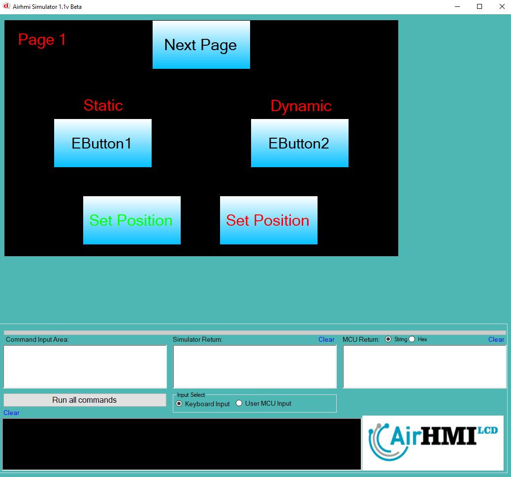
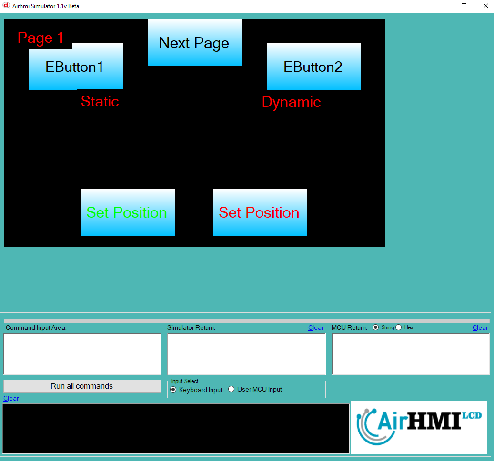
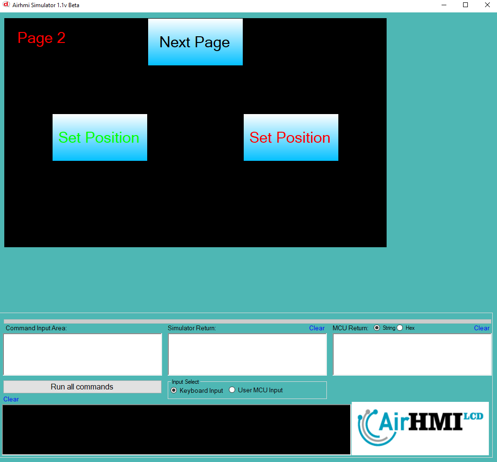
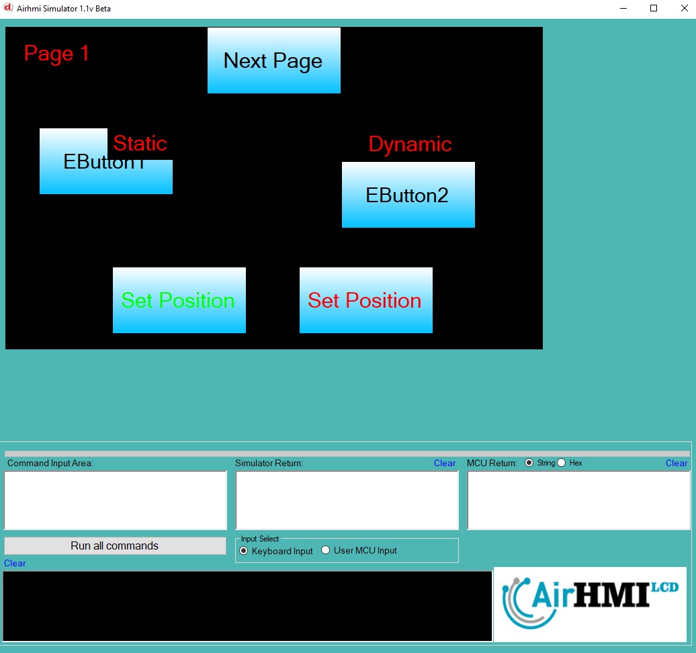

# Buton Left Top Olasılıkları

Butonun ekran üzerindeki konumunu değiştirme işlemdir. 
Bu dokümanda, statik ve dinamik olmak üzere iki farklı butonun Text özelliği üzerinde etkili olan faktörler incelenmiştir.
Statik butonlar her sayfadan tüm özelliklerine ulaşılıp değiştirilebilen butonlardır. Static(false) yani dinamik butonlar ise sayfaya özgüdür.
Sayfa değiştiği zaman hiçbir özelliği tutulmaz. Sayfa değişip tekrar aynı sayfaya gidildiği zaman buton ilk hali ile baştan meydana getirilir. 

## 📌 1. Butonların Tanımı
- **🟢 Statik Buton**: Static özelliği true olan butondur. Left ve Top özelliği **hem aynı sayfadan hem de diğer sayfalardan** değiştirilebilir.
- **🔵 Dinamik Buton**: Statik özelliği false olan butondur. Left ve Top özelliği **yalnızca aynı sayfada** değiştirilebilir, diğer sayfalardan değiştirilemez.

## 🔍 2. Buton Text Caption Değiştirme Durumları
### 🏠 Aynı Sayfada Olası Senaryolar
- Kullanıcı **statik butonun Left ve Top değerini** değiştirebilir.
- Kullanıcı **dinamik butonun Left ve Top değerini** değiştirebilir.

### 🔄 Farklı Sayfadan Olası Senaryolar
- Kullanıcı **statik butonun Left ve Top değerini** değiştirebilir.
- Kullanıcı **dinamik butonun Left ve Top değerini değiştiremez.**
- **Statik buton**, farklı sayfadan Left ve Top değerini değiştirirsek, aynı sayfaya dönüldüğünde **yeni değiştirilen text değeri gelir.**
- **Dinamik butonun Left ve Top değerini değiştirsek bile etki etmez.**

## 🎯 4. Sonuç
✔️ Aynı sayfada **her iki butonun Left ve Top değerini değiştirilebilir**.  
✔️ **Statik butonun Left ve Top değerini** diğer sayfalardan değiştirilebilir.  
✔️ **Dinamik butonun Left ve Top değerini** yalnızca oluşturulduğu sayfada değiştirilebilir.  

