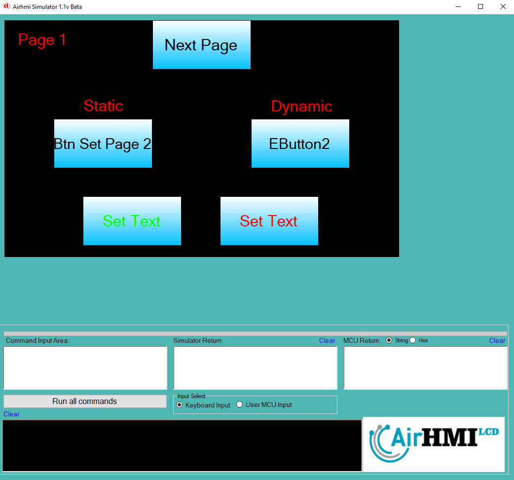
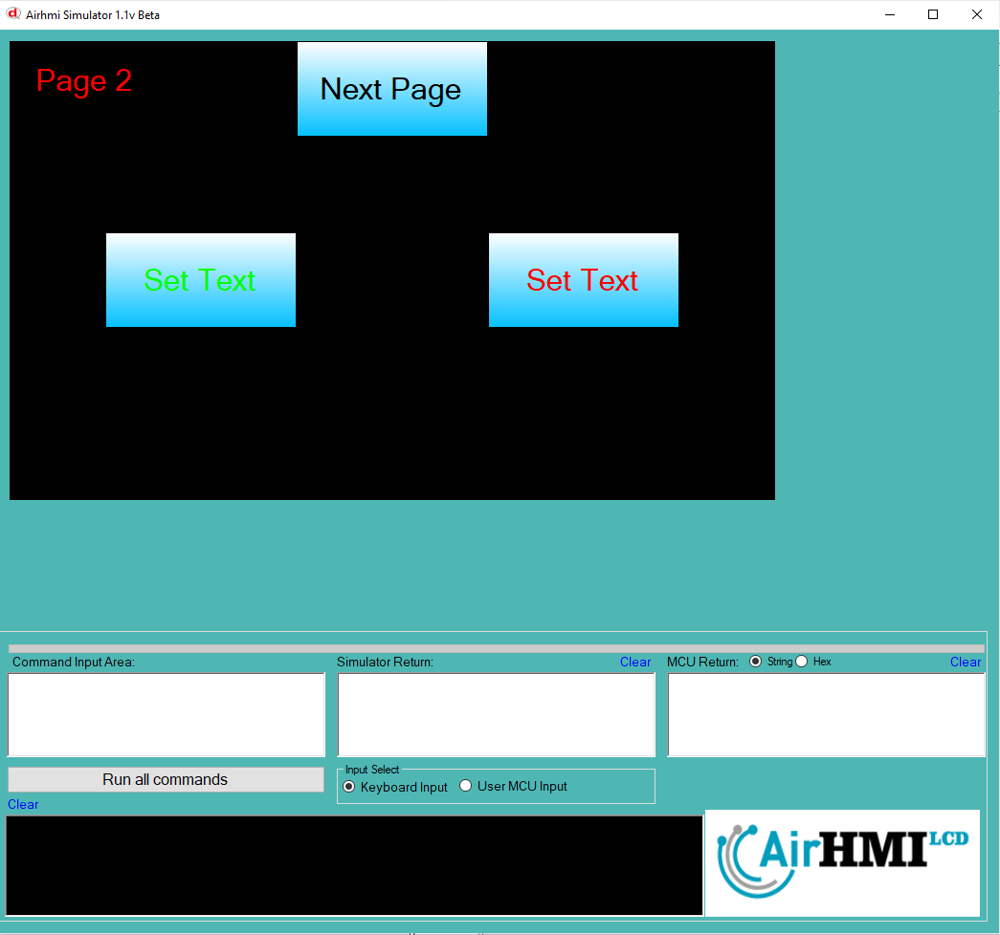

# Buton Text Olasılıkları

Bu dokümanda, statik ve dinamik olmak üzere iki farklı butonun Text özelliği üzerinde etkili olan faktörler incelenmiştir.
Statik butonlar her sayfadan tüm özelliklerine ulaşılıp değiştirilebilen butonlardır. Static(false) yani dinamik butonlar ise sayfaya özgüdür.
Sayfa değiştiği zaman hiçbir özelliği tutulmaz. Sayfa değişip tekrar aynı sayfaya gidildiği zaman buton ilk hali ile baştan meydana getirilir. 

## 📌 1. Butonların Tanımı
- **🟢 Statik Buton**: Static özelliği true olan butondur. Text (`Caption`) özelliği **hem aynı sayfadan hem de diğer sayfalardan** değiştirilebilir.
- **🔵 Dinamik Buton**: Statik özelliği false olan butondur. Text (`Caption`) özelliği **yalnızca aynı sayfada** değiştirilebilir, diğer sayfalardan değiştirilemez.

## 🔍 2. Buton Text Caption Değiştirme Durumları
### 🏠 Aynı Sayfada Olası Senaryolar
- Kullanıcı **statik butonun Text değerini** değiştirebilir.
- Kullanıcı **dinamik butonun Text değerini** değiştirebilir.

### 🔄 Farklı Sayfadan Olası Senaryolar
- Kullanıcı **statik butonun Text değerini** değiştirebilir.
- Kullanıcı **dinamik butonun Text değerini değiştiremez.**
- **Statik buton**, farklı sayfadan Text değerini değiştirirsek, aynı sayfaya dönüldüğünde **yeni değiştirilen text değeri gelir.**
- **Dinamik butonun Text değerini değiştirsek bile etki etmez.**

## 🎯 4. Sonuç
✔️ Aynı sayfada **her iki butonun Text değerini değiştirilebilir**.  
✔️ **Statik butonun Text değerini** diğer sayfalardan değiştirilebilir.  
✔️ **Dinamik butonun Text değerini** yalnızca oluşturulduğu sayfada değiştirilebilir.  

