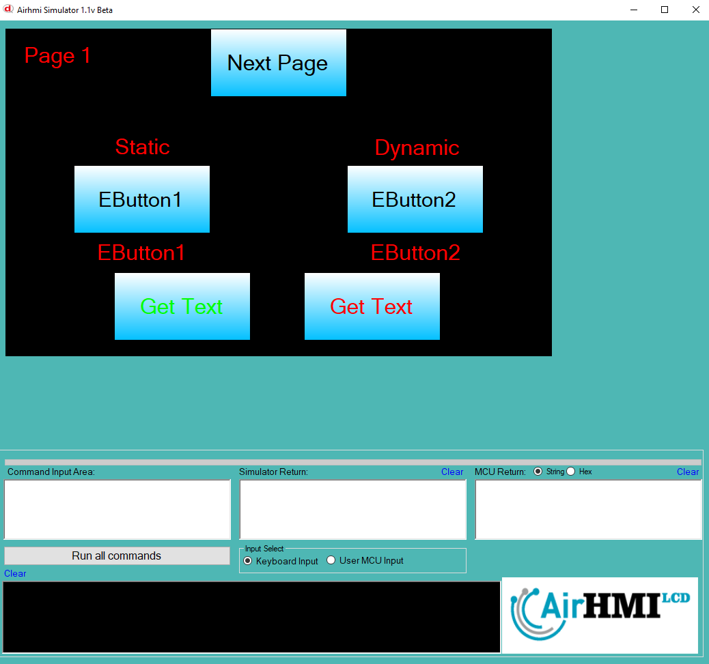
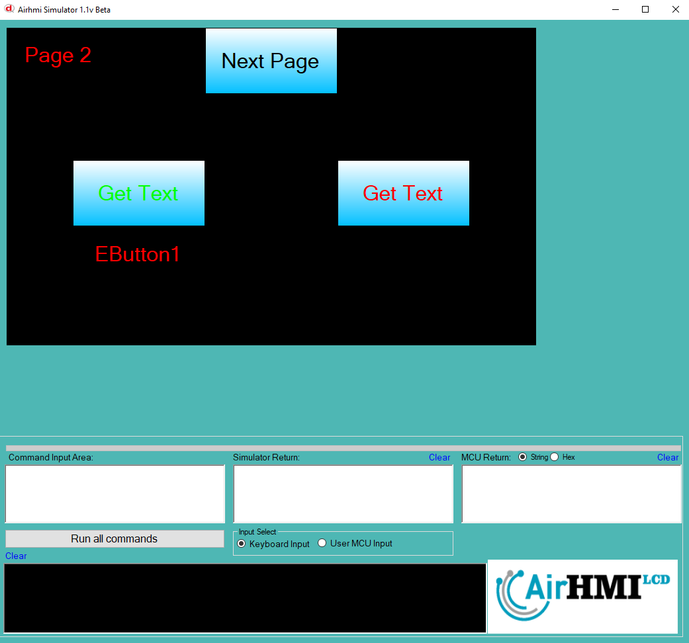

# Buton Text Değeri Alma

Bu dokümanda, statik ve dinamik olmak üzere iki farklı butonun Text özelliği üzerinde etkili olan faktörler incelenmiştir.
Statik butonlar her sayfadan tüm özelliklerine ulaşılıp değiştirilebilen butonlardır. Static(false) yani dinamik butonlar ise sayfaya özgüdür.
Sayfa değiştiği zaman hiçbir özelliği tutulmaz. Sayfa değişip tekrar aynı sayfaya gidildiği zaman buton ilk hali ile baştan meydana getirilir. 

## 📌 1. Butonların Tanımı
- **🟢 Statik Buton**: Static özelliği true olan butondur. Text (`Caption`) özelliği **hem aynı sayfadan hem de diğer sayfalardan** değeri okunabilir.
- **🔵 Dinamik Buton**: Statik özelliği false olan butondur. Text (`Caption`) özelliği **yalnızca aynı sayfada** değiştirilebilir, diğer sayfalardan değeri alınamaz.

## 🔍 2. Buton Text Caption Değiştirme Durumları
### 🏠 Aynı Sayfada Olası Senaryolar
- Kullanıcı **statik butonun Text değerini** alabilir.
- Kullanıcı **dinamik butonun Text değerini** alabilir.

### 🔄 Farklı Sayfadan Olası Senaryolar
- Kullanıcı **statik butonun Text değerini** alabilir.
- Kullanıcı **dinamik butonun Text değerini alamaz.**

## 🎯 4. Sonuç
✔️ Aynı sayfada **her iki butonun Text değerini alabiliriz**.  
✔️ **Statik butonun Text değerini** diğer sayfalardan okuyabiliriz.  
✔️ **Dinamik butonun Text değerini** yalnızca oluşturulduğu sayfada değeri okunabilir.  

