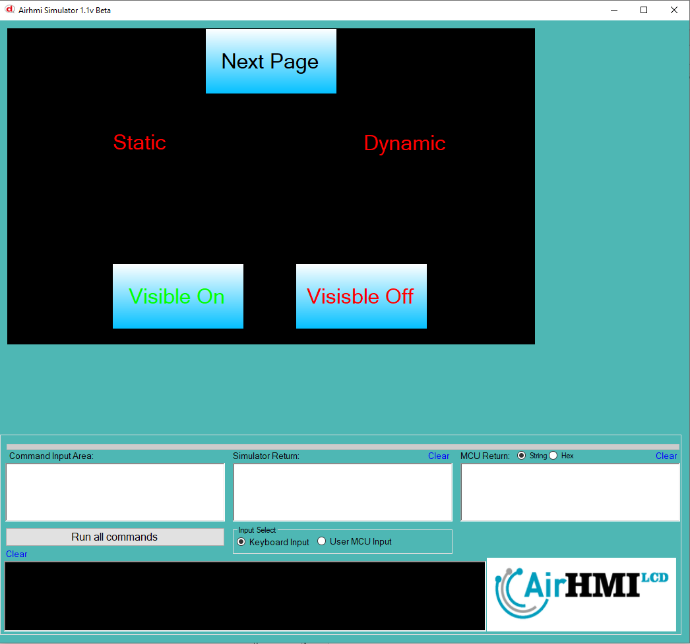

# Buton Görünürlük Olasılıkları

Bu dokümanda, statik ve dinamik olmak üzere iki farklı butonun görünürlük durumları üzerinde etkili olan faktörler incelenmiştir.
Statik butonlar her sayfadan tüm özelliklerine ulaşılıp değiştirilebilen butonlardır. Static(false) yani dinamik butonlar ise sayfaya özgüdür.
Sayfa değiştiği zaman hiçbir özelliği tutulmaz. Sayfa değişip tekrar aynı sayfaya gidildiği zaman buton ilk hali ile baştan meydana getirilir. 

## 📌 1. Butonların Tanımı
- **🟢 Statik Buton**: Static özelliği true olan butondur. Görünürlük (`Visible`) özelliği **hem aynı sayfadan hem de diğer sayfalardan** değiştirilebilir.
- **🔵 Dinamik Buton**: Statik özelliği false olan butondur. Görünürlük (`Visible`) özelliği **yalnızca aynı sayfada** değiştirilebilir, diğer sayfalardan değiştirilemez.

## 🔍 2. Buton Görünürlük Durumları
### 🏠 Aynı Sayfada Olası Senaryolar
- Kullanıcı **statik butonun görünürlüğünü** `true` veya `false` yapabilir.
- Kullanıcı **dinamik butonun görünürlüğünü** `true` veya `false` yapabilir.
- **Her iki buton da görünür olabilir.**
- **Her iki buton da gizlenebilir.**

### 🔄 Farklı Sayfadan Olası Senaryolar
- Kullanıcı **statik butonun görünürlüğünü** `true` veya `false` yapabilir.
- Kullanıcı **dinamik butonun görünürlüğünü değiştiremez.**
- **Statik buton**, farklı sayfadan gizlenirse, aynı sayfaya dönüldüğünde **görünmez** olur.
- **Dinamik butonun görünürlük durumu korunur.**

## 📊 3. Olasılıklar Tablosu

| Senaryo | Statik Buton (Visible) | Dinamik Buton (Visible) | Açıklama |
|---------|------------------------|------------------------|-----------|
| ✅ 1 | `true`  | `true`  | Her iki buton da görünür. |
| ✅ 2 | `true`  | `false` | Statik buton görünür, dinamik buton gizli. |
| ✅ 3 | `false` | `true`  | Statik buton gizli, dinamik buton görünür. |
| ✅ 4 | `false` | `false` | Her iki buton da gizli. |
| ✅ 5 | `false` (Dışarıdan değiştirildi) | `true` | Farklı sayfada statik buton kapatıldı, dinamik buton etkilenmedi. |
| ✅ 6 | `true`  | `true` (Dışarıdan değiştirilemedi) | Statik buton değiştirildi, dinamik buton aynı kaldı. |

## 🎯 4. Sonuç
✔️ Aynı sayfada **her iki butonun görünürlük durumu değiştirilebilir**.  
✔️ **Statik butonun görünürlüğü** diğer sayfalardan değiştirilebilir.  
✔️ **Dinamik butonun görünürlüğü** yalnızca oluşturulduğu sayfada değiştirilebilir.  

Bu bilgiler ışığında, **görünürlük değişikliklerinin beklenen sonuçları doğru şekilde ele alınmalıdır.** 🚀

