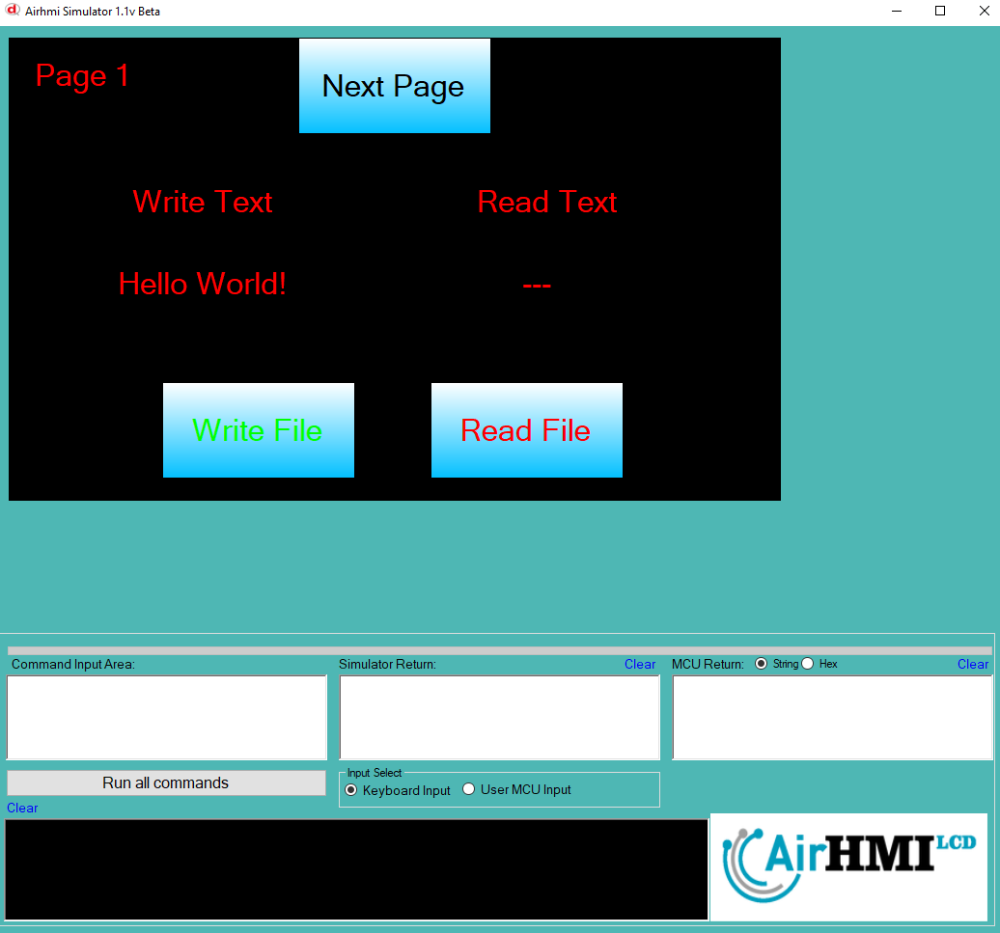
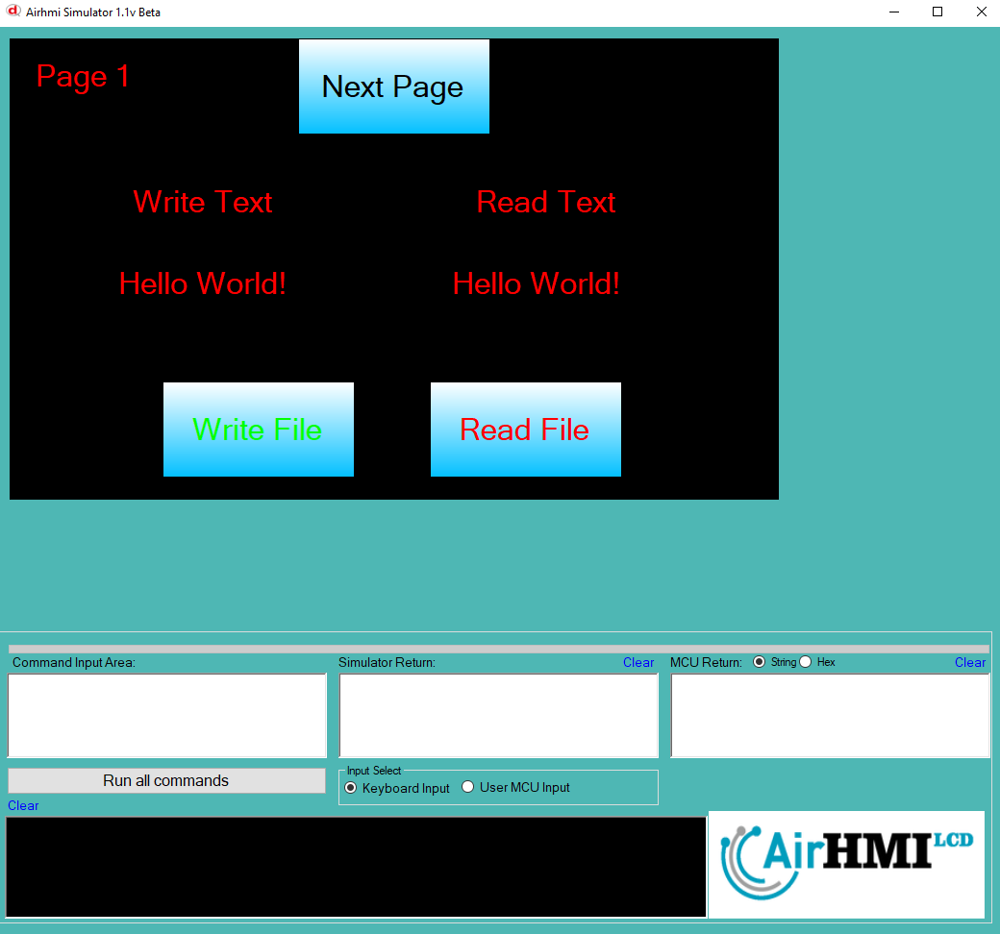

# File (Dosya) Yazma ve Okuma

Airhmi, dosya yazma ve okuma işlemlerini kendi üzerindeki dahili flash hafızasında gerçekleştirir.

Aşağıdaki örnekte, EFile1_fileName.txt adlı dosyaya başlangıçta "AIRHMI" ifadesini yazıyoruz.

## Program İlk Açılışta Görünümü
Uygulama ilk başlatıldığında, dosyanın içeriği henüz değiştirilmeyip varsayılan olarak belirlenen değer bulunmaktadır. Aşağıdaki görselde, programın açılış ekranı görülmektedir.

## Dosya Okuma İşlemi
Read File butonuna bastığımızda, dosyanın mevcut içeriği okunarak LabelBox içerisine yazdırılır. İlk başta, dosyada bulunan "AIRHMI" yazısı okunarak ekranda görüntülenir.

## Dosya Yazma ve Okuma İşlemi
File Write butonuna bastığımızda, LabelBox içerisinde bulunan "Hello World" ifadesi dosyaya yazılır. Ardından, File Read butonuna tekrar basarak dosyanın güncellenmiş içeriğini okuruz ve bu yeni değer LabelBox üzerinde görüntülenir.

