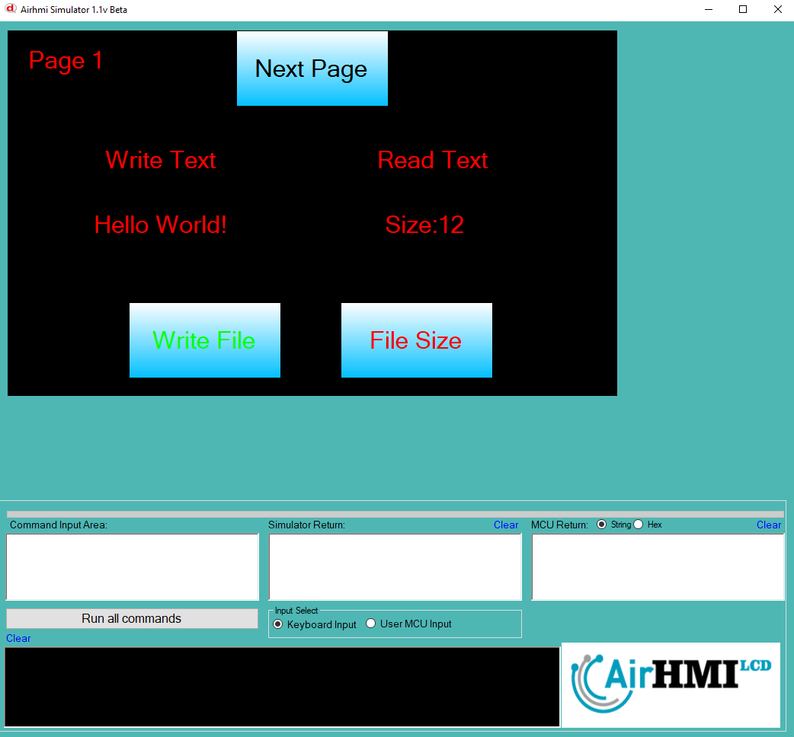

# File (Dosya) Boyutu Okuma

Airhmi, dosya yazma ve okuma işlemlerini kendi üzerindeki dahili flash hafızasında gerçekleştirir.

Aşağıdaki örnekte, EFile1_fileName.txt adlı dosyaya başlangıçta "AIRHMI" ifadesi vardır..

## Program İlk Açılışta Görünümü
Uygulama ilk başlatıldığında, dosyanın içeriği varsayılan olarak belirlenmiş veriyi içermektedir. Dosyanın boyutu, içerisindeki veri miktarına bağlı olarak belirlenir. Aşağıdaki görselde, programın açılış ekranı gösterilmektedir.

## Dosya Boyutu Okuma İşlemi
File Size butonuna bastığımızda, uygulama dosyanın mevcut boyutunu hesaplar ve bu değeri Label üzerinde gösterir. Dosyanın içeriği değişmedikçe, boyutu sabit kalacaktır.

## Dosya Yazma ve Boyutu Okuma İşlemi
File Write butonuna basarak dosyanın içeriğini değiştiriyoruz. Örneğin, "AIRHMI" yerine "Hello World" yazıldığında, dosyanın boyutu artacak veya azalacaktır.
Daha sonra, tekrar File Size butonuna basarak dosyanın yeni boyutunu okuyoruz. Yeni içerik yazıldığı için, dosya boyutunda bir değişiklik gözlemlenir.

