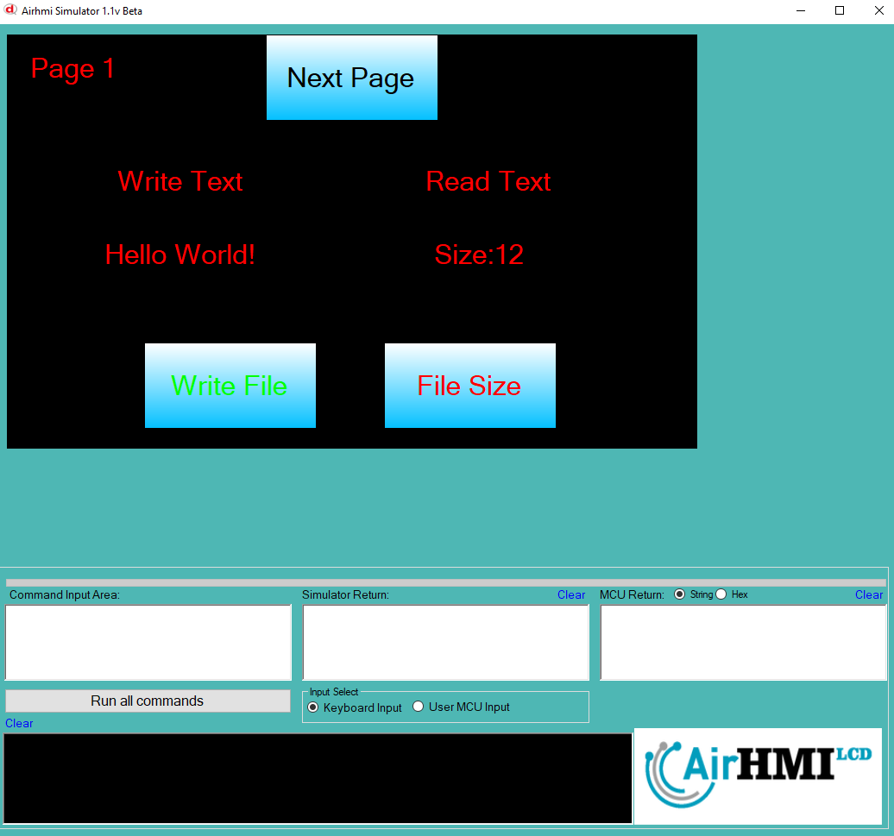

# SD Kart File (Dosya) Boyutu Okuma

Airhmi, SD karta dosya yazma ve okuma işlemlerini dahili flash hafızasında gerçekleştirir.

Simülatörde SD kart olarak **C:\Users\Public\airhmi\SD_CARD** dizini kullanılır. Bu dizine dosyaları manuel olarak da kopyalayabilir ve işlemlerinizi buradan gerçekleştirebilirsiniz.

## Program İlk Açılışta Görünümü
Aşağıdaki görselde, programın açılış ekranı gösterilmektedir.

## Dosya Yazma ve Boyutu Okuma İşlemi
File Write butonuna basarak dosyanın içeriğini değiştiriyoruz. Dosyaya "Hello World" yazılır.
File Size butonuna basarak dosyanın boyutunu okuyoruz.

