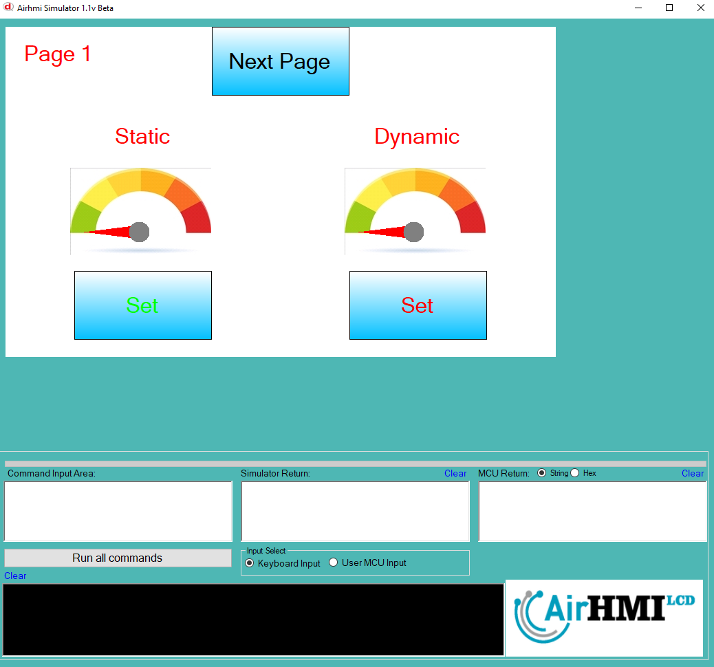
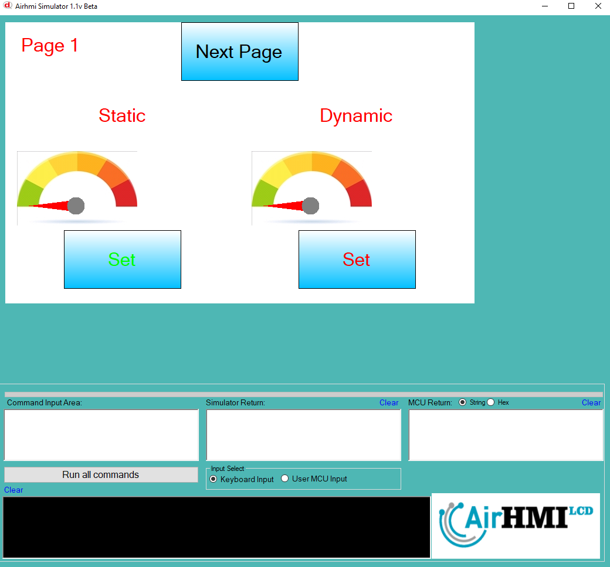
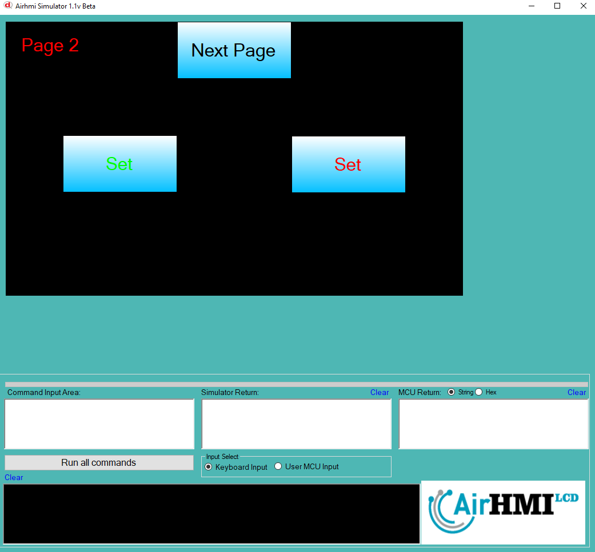
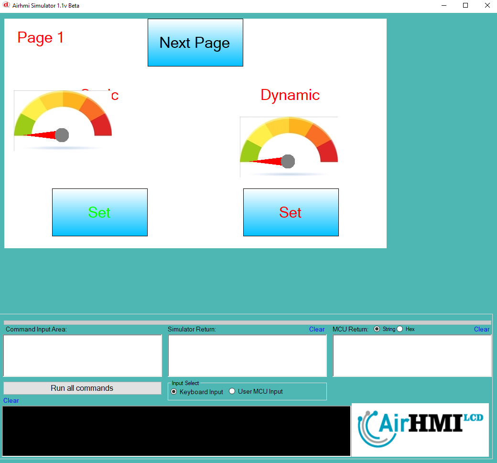

# Gauge Left Top Özelliği

Gauge ekran üzerindeki konumunu değiştirme işlemdir. 
Bu dokümanda, statik ve dinamik olmak üzere iki farklı Gauge Text özelliği üzerinde etkili olan faktörler incelenmiştir.
Statik Gaugelar her sayfadan tüm özelliklerine ulaşılıp değiştirilebilen Gaugelardır. Static(false) yani dinamik Gaugelar ise sayfaya özgüdür.
Sayfa değiştiği zaman hiçbir özelliği tutulmaz. Sayfa değişip tekrar aynı sayfaya gidildiği zaman Gauge ilk hali ile baştan meydana getirilir. 

## 📌 1. Gaugeların Tanımı
- **🟢 Statik Gauge**: Static özelliği true olan Gaugedur. Left ve Top özelliği **hem aynı sayfadan hem de diğer sayfalardan** değiştirilebilir.
- **🔵 Dinamik Gauge**: Statik özelliği false olan Gaugedur. Left ve Top özelliği **yalnızca aynı sayfada** değiştirilebilir, diğer sayfalardan değiştirilemez.

## 🔍 2. Gauge Left ve Top Değiştirme Durumları
### 🏠 Aynı Sayfada Olası Senaryolar
- Kullanıcı **statik Gauge Left ve Top değerini** değiştirebilir.
- Kullanıcı **dinamik Gauge Left ve Top değerini** değiştirebilir.

### 🔄 Farklı Sayfadan Olası Senaryolar
- Kullanıcı **statik Gauge Left ve Top değerini** değiştirebilir.
- Kullanıcı **dinamik Gauge Left ve Top değerini değiştiremez.**
- **Statik Gauge**, farklı sayfadan Left ve Top değerini değiştirirsek, aynı sayfaya dönüldüğünde **yeni konumu gelir.**
- **Dinamik Gauge Left ve Top değerini değiştirsek bile etki etmez.**

## 🎯 4. Sonuç
✔️ Aynı sayfada **her iki Gauge Left ve Top değerini değiştirilebilir**.  
✔️ **Statik Gauge Left ve Top değerini** diğer sayfalardan değiştirilebilir.  
✔️ **Dinamik Gauge Left ve Top değerini** yalnızca oluşturulduğu sayfada değiştirilebilir.  

