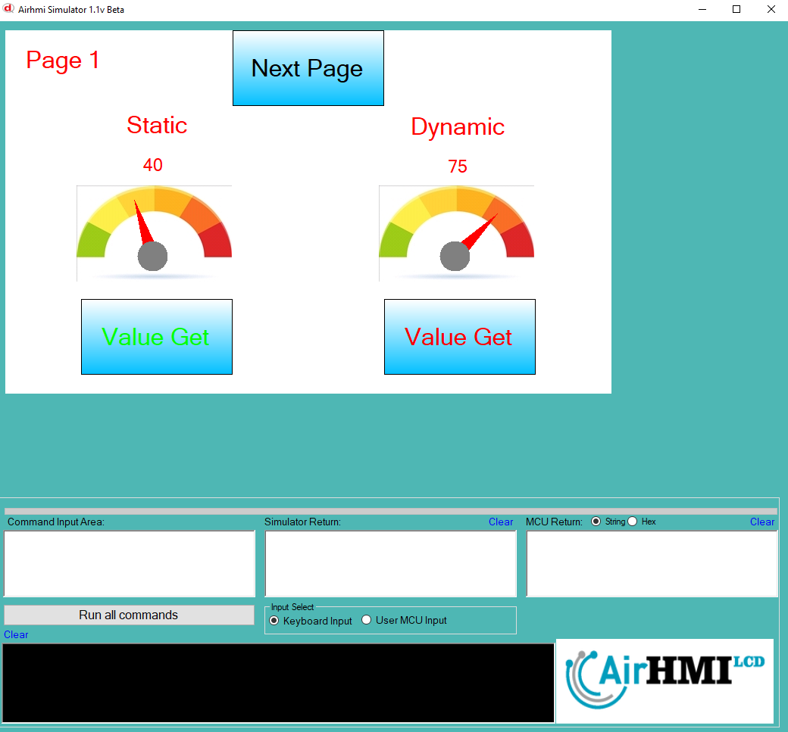
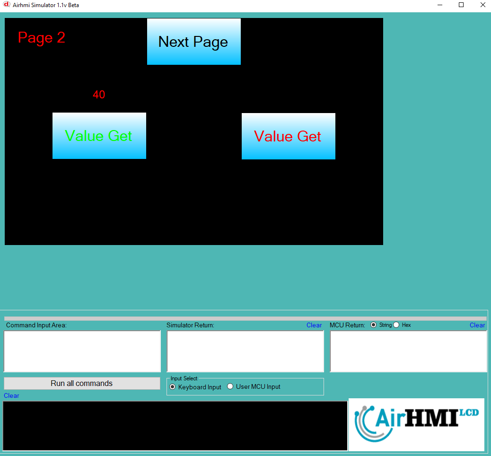

# Gauge Value Get Özelliği

Bu dokümanda, statik ve dinamik olmak üzere iki farklı Gauge Value Get durumları üzerinde etkili olan faktörler incelenmiştir.
Statik Gaugelar her sayfadan tüm özelliklerine ulaşılıp değiştirilebilen Gaugelardır. Static(false) yani dinamik Gauge'lar ise sayfaya özgüdür.
Sayfa değiştiği zaman hiçbir özelliği tutulmaz. Sayfa değişip tekrar aynı sayfaya gidildiği zaman Gauge ilk hali ile baştan meydana getirilir. 

## 📌 1. Gaugeların Tanımı
- **🟢 Statik Gauge**: Static özelliği true olan Gauge'dur.. Value Get  özelliği **hem aynı sayfadan hem de diğer sayfalardan** alınabilinir.
- **🔵 Dinamik Gauge**: Statik özelliği false olan Gauge'dur.. Value Get özelliği **yalnızca aynı sayfada** alınabilinir, diğer sayfalardan alınamaz.

## 🔍 2. Gauge Value Get Durumları
### 🏠 Aynı Sayfada Olası Senaryolar
- Kullanıcı **statik Gauge Value Get**  alınabilinir.
- Kullanıcı **dinamik Gauge Value Get**  alınabilinir.

### 🔄 Farklı Sayfadan Olası Senaryolar
- Kullanıcı **statik Gauge Value Get**  yapabilir.
- Kullanıcı **dinamik Gauge Value Get ile alınamaz.**

## 🎯 4. Sonuç
✔️ Aynı sayfada **her iki Gauge Value Get durumu alınabilinir**.  
✔️ **Statik Gauge Value Get** diğer sayfalardan alınabilinir.  
✔️ **Dinamik Gauge Value Get** yalnızca oluşturulduğu sayfada alınabilinir.  

Bu bilgiler ışığında, **Value Get değişikliklerinin beklenen sonuçları doğru şekilde ele alınmalıdır.** 🚀

## Program İlk Açılış Görüntüsü

## Her iki Gauge un da Velue Değeri alınıyor.

## Sonraki Sayfaya geçiyoruz. Gauge velue değerini alıyoruz. Statik olan gauge nin değerini alabiliyoruz. Dinamik olan gauge un değerini alamıyoruz.

