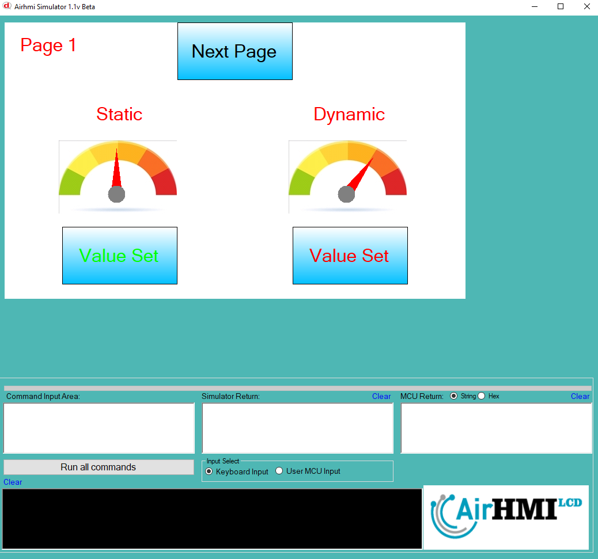
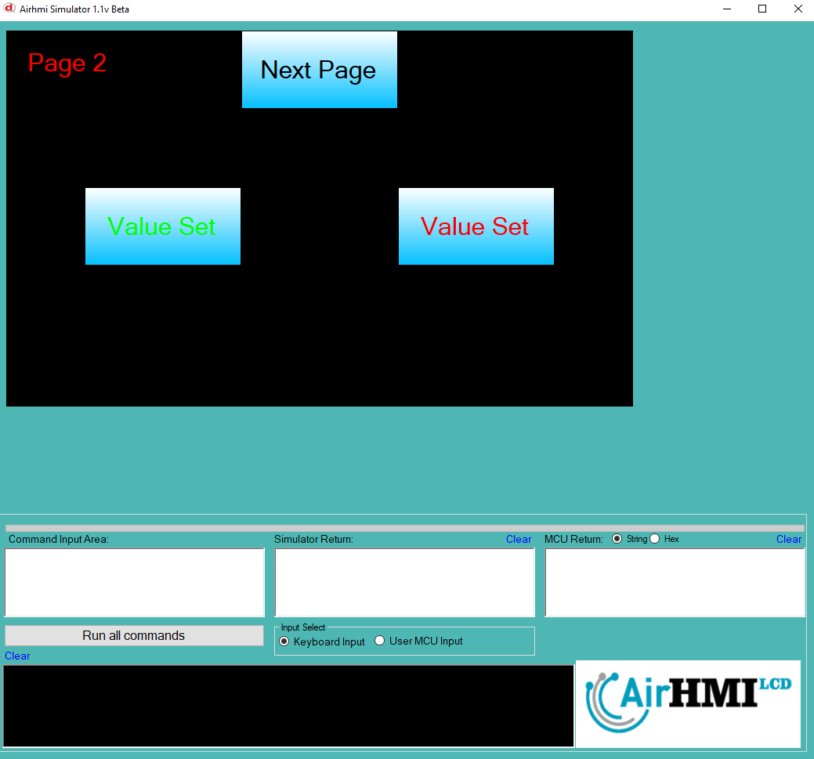
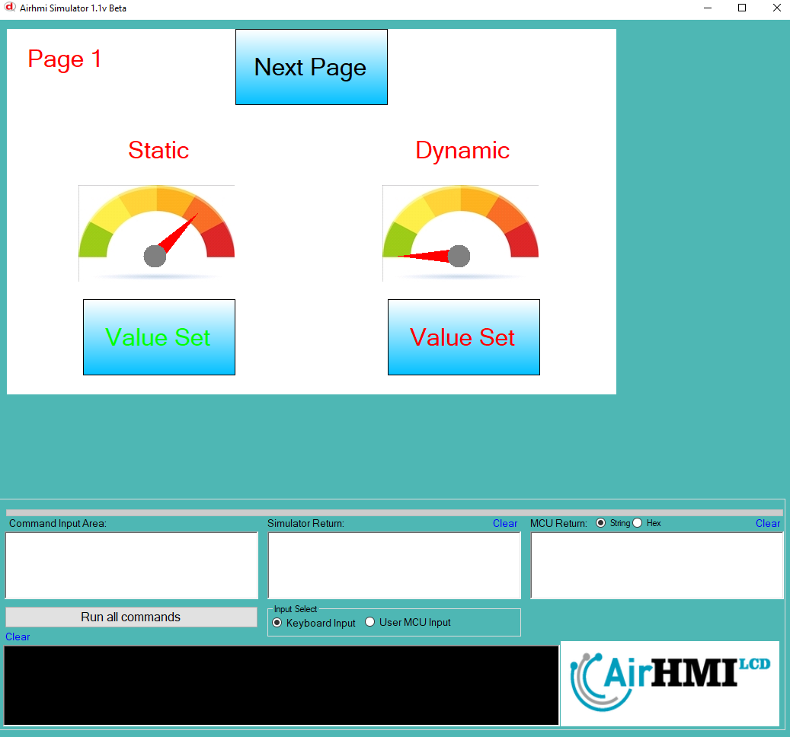

# Gauge Value Set Özelliği

Bu dokümanda, statik ve dinamik olmak üzere iki farklı Gauge Value Set durumları üzerinde etkili olan faktörler incelenmiştir.
Statik Gaugelar her sayfadan tüm özelliklerine ulaşılıp değiştirilebilen Gaugelardır. Static(false) yani dinamik Gauge'lar ise sayfaya özgüdür.
Sayfa değiştiği zaman hiçbir özelliği tutulmaz. Sayfa değişip tekrar aynı sayfaya gidildiği zaman Gauge ilk hali ile baştan meydana getirilir. 

## 📌 1. Gaugeların Tanımı
- **🟢 Statik Gauge**: Static özelliği true olan Gauge'dur.. Value Set  özelliği **hem aynı sayfadan hem de diğer sayfalardan** değiştirilebilir.
- **🔵 Dinamik Gauge**: Statik özelliği false olan Gauge'dur.. Value Set özelliği **yalnızca aynı sayfada** değiştirilebilir, diğer sayfalardan değiştirilemez.

## 🔍 2. Gauge Value Set Durumları
### 🏠 Aynı Sayfada Olası Senaryolar
- Kullanıcı **statik Gauge Value Set**  yapabilir.
- Kullanıcı **dinamik Gauge Value Set**  yapabilir.

### 🔄 Farklı Sayfadan Olası Senaryolar
- Kullanıcı **statik Gauge Value Set**  yapabilir.
- Kullanıcı **dinamik Gauge Value Set ile değiştiremez.**

## 🎯 4. Sonuç
✔️ Aynı sayfada **her iki Gauge Value Set durumu değiştirilebilir**.  
✔️ **Statik Gauge Value Set** diğer sayfalardan değiştirilebilir.  
✔️ **Dinamik Gauge Value Set** yalnızca oluşturulduğu sayfada değiştirilebilir.  

Bu bilgiler ışığında, **Value Set değişikliklerinin beklenen sonuçları doğru şekilde ele alınmalıdır.** 🚀

## Program İlk Açılış Görüntüsü

## Her iki Gauge un da Velue Değeri değiştiriliyor.

## Sonraki Sayfaya geçiyoruz. Gauge velue değerini değiştiriyoruz.

## Birinci sayfaya tekrar dönüyoruz. 1.Statik olan gauge un değeri değişmiştir. , Dinamik olan ilk değerini alır. 

