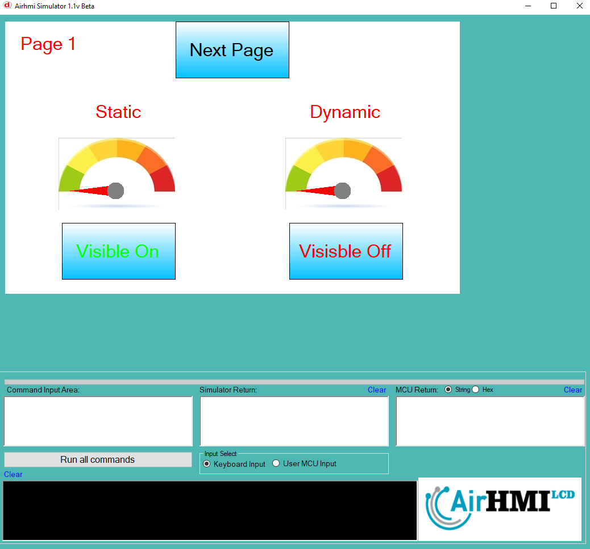
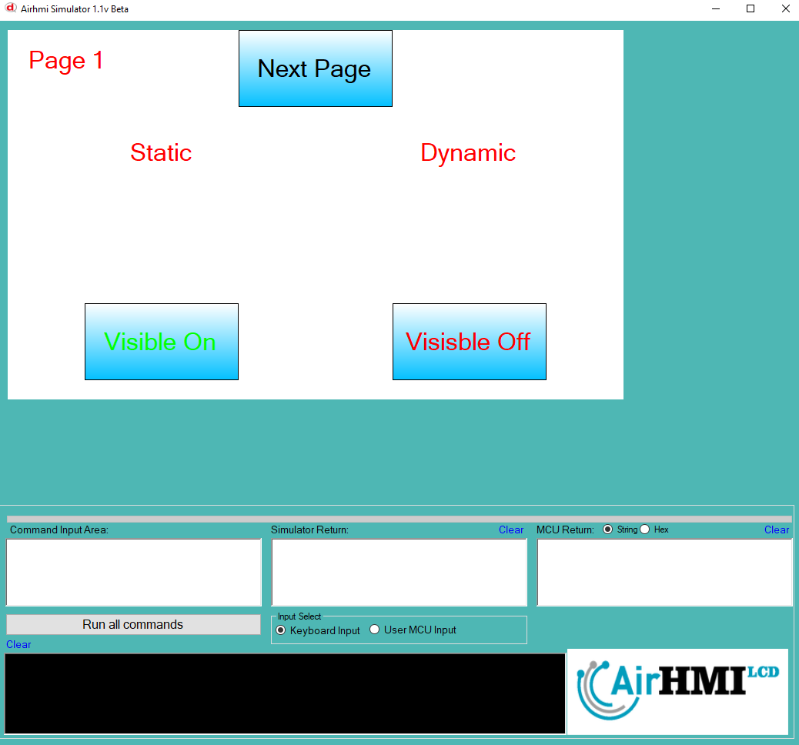
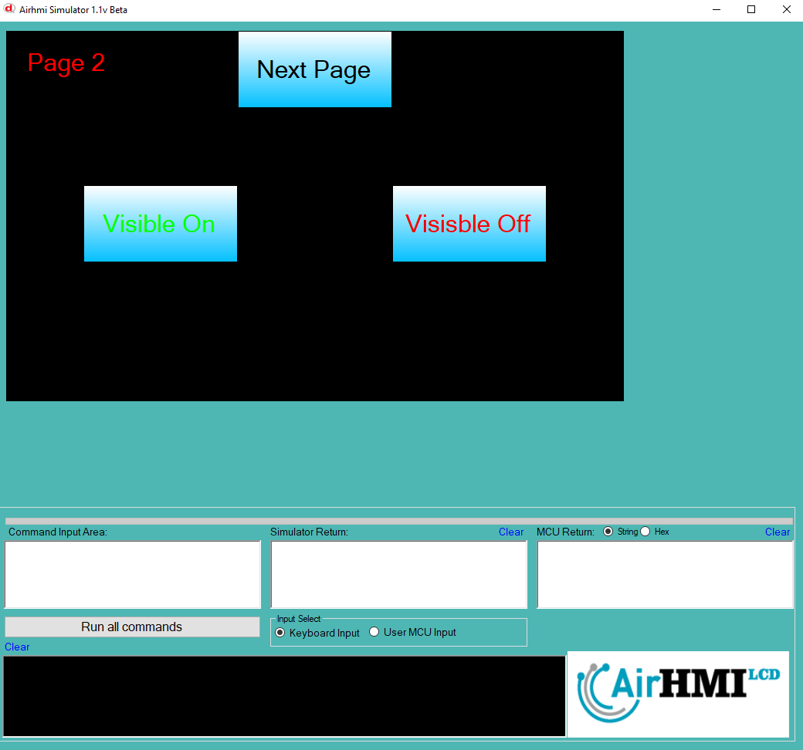
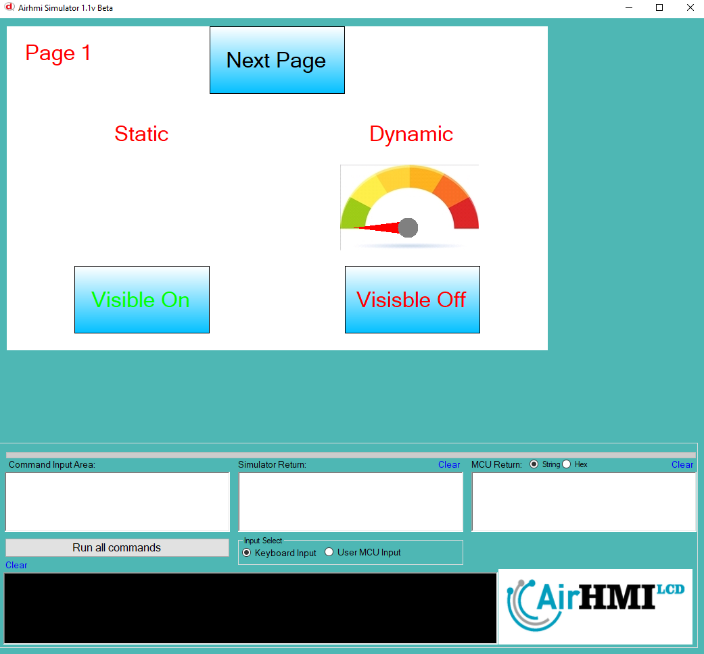

# Gauge Görünürlük Özelliği

Bu dokümanda, statik ve dinamik olmak üzere iki farklı Gauge görünürlük durumları üzerinde etkili olan faktörler incelenmiştir.
Statik Gaugelar her sayfadan tüm özelliklerine ulaşılıp değiştirilebilen Gaugelardır. Static(false) yani dinamik Gaugelar ise sayfaya özgüdür.
Sayfa değiştiği zaman hiçbir özelliği tutulmaz. Sayfa değişip tekrar aynı sayfaya gidildiği zaman Gauge ilk hali ile baştan meydana getirilir. 

## 📌 1. Gaugeların Tanımı
- **🟢 Statik Gauge**: Static özelliği true olan Gaugedur. Görünürlük (`Visible`) özelliği **hem aynı sayfadan hem de diğer sayfalardan** değiştirilebilir.
- **🔵 Dinamik Gauge**: Statik özelliği false olan Gaugedur. Görünürlük (`Visible`) özelliği **yalnızca aynı sayfada** değiştirilebilir, diğer sayfalardan değiştirilemez.

## 🔍 2. Gauge Görünürlük Durumları
### 🏠 Aynı Sayfada Olası Senaryolar
- Kullanıcı **statik Gauge görünürlüğünü** `true` veya `false` yapabilir.
- Kullanıcı **dinamik Gauge görünürlüğünü** `true` veya `false` yapabilir.
- **Her iki Gauge da görünür olabilir.**
- **Her iki Gauge da gizlenebilir.**

### 🔄 Farklı Sayfadan Olası Senaryolar
- Kullanıcı **statik Gauge görünürlüğünü** `true` veya `false` yapabilir.
- Kullanıcı **dinamik Gauge görünürlüğünü değiştiremez.**
- **Statik Gauge**, farklı sayfadan gizlenirse, aynı sayfaya dönüldüğünde **görünmez** olur.
- **Dinamik Gauge görünürlük durumu korunur.**

## 📊 3. Olasılıklar Tablosu

| Senaryo | Statik Gauge (Visible) | Dinamik Gauge (Visible) | Açıklama |
|---------|------------------------|------------------------|-----------|
| ✅ 1 | `true`  | `true`  | Her iki Gauge da görünür. |
| ✅ 2 | `true`  | `false` | Statik Gauge görünür, dinamik Gauge gizli. |
| ✅ 3 | `false` | `true`  | Statik Gauge gizli, dinamik Gauge görünür. |
| ✅ 4 | `false` | `false` | Her iki Gauge da gizli. |
| ✅ 5 | `false` (Dışarıdan değiştirildi) | `true` | Farklı sayfada statik Gauge kapatıldı, dinamik Gauge etkilenmedi. |
| ✅ 6 | `true`  | `true` (Dışarıdan değiştirilemedi) | Statik Gauge değiştirildi, dinamik Gauge aynı kaldı. |

## 🎯 4. Sonuç
✔️ Aynı sayfada **her iki Gauge görünürlük durumu değiştirilebilir**.  
✔️ **Statik Gauge görünürlüğü** diğer sayfalardan değiştirilebilir.  
✔️ **Dinamik Gauge görünürlüğü** yalnızca oluşturulduğu sayfada değiştirilebilir.  

Bu bilgiler ışığında, **görünürlük değişikliklerinin beklenen sonuçları doğru şekilde ele alınmalıdır.** 🚀

## Program İlk Açılış Görüntüsü

## Herki Gauge un da visible i false yaplıyor.

## Sonraki Sayfaya geçiyoruz. Gauge visible false yapılyoruz.

## Birinci sayfaya tekrar dönüyoruz. 1.Statik olan gauge Visible off , Dinamik olan On olarak geliyor. 

