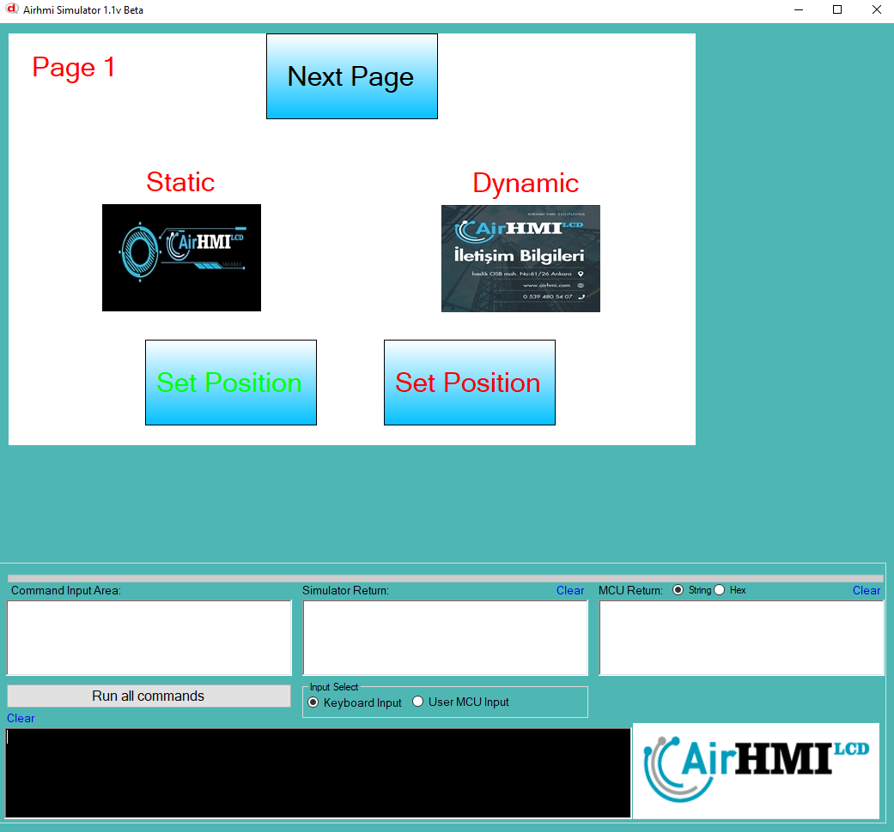
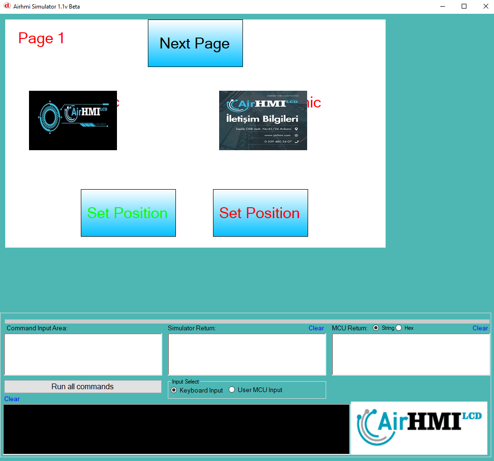
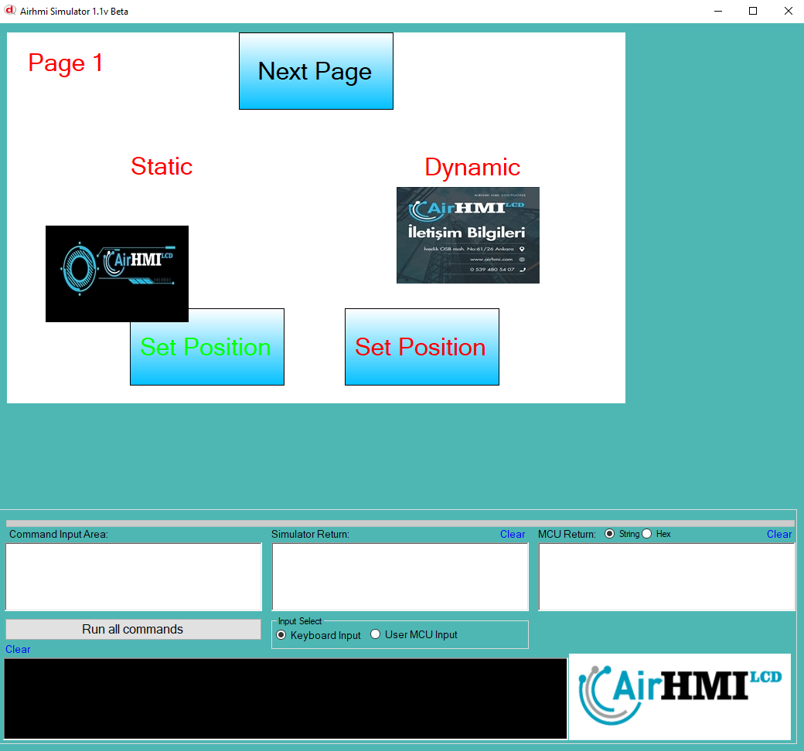

# Image Left Top Olasılıkları

Image nesnesinin ekran üzerindeki konumunu değiştirme işlemdir. 
Bu dokümanda, statik ve dinamik olmak üzere iki farklı Image Text özelliği üzerinde etkili olan faktörler incelenmiştir.
Statik Imagelar her sayfadan tüm özelliklerine ulaşılıp değiştirilebilen Imagelardır. Static(false) yani dinamik Imagelar ise sayfaya özgüdür.
Sayfa değiştiği zaman hiçbir özelliği tutulmaz. Sayfa değişip tekrar aynı sayfaya gidildiği zaman Image ilk hali ile baştan meydana getirilir. 

## 📌 1. Image nesnesinin Tanımı
- **🟢 Statik Image**: Static özelliği true olan Imagedur. Left ve Top özelliği **hem aynı sayfadan hem de diğer sayfalardan** değiştirilebilir.
- **🔵 Dinamik Image**: Statik özelliği false olan Imagedur. Left ve Top özelliği **yalnızca aynı sayfada** değiştirilebilir, diğer sayfalardan değiştirilemez.

## 🔍 2. Image Left ve Top Değiştirme Durumları
### 🏠 Aynı Sayfada Olası Senaryolar
- Kullanıcı **statik Image Left ve Top değerini** değiştirebilir.
- Kullanıcı **dinamik Image Left ve Top değerini** değiştirebilir.

### 🔄 Farklı Sayfadan Olası Senaryolar
- Kullanıcı **statik Image Left ve Top değerini** değiştirebilir.
- Kullanıcı **dinamik Image Left ve Top değerini değiştiremez.**
- **Statik Image**, farklı sayfadan Left ve Top değerini değiştirirsek, aynı sayfaya dönüldüğünde **yeni değiştirilen text değeri gelir.**
- **Dinamik Image Left ve Top değerini değiştirsek bile etki etmez.**

## 🎯 4. Sonuç
✔️ Aynı sayfada **her iki Image Left ve Top değerini değiştirilebilir**.  
✔️ **Statik Image Left ve Top değerini** diğer sayfalardan değiştirilebilir.  
✔️ **Dinamik Image Left ve Top değerini** yalnızca oluşturulduğu sayfada değiştirilebilir.  

