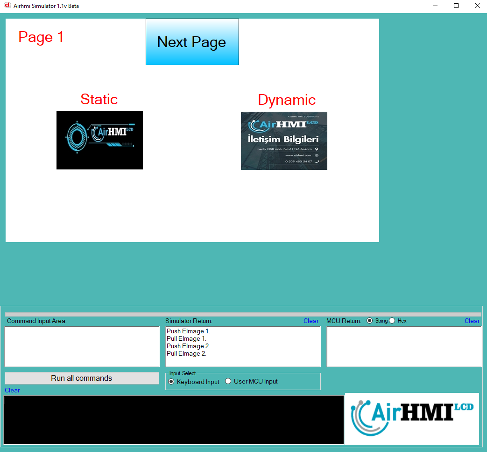
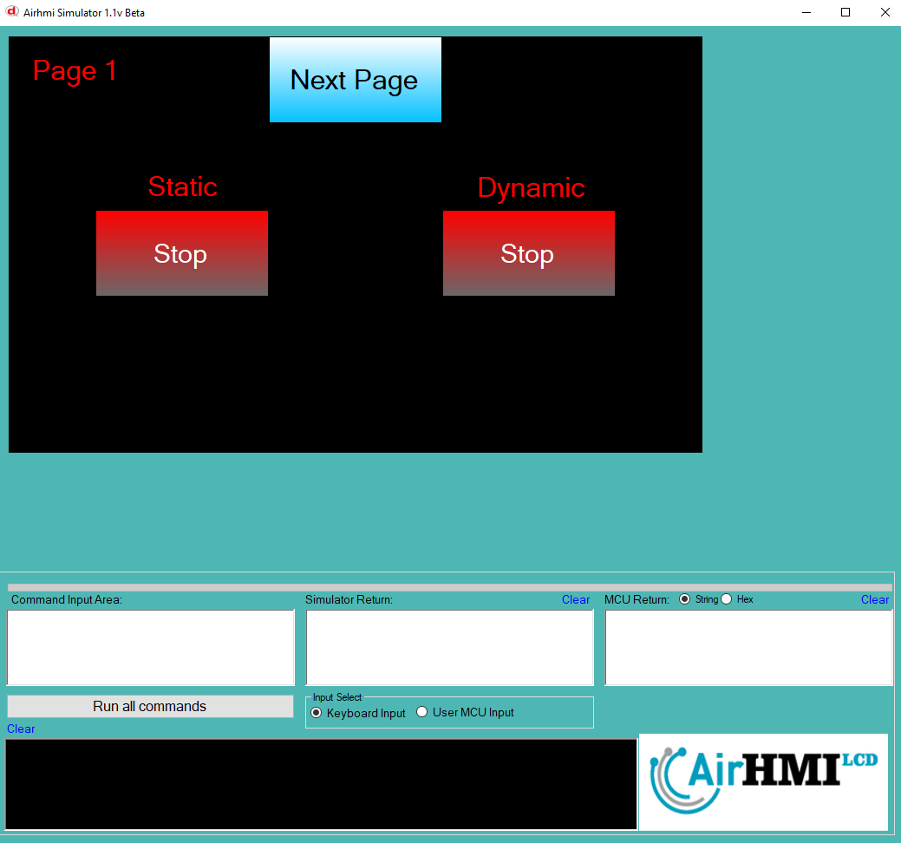
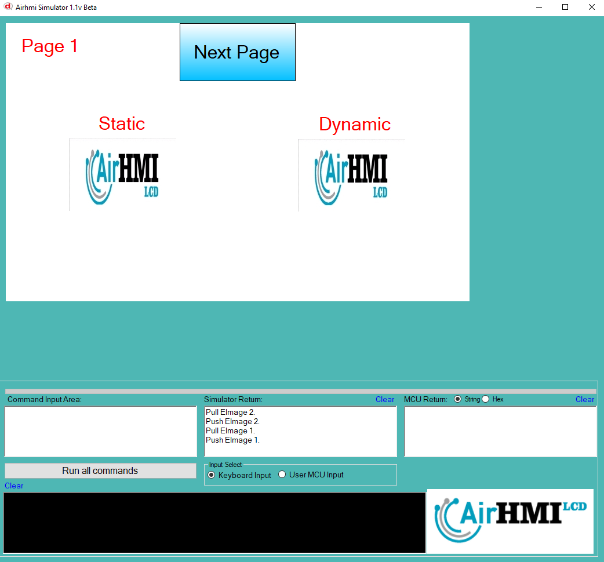

# Image PushPull Özelliği

Elektronik ve mekanik sistemlerde push-pull özelliği, bir butonun veya anahtarın iki yönlü çalışma prensibini ifade eder.
Bu özellik, genellikle butonların veya anahtarların iki farklı durumu arasında geçiş yapmasını sağlar.

Imageda PushPull özellği true ise, bir kez basıldığında onDown çalışır. Sonraki basıldığında ise onUp kodu çalışır. Bu sayede Image switch gibi kullanılır.

Bu dokümanda, statik ve dinamik olmak üzere iki farklı Image pushpull özelliği üzerinde etkili olan faktörler incelenmiştir.
Statik Imagelar her sayfadan tüm özelliklerine ulaşılıp değiştirilebilen Imagelardır. Static(false) yani dinamik Imagelar ise sayfaya özgüdür.
Sayfa değiştiği zaman hiçbir özelliği tutulmaz. Sayfa değişip tekrar aynı sayfaya gidildiği zaman Image ilk hali ile baştan meydana getirilir. 

## 📌 1. Imageların Tanımı
- **🟢 Statik Image**: Static özelliği true olan Imagedur. pushpull özelliği **hem aynı sayfadan hem de diğer sayfalardan** değiştirilebilir.
- **🔵 Dinamik Image**: Statik özelliği false olan Imagedur. pushpull  özelliği **yalnızca aynı sayfada** değiştirilebilir, diğer sayfalardan değiştirilemez.

## 🔍 2. Image pushpull Değiştirme Durumları
### 🏠 Aynı Sayfada Olası Senaryolar
- Kullanıcı **statik Image pushpull değerini** değiştirebilir.
- Kullanıcı **dinamik Image pushpull değerini** değiştirebilir.

### 🔄 Farklı Sayfadan Olası Senaryolar
- Kullanıcı **statik Image pushpull değerini** değiştirebilir.
- Kullanıcı **dinamik Image pushpull değerini değiştiremez.**
- **Statik Image**, farklı sayfadan pushpull değerini değiştirirsek, aynı sayfaya dönüldüğünde **yeni değiştirilen pushpull değeri gelir.**
- **Dinamik Image pushpull değerini değiştirsek bile etki etmez.**

## 🎯 4. Sonuç
✔️ Aynı sayfada **her iki Image pushpull değerini değiştirilebilir**.  
✔️ **Statik Image pushpull değerini** diğer sayfalardan değiştirilebilir.  
✔️ **Dinamik Image pushpull değerini** yalnızca oluşturulduğu sayfada değiştirilebilir.  

