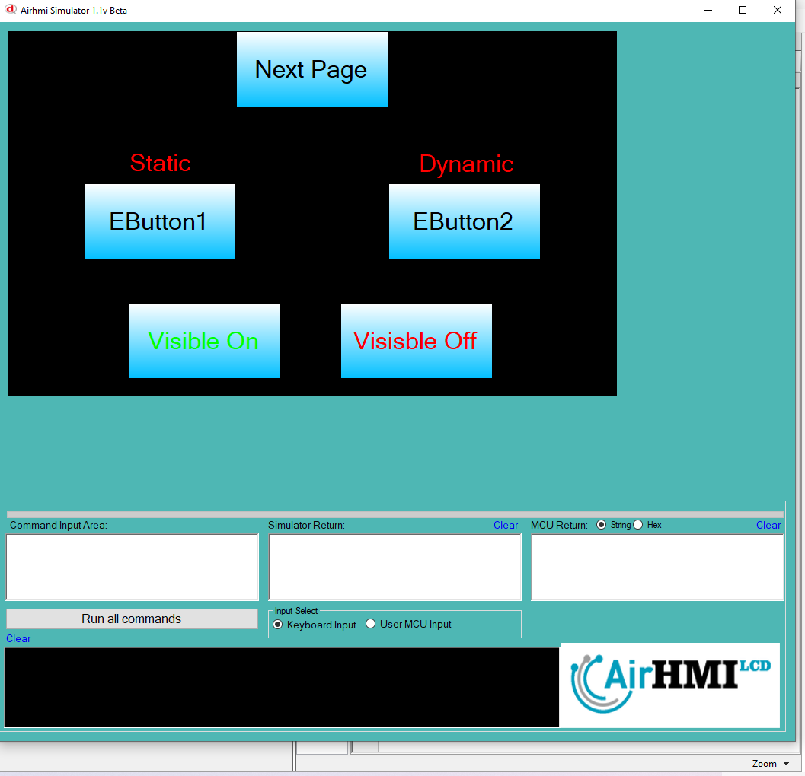
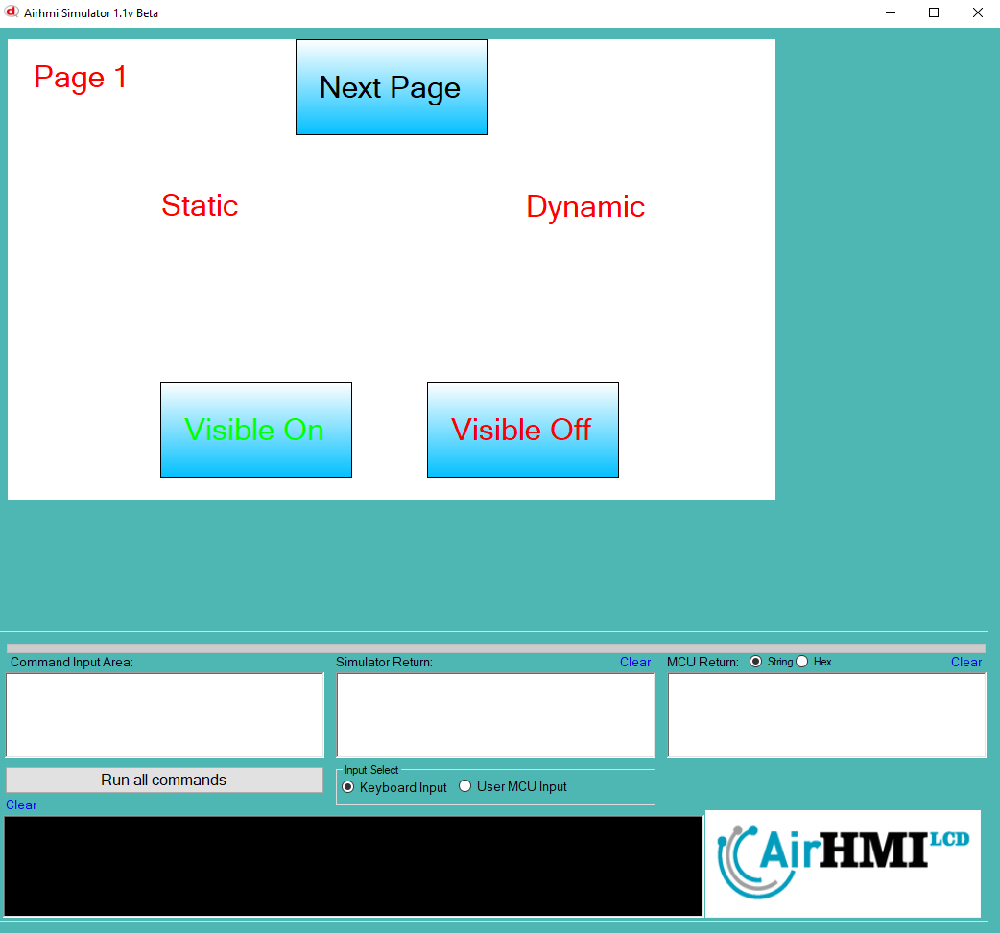
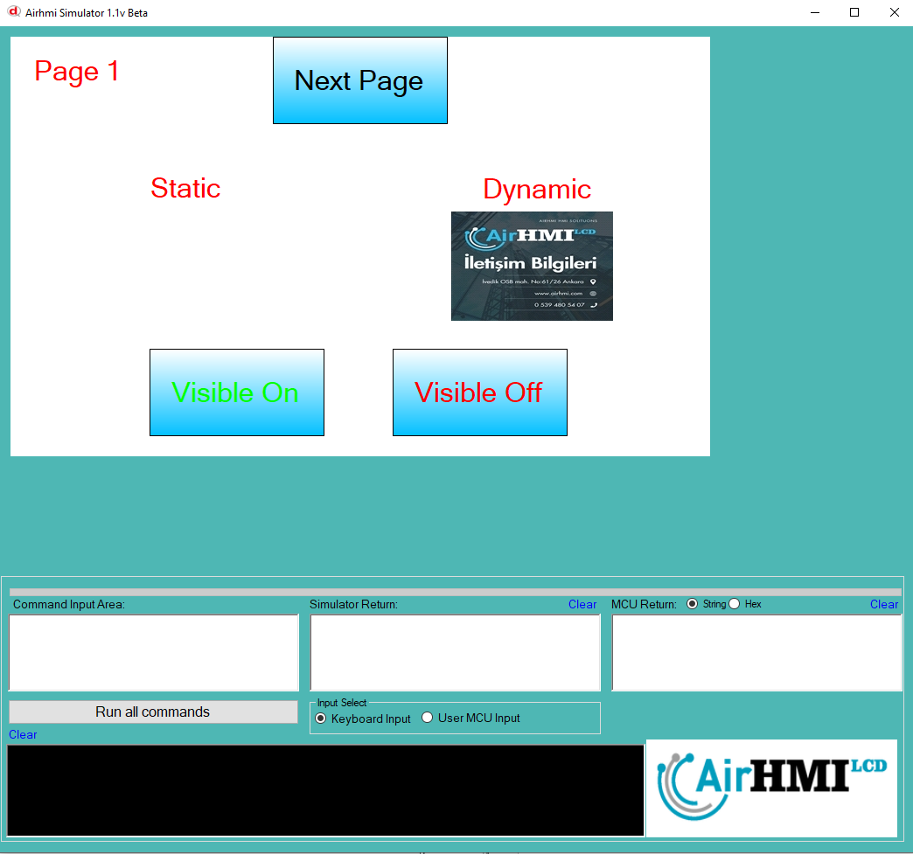

# Image Görünürlük Olasılıkları

Bu dokümanda, statik ve dinamik olmak üzere iki farklı Image görünürlük durumları üzerinde etkili olan faktörler incelenmiştir.
Statik Imagelar her sayfadan tüm özelliklerine ulaşılıp değiştirilebilen Imagelardır. Static(false) yani dinamik Imagelar ise sayfaya özgüdür.
Sayfa değiştiği zaman hiçbir özelliği tutulmaz. Sayfa değişip tekrar aynı sayfaya gidildiği zaman Image ilk hali ile baştan meydana getirilir. 

## 📌 1. Imageların Tanımı
- **🟢 Statik Image**: Static özelliği true olan Imagedur. Görünürlük (`Visible`) özelliği **hem aynı sayfadan hem de diğer sayfalardan** değiştirilebilir.
- **🔵 Dinamik Image**: Statik özelliği false olan Imagedur. Görünürlük (`Visible`) özelliği **yalnızca aynı sayfada** değiştirilebilir, diğer sayfalardan değiştirilemez.

## 🔍 2. Image Görünürlük Durumları
### 🏠 Aynı Sayfada Olası Senaryolar
- Kullanıcı **statik Image görünürlüğünü** `true` veya `false` yapabilir.
- Kullanıcı **dinamik Image görünürlüğünü** `true` veya `false` yapabilir.
- **Her iki Image da görünür olabilir.**
- **Her iki Image da gizlenebilir.**

### 🔄 Farklı Sayfadan Olası Senaryolar
- Kullanıcı **statik Image görünürlüğünü** `true` veya `false` yapabilir.
- Kullanıcı **dinamik Image görünürlüğünü değiştiremez.**
- **Statik Image**, farklı sayfadan gizlenirse, aynı sayfaya dönüldüğünde **görünmez** olur.
- **Dinamik Image görünürlük durumu korunur.**

## 📊 3. Olasılıklar Tablosu

| Senaryo | Statik Image (Visible) | Dinamik Image (Visible) | Açıklama |
|---------|------------------------|------------------------|-----------|
| ✅ 1 | `true`  | `true`  | Her iki Image da görünür. |
| ✅ 2 | `true`  | `false` | Statik Image görünür, dinamik Image gizli. |
| ✅ 3 | `false` | `true`  | Statik Image gizli, dinamik Image görünür. |
| ✅ 4 | `false` | `false` | Her iki Image da gizli. |
| ✅ 5 | `false` (Dışarıdan değiştirildi) | `true` | Farklı sayfada statik Image kapatıldı, dinamik Image etkilenmedi. |
| ✅ 6 | `true`  | `true` (Dışarıdan değiştirilemedi) | Statik Image değiştirildi, dinamik Image aynı kaldı. |

## 🎯 4. Sonuç
✔️ Aynı sayfada **her iki Image görünürlük durumu değiştirilebilir**.  
✔️ **Statik Image görünürlüğü** diğer sayfalardan değiştirilebilir.  
✔️ **Dinamik Image görünürlüğü** yalnızca oluşturulduğu sayfada değiştirilebilir.  

Bu bilgiler ışığında, **görünürlük değişikliklerinin beklenen sonuçları doğru şekilde ele alınmalıdır.** 🚀

