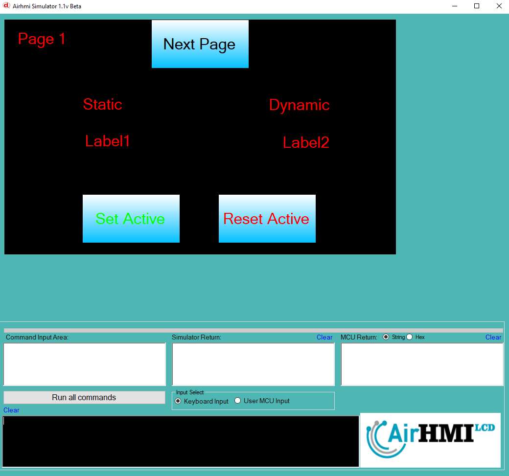
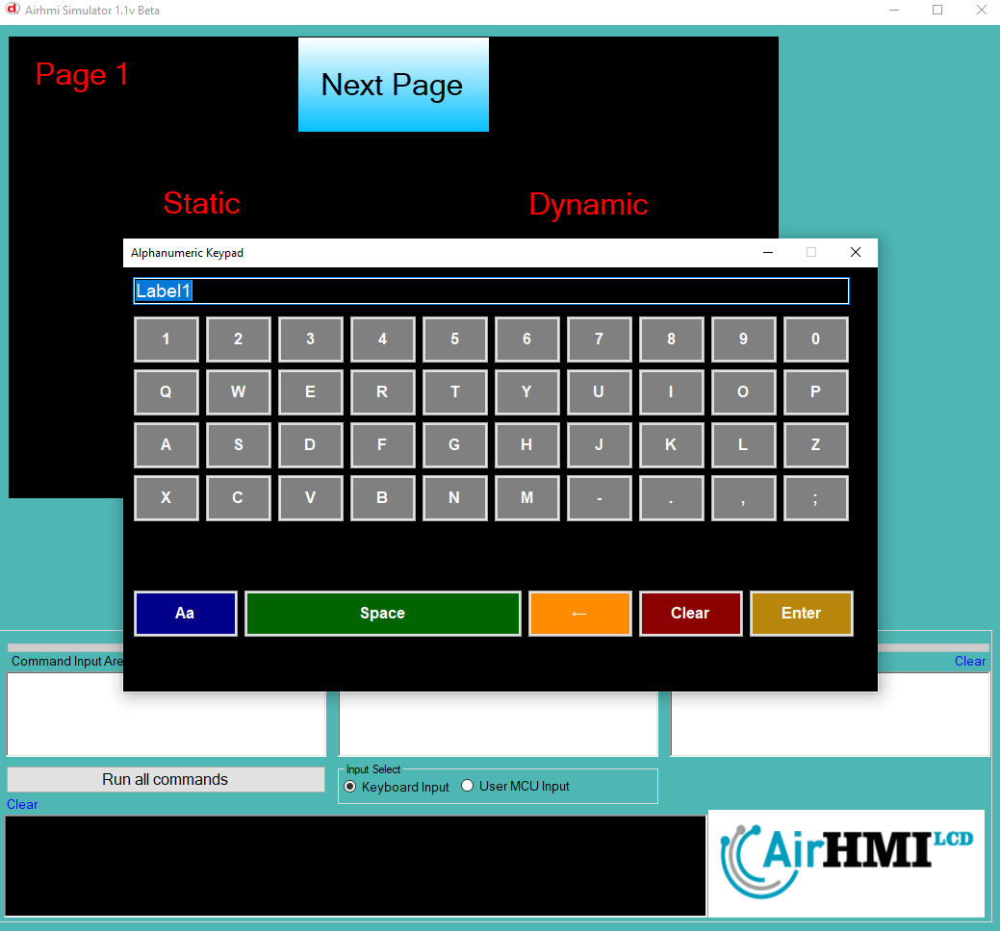
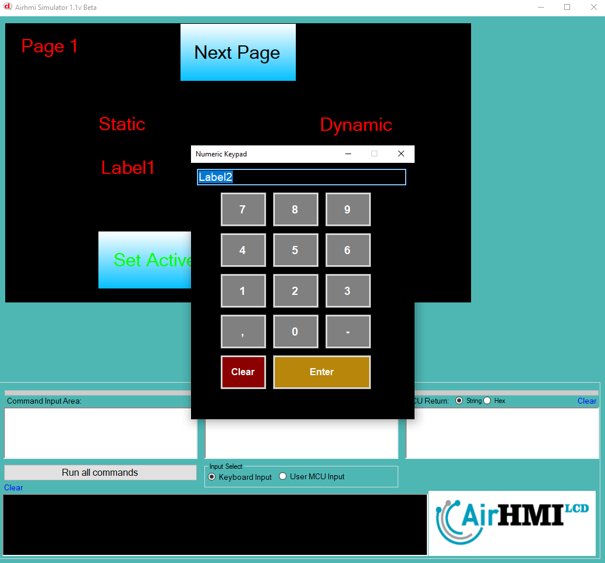
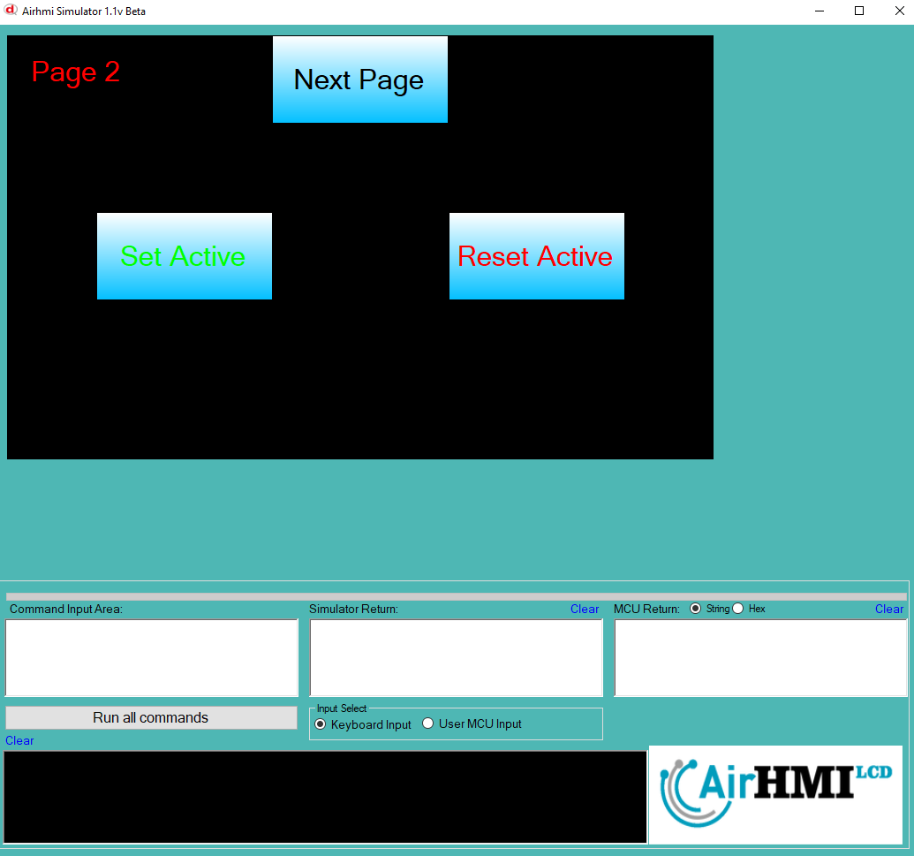

# Label Active Özelliği

Active özelliği Label basma işlemi için açma ve kapatma özelliğine sahip olması anlamına gelir.
Bu dokümanda, statik ve dinamik olmak üzere iki farklı Label Active özelliği üzerinde etkili olan faktörler incelenmiştir.
Statik Labellar her sayfadan tüm özelliklerine ulaşılıp değiştirilebilen Labellardır. Static(false) yani dinamik Labellar ise sayfaya özgüdür.
Sayfa değiştiği zaman hiçbir özelliği tutulmaz. Sayfa değişip tekrar aynı sayfaya gidildiği zaman Label ilk hali ile baştan meydana getirilir. 

## 📌 1. Label Tanımı
- **🟢 Statik Label**: Static özelliği true olan Labeldur. Active özelliği **hem aynı sayfadan hem de diğer sayfalardan** değiştirilebilir.
- **🔵 Dinamik Label**: Statik özelliği false olan Labeldur. Active  özelliği **yalnızca aynı sayfada** değiştirilebilir, diğer sayfalardan değiştirilemez.

## 🔍 2. Label Active Değiştirme Durumları
### 🏠 Aynı Sayfada Olası Senaryolar
- Kullanıcı **statik Label Active değerini** değiştirebilir.
- Kullanıcı **dinamik Label Active değerini** değiştirebilir.

### 🔄 Farklı Sayfadan Olası Senaryolar
- Kullanıcı **statik Label Active değerini** değiştirebilir.
- Kullanıcı **dinamik Label Active değerini değiştiremez.**
- **Statik Label**, farklı sayfadan Active değerini değiştirirsek, aynı sayfaya dönüldüğünde **yeni değiştirilen Active değeri gelir.**
- **Dinamik Label Active değerini değiştirsek bile etki etmez.**

## 🎯 4. Sonuç
✔️ Aynı sayfada **her iki Label Active değerini değiştirilebilir**.  
✔️ **Statik Label Active değerini** diğer sayfalardan değiştirilebilir.  
✔️ **Dinamik Label Active değerini** yalnızca oluşturulduğu sayfada değiştirilebilir.  

