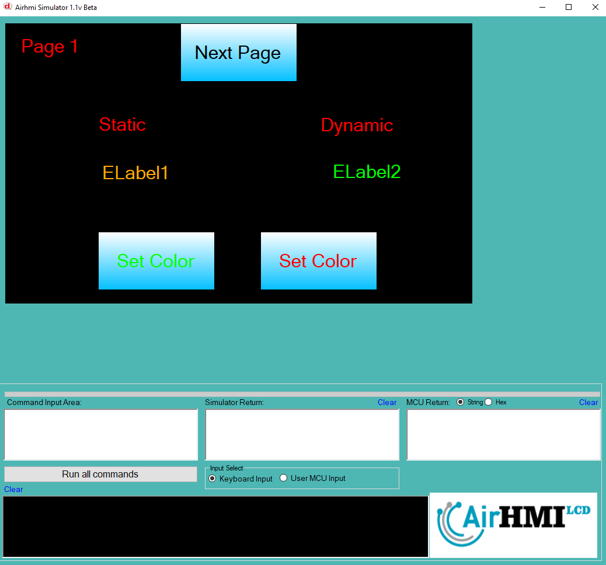

# Label Color Özelliği

Bu dokümanda, statik ve dinamik olmak üzere iki farklı Label rengi özelliği üzerinde etkili olan faktörler incelenmiştir.
Statik Labellar her sayfadan tüm özelliklerine ulaşılıp değiştirilebilen Labellardır. Static(false) yani dinamik Labellar ise sayfaya özgüdür.
Sayfa değiştiği zaman hiçbir özelliği tutulmaz. Sayfa değişip tekrar aynı sayfaya gidildiği zaman Label ilk hali ile baştan meydana getirilir. 

## 📌 1. Label Tanımı
- **🟢 Statik Label**: Static özelliği true olan Labeldur. Color özelliği **hem aynı sayfadan hem de diğer sayfalardan** değiştirilebilir.
- **🔵 Dinamik Label**: Statik özelliği false olan Labeldur. Color  özelliği **yalnızca aynı sayfada** değiştirilebilir, diğer sayfalardan değiştirilemez.

## 🔍 2. Label Font_Color Değiştirme Durumları
### 🏠 Aynı Sayfada Olası Senaryolar
- Kullanıcı **statik Label Color değerini** değiştirebilir.
- Kullanıcı **dinamik Label Color değerini** değiştirebilir.

### 🔄 Farklı Sayfadan Olası Senaryolar
- Kullanıcı **statik Label Color değerini** değiştirebilir.
- Kullanıcı **dinamik Label Color değerini değiştiremez.**
- **Statik Label**, farklı sayfadan Color değerini değiştirirsek, aynı sayfaya dönüldüğünde **yeni değiştirilen Color değeri gelir.**
- **Dinamik Label Color değerini değiştirsek bile etki etmez.**

## 🎯 4. Sonuç
✔️ Aynı sayfada **her iki Label Color değerini değiştirilebilir**.  
✔️ **Statik Label Color değerini** diğer sayfalardan değiştirilebilir.  
✔️ **Dinamik Label Color değerini** yalnızca oluşturulduğu sayfada değiştirilebilir.  

