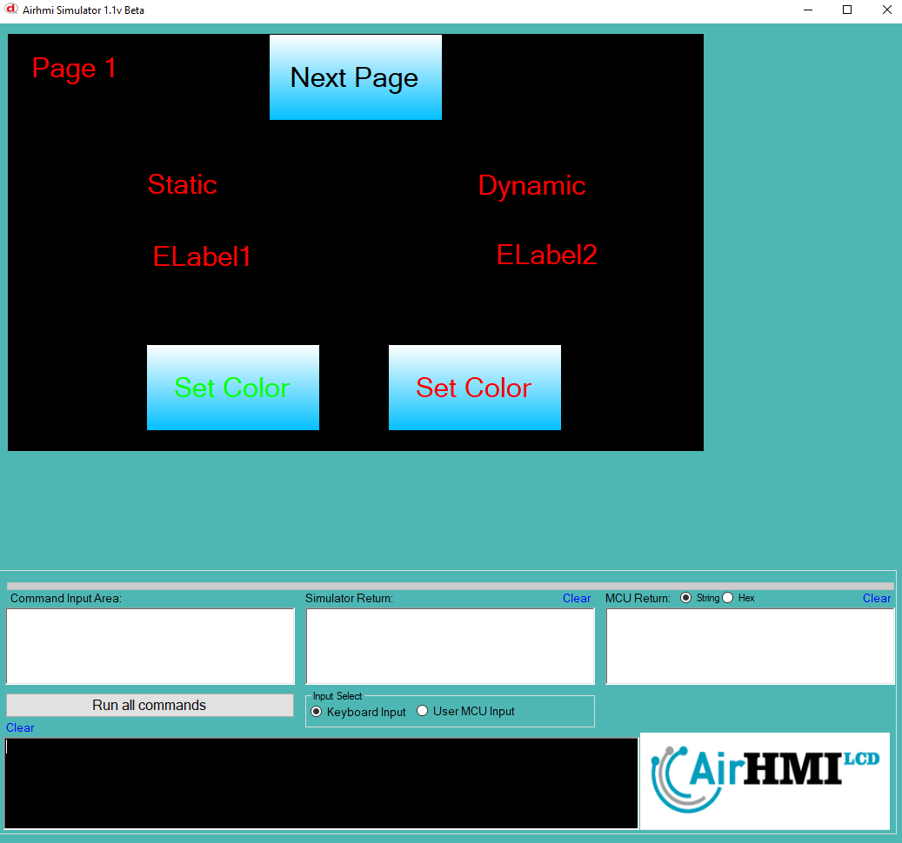

# Label Color Özelliği

Bu dokümanda, **statik** ve **dinamik** olmak üzere iki farklı **Label** rengi özelliği üzerinde etkili olan faktörler incelenmiştir.  
**Statik Labellar**, her sayfadan tüm özelliklerine ulaşılıp değiştirilebilen **Label**'lardır.  
**Static(false)** yani **dinamik Labellar** ise **sayfaya özgüdür**. Sayfa değiştiği zaman hiçbir özelliği korunmaz. Sayfa değişip tekrar aynı sayfaya gidildiğinde **Label**, ilk hâli ile yeniden oluşturulur.

## 📌 1. Label Tanımı
- **🟢 Statik Label**: **Static** özelliği **true** olan **Label**'dır. **Color** özelliği **hem aynı sayfadan hem de diğer sayfalardan** değiştirilebilir.
- **🔵 Dinamik Label**: **Static** özelliği **false** olan **Label**'dır. **Color** özelliği **yalnızca aynı sayfada** değiştirilebilir, **diğer sayfalardan değiştirilemez**.

## 📌 1. Label Tanımı
- **🟢 Statik Label**: Static özelliği true olan Labeldur. Color özelliği **hem aynı sayfadan hem de diğer sayfalardan** değiştirilebilir.
- **🔵 Dinamik Label**: Statik özelliği false olan Labeldur. Color  özelliği **yalnızca aynı sayfada** değiştirilebilir, diğer sayfalardan değiştirilemez.

## 🔍 2. Label Font_Color Değiştirme Durumları

### 🏠 Aynı Sayfada Olası Senaryolar
- Kullanıcı **statik Label Color** değerini değiştirebilir.
- Kullanıcı **dinamik Label Color** değerini değiştirebilir.

### 🔄 Farklı Sayfadan Olası Senaryolar
- Kullanıcı **statik Label Color** değerini değiştirebilir.
- Kullanıcı **dinamik Label Color** değerini değiştiremez.
- **Statik Label**'ın **Color** değeri farklı bir sayfadan değiştirildiğinde, aynı sayfaya dönüldüğünde **yeni değiştirilen Color değeri korunur**.
- **Dinamik Label**'ın **Color** değeri farklı bir sayfadan değiştirilse bile etkili olmaz.

## 🎯 4. Sonuç
✔️ **Aynı sayfada** hem **statik** hem de **dinamik** Label'ın **Color** değeri değiştirilebilir.  
✔️ **Statik Label**'ın **Color** değeri **diğer sayfalardan değiştirilebilir**.  
✔️ **Dinamik Label**'ın **Color** değeri yalnızca oluşturulduğu sayfada değiştirilebilir.  

  
  

