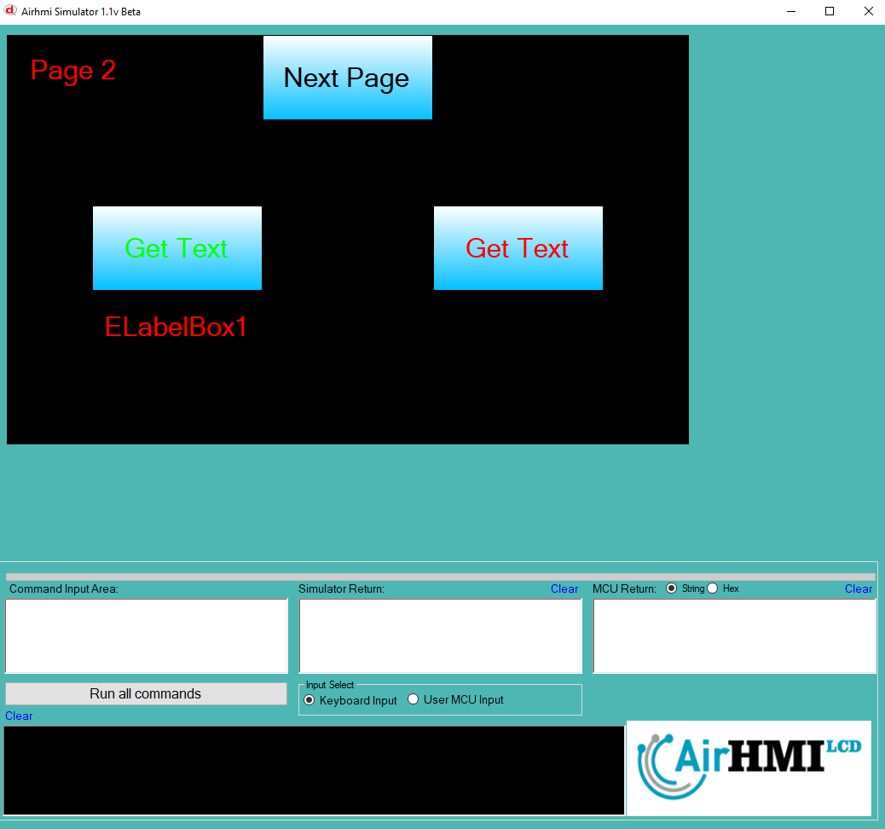

# LabelBox Text Değeri Alma

Bu dokümanda, statik ve dinamik olmak üzere iki farklı LabelBox Text özelliği üzerinde etkili olan faktörler incelenmiştir.
Statik LabelBoxlar her sayfadan tüm özelliklerine ulaşılıp değiştirilebilen LabelBoxlardır. Static(false) yani dinamik LabelBoxlar ise sayfaya özgüdür.
Sayfa değiştiği zaman hiçbir özelliği tutulmaz. Sayfa değişip tekrar aynı sayfaya gidildiği zaman LabelBox ilk hali ile baştan meydana getirilir. 

## 📌 1. LabelBoxların Tanımı
- **🟢 Statik LabelBox**: Static özelliği true olan LabelBoxdur. Text (`Caption`) özelliği **hem aynı sayfadan hem de diğer sayfalardan** değeri okunabilir.
- **🔵 Dinamik LabelBox**: Statik özelliği false olan LabelBoxdur. Text (`Caption`) özelliği **yalnızca aynı sayfada** değiştirilebilir, diğer sayfalardan değeri alınamaz.

## 🔍 2. LabelBox Text Caption Değerini Alma Durumları
### 🏠 Aynı Sayfada Olası Senaryolar
- Kullanıcı **statik LabelBox Text değerini** alabilir.
- Kullanıcı **dinamik LabelBox Text değerini** alabilir.

### 🔄 Farklı Sayfadan Olası Senaryolar
- Kullanıcı **statik LabelBox Text değerini** alabilir.
- Kullanıcı **dinamik LabelBox Text değerini alamaz.**

## 🎯 4. Sonuç
✔️ Aynı sayfada **her iki LabelBox Text değerini alabiliriz**.  
✔️ **Statik LabelBox Text değerini** diğer sayfalardan okuyabiliriz.  
✔️ **Dinamik LabelBox Text değerini** yalnızca oluşturulduğu sayfada değeri okunabilir.  

