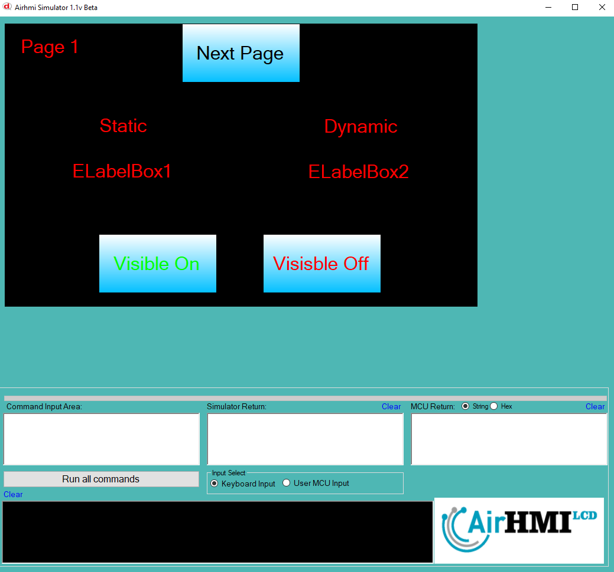
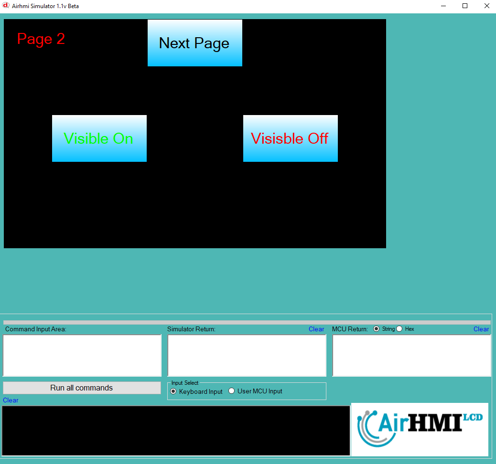

# Label Görünürlük Özelliği

Bu dokümanda, statik ve dinamik olmak üzere iki farklı Label görünürlük durumları üzerinde etkili olan faktörler incelenmiştir.
Statik Labellar her sayfadan tüm özelliklerine ulaşılıp değiştirilebilen Labellardır. Static(false) yani dinamik Labellar ise sayfaya özgüdür.
Sayfa değiştiği zaman hiçbir özelliği tutulmaz. Sayfa değişip tekrar aynı sayfaya gidildiği zaman Label ilk hali ile baştan meydana getirilir. 

## 📌 1. Labelların Tanımı
- **🟢 Statik Label**: Static özelliği true olan Labeldur. Görünürlük (`Visible`) özelliği **hem aynı sayfadan hem de diğer sayfalardan** değiştirilebilir.
- **🔵 Dinamik Label**: Statik özelliği false olan Labeldur. Görünürlük (`Visible`) özelliği **yalnızca aynı sayfada** değiştirilebilir, diğer sayfalardan değiştirilemez.

## 🔍 2. Label Görünürlük Durumları
### 🏠 Aynı Sayfada Olası Senaryolar
- Kullanıcı **statik Label görünürlüğünü** `true` veya `false` yapabilir.
- Kullanıcı **dinamik Label görünürlüğünü** `true` veya `false` yapabilir.
- **Her iki Label da görünür olabilir.**
- **Her iki Label da gizlenebilir.**

### 🔄 Farklı Sayfadan Olası Senaryolar
- Kullanıcı **statik Label görünürlüğünü** `true` veya `false` yapabilir.
- Kullanıcı **dinamik Label görünürlüğünü değiştiremez.**
- **Statik Label**, farklı sayfadan gizlenirse, aynı sayfaya dönüldüğünde **görünmez** olur.
- **Dinamik Label görünürlük durumu korunur.**

## 📊 3. Olasılıklar Tablosu

| Senaryo | Statik Label (Visible) | Dinamik Label (Visible) | Açıklama |
|---------|------------------------|------------------------|-----------|
| ✅ 1 | `true`  | `true`  | Her iki Label da görünür. |
| ✅ 2 | `true`  | `false` | Statik Label görünür, dinamik Label gizli. |
| ✅ 3 | `false` | `true`  | Statik Label gizli, dinamik Label görünür. |
| ✅ 4 | `false` | `false` | Her iki Label da gizli. |
| ✅ 5 | `false` (Dışarıdan değiştirildi) | `true` | Farklı sayfada statik Label kapatıldı, dinamik Label etkilenmedi. |
| ✅ 6 | `true`  | `true` (Dışarıdan değiştirilemedi) | Statik Label değiştirildi, dinamik Label aynı kaldı. |

## 🎯 4. Sonuç
✔️ Aynı sayfada **her iki Label görünürlük durumu değiştirilebilir**.  
✔️ **Statik Label görünürlüğü** diğer sayfalardan değiştirilebilir.  
✔️ **Dinamik Label görünürlüğü** yalnızca oluşturulduğu sayfada değiştirilebilir.  

Bu bilgiler ışığında, **görünürlük değişikliklerinin beklenen sonuçları doğru şekilde ele alınmalıdır.** 🚀

# Projenin Çalıştırlması
## **1 - Proje ilk sayfa agörünümü**

## **2 - Visible Off Butonuna basılır**

## **3 - 2.Sayfaya Geçilir. Visible Off Butonuna basılıp , tekrar 1. sayfaya dönülür.**

## **4 - Statik olan bu durumdan etkilenir. Dinamik olan ise ilk halinde visible On olduğu için aynı şekilde kalır.**

