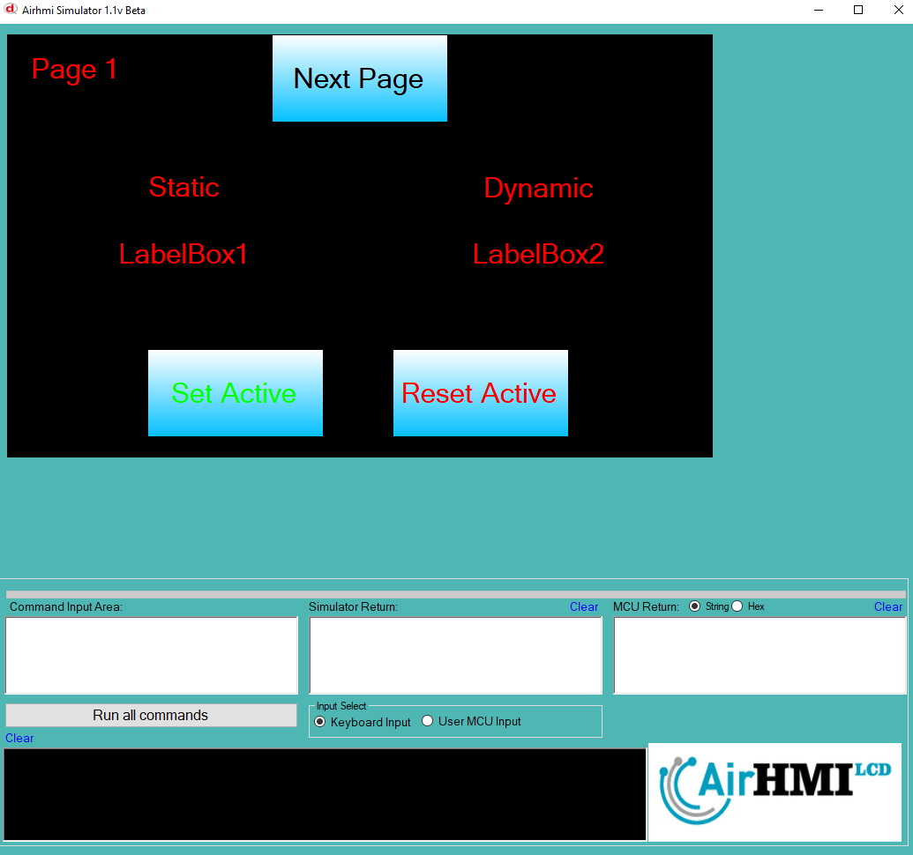
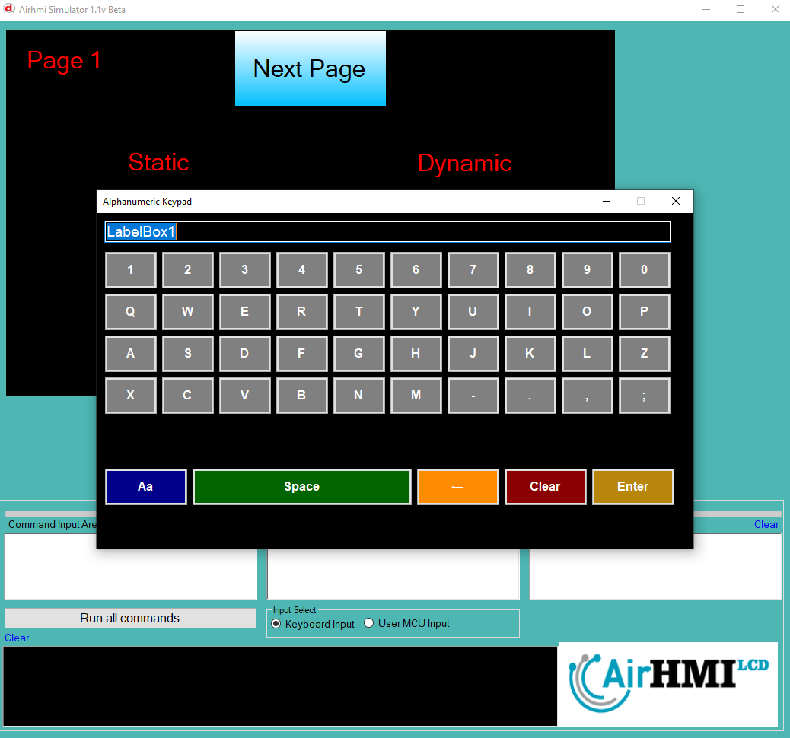
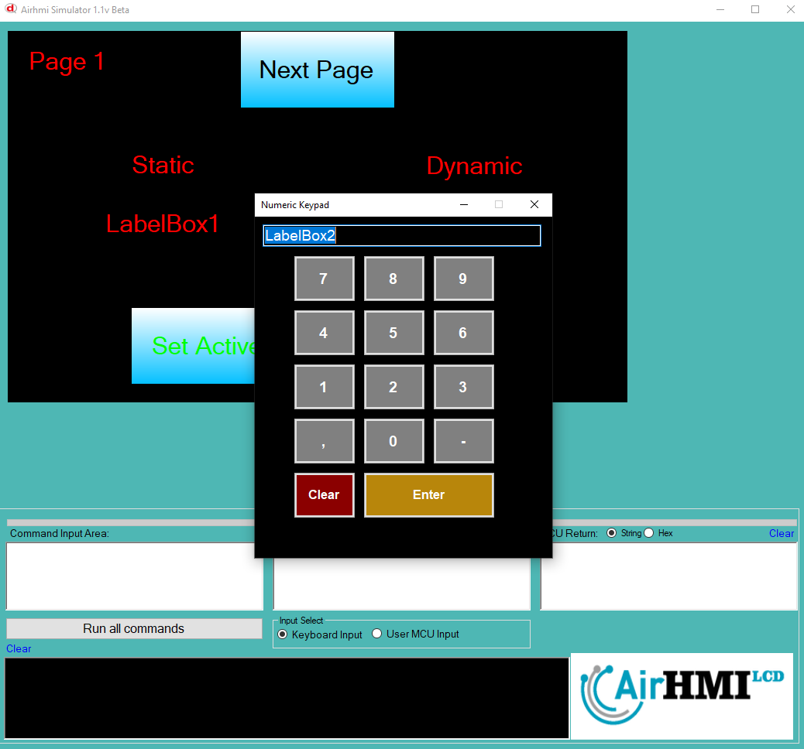
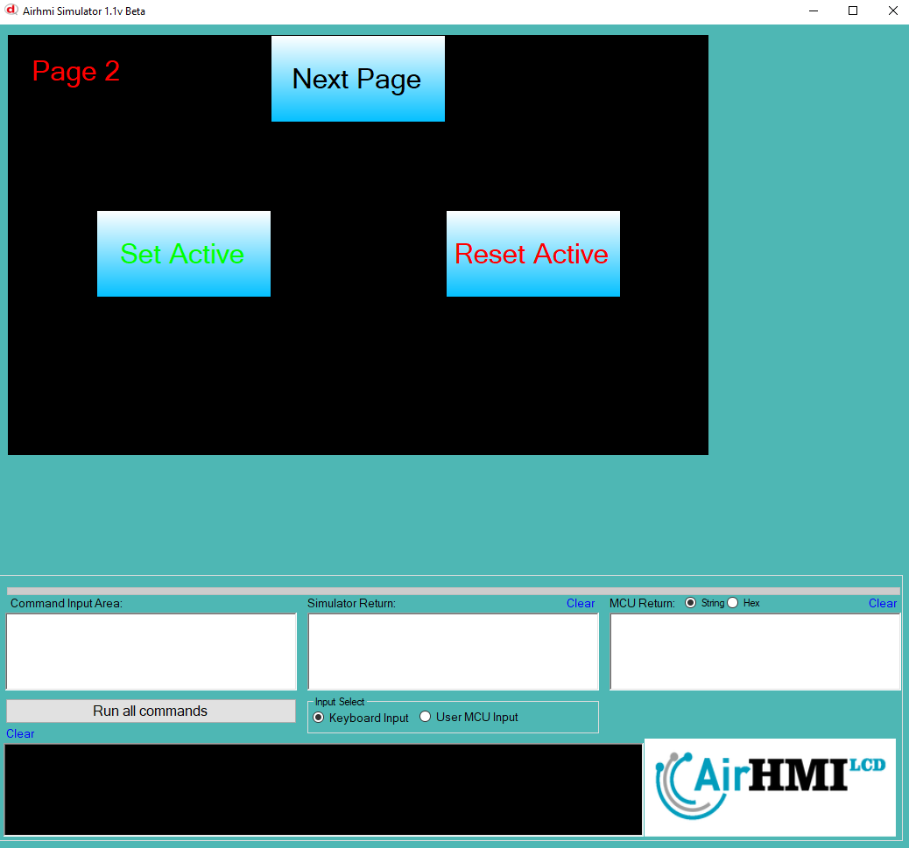

# LabelBox Active Özelliği

Active özelliği LabelBox basma işlemi için açma ve kapatma özelliğine sahip olması anlamına gelir.
Bu dokümanda, statik ve dinamik olmak üzere iki farklı LabelBox Active özelliği üzerinde etkili olan faktörler incelenmiştir.
Statik LabelBoxlar her sayfadan tüm özelliklerine ulaşılıp değiştirilebilen LabelBoxlardır. Static(false) yani dinamik LabelBoxlar ise sayfaya özgüdür.
Sayfa değiştiği zaman hiçbir özelliği tutulmaz. Sayfa değişip tekrar aynı sayfaya gidildiği zaman LabelBox ilk hali ile baştan meydana getirilir. 

## 📌 1. LabelBoxların Tanımı
- **🟢 Statik LabelBox**: Static özelliği true olan LabelBoxdur. Active özelliği **hem aynı sayfadan hem de diğer sayfalardan** değiştirilebilir.
- **🔵 Dinamik LabelBox**: Statik özelliği false olan LabelBoxdur. Active  özelliği **yalnızca aynı sayfada** değiştirilebilir, diğer sayfalardan değiştirilemez.

## 🔍 2. LabelBox Active Değiştirme Durumları
### 🏠 Aynı Sayfada Olası Senaryolar
- Kullanıcı **statik LabelBox Active değerini** değiştirebilir.
- Kullanıcı **dinamik LabelBox Active değerini** değiştirebilir.

### 🔄 Farklı Sayfadan Olası Senaryolar
- Kullanıcı **statik LabelBox Active değerini** değiştirebilir.
- Kullanıcı **dinamik LabelBox Active değerini değiştiremez.**
- **Statik LabelBox**, farklı sayfadan Active değerini değiştirirsek, aynı sayfaya dönüldüğünde **yeni değiştirilen Active değeri gelir.**
- **Dinamik LabelBox Active değerini değiştirsek bile etki etmez.**

## 🎯 4. Sonuç
✔️ Aynı sayfada **her iki LabelBox Active değerini değiştirilebilir**.  
✔️ **Statik LabelBox Active değerini** diğer sayfalardan değiştirilebilir.  
✔️ **Dinamik LabelBox Active değerini** yalnızca oluşturulduğu sayfada değiştirilebilir.  

