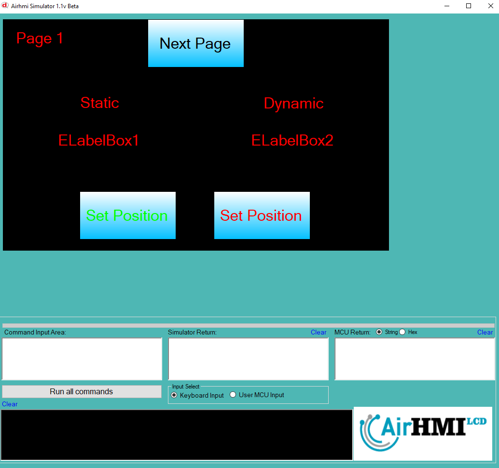

# LabelBox Left Top Özelliği

LabelBox ekran üzerindeki konumunu değiştirme işlemdir. 
Bu dokümanda, statik ve dinamik olmak üzere iki farklı LabelBox Text özelliği üzerinde etkili olan faktörler incelenmiştir.
Statik LabelBoxlar her sayfadan tüm özelliklerine ulaşılıp değiştirilebilen LabelBoxlardır. Static(false) yani dinamik LabelBoxlar ise sayfaya özgüdür.
Sayfa değiştiği zaman hiçbir özelliği tutulmaz. Sayfa değişip tekrar aynı sayfaya gidildiği zaman LabelBox ilk hali ile baştan meydana getirilir. 

## 📌 1. LabelBox ların Tanımı
- **🟢 Statik LabelBox**: Static özelliği true olan LabelBoxdur. Left ve Top özelliği **hem aynı sayfadan hem de diğer sayfalardan** değiştirilebilir.
- **🔵 Dinamik LabelBox**: Statik özelliği false olan LabelBoxdur. Left ve Top özelliği **yalnızca aynı sayfada** değiştirilebilir, diğer sayfalardan değiştirilemez.

## 🔍 2. LabelBox Left ve Top Değiştirme Durumları
### 🏠 Aynı Sayfada Olası Senaryolar
- Kullanıcı **statik LabelBox Left ve Top değerini** değiştirebilir.
- Kullanıcı **dinamik LabelBox Left ve Top değerini** değiştirebilir.

### 🔄 Farklı Sayfadan Olası Senaryolar
- Kullanıcı **statik LabelBox Left ve Top değerini** değiştirebilir.
- Kullanıcı **dinamik LabelBox Left ve Top değerini değiştiremez.**
- **Statik LabelBox**, farklı sayfadan Left ve Top değerini değiştirirsek, aynı sayfaya dönüldüğünde **yeni değiştirilen text değeri gelir.**
- **Dinamik LabelBox Left ve Top değerini değiştirsek bile etki etmez.**

## 🎯 4. Sonuç
✔️ Aynı sayfada **her iki LabelBox Left ve Top değerini değiştirilebilir**.  
✔️ **Statik LabelBox Left ve Top değerini** diğer sayfalardan değiştirilebilir.  
✔️ **Dinamik LabelBox Left ve Top değerini** yalnızca oluşturulduğu sayfada değiştirilebilir.  

