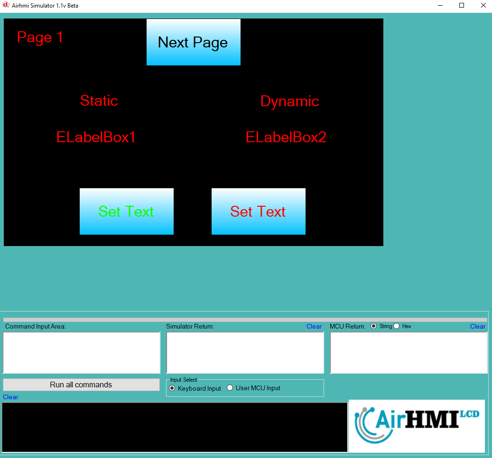
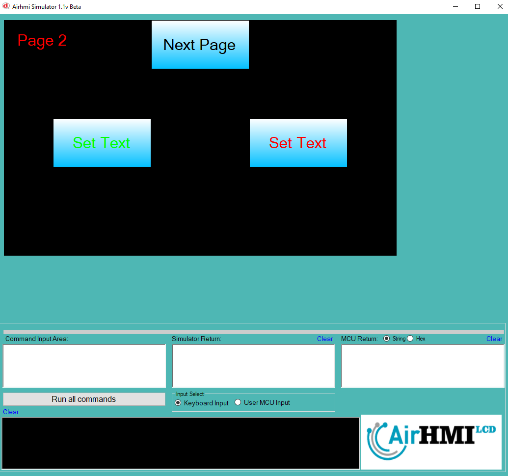

# LabelBox Text Özelliği

Bu dokümanda, statik ve dinamik olmak üzere iki farklı LabelBox Text özelliği üzerinde etkili olan faktörler incelenmiştir.
Statik LabelBoxlar her sayfadan tüm özelliklerine ulaşılıp değiştirilebilen LabelBoxlardır. Static(false) yani dinamik LabelBoxlar ise sayfaya özgüdür.
Sayfa değiştiği zaman hiçbir özelliği tutulmaz. Sayfa değişip tekrar aynı sayfaya gidildiği zaman LabelBox ilk hali ile baştan meydana getirilir. 

## 📌 1. LabelBoxların Tanımı
- **🟢 Statik LabelBox**: Static özelliği true olan LabelBoxdur. Text (`Caption`) özelliği **hem aynı sayfadan hem de diğer sayfalardan** değiştirilebilir.
- **🔵 Dinamik LabelBox**: Statik özelliği false olan LabelBoxdur. Text (`Caption`) özelliği **yalnızca aynı sayfada** değiştirilebilir, diğer sayfalardan değiştirilemez.

## 🔍 2. LabelBox Text Caption Değiştirme Durumları
### 🏠 Aynı Sayfada Olası Senaryolar
- Kullanıcı **statik LabelBox Text değerini** değiştirebilir.
- Kullanıcı **dinamik LabelBox Text değerini** değiştirebilir.

### 🔄 Farklı Sayfadan Olası Senaryolar
- Kullanıcı **statik LabelBox Text değerini** değiştirebilir.
- Kullanıcı **dinamik LabelBox Text değerini değiştiremez.**
- **Statik LabelBox**, farklı sayfadan Text değerini değiştirirsek, aynı sayfaya dönüldüğünde **yeni değiştirilen text değeri gelir.**
- **Dinamik LabelBox Text değerini değiştirsek bile etki etmez.**

## 🎯 4. Sonuç
✔️ Aynı sayfada **her iki LabelBox Text değerini değiştirilebilir**.  
✔️ **Statik LabelBox Text değerini** diğer sayfalardan değiştirilebilir.  
✔️ **Dinamik LabelBox Text değerini** yalnızca oluşturulduğu sayfada değiştirilebilir.  

