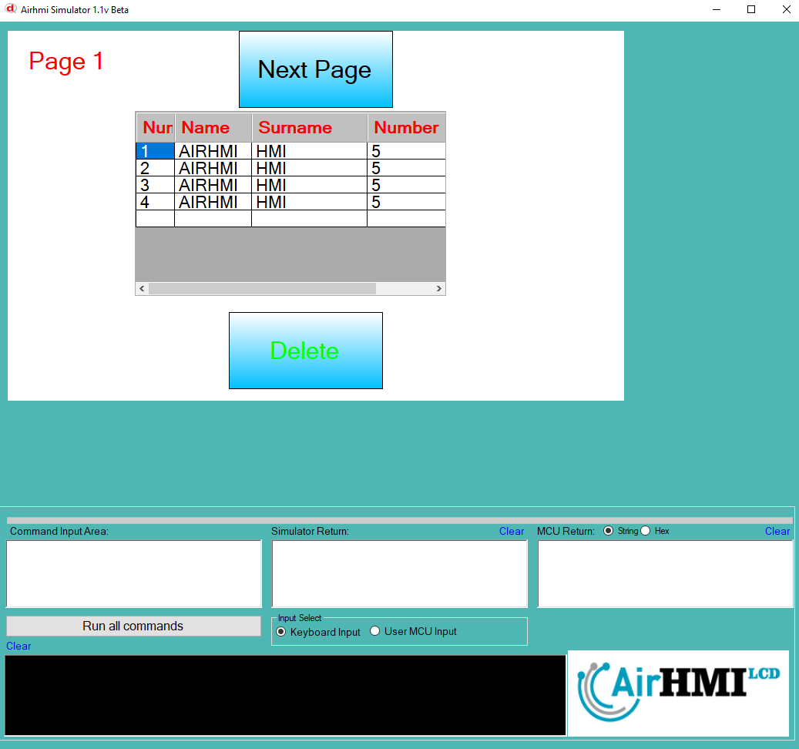
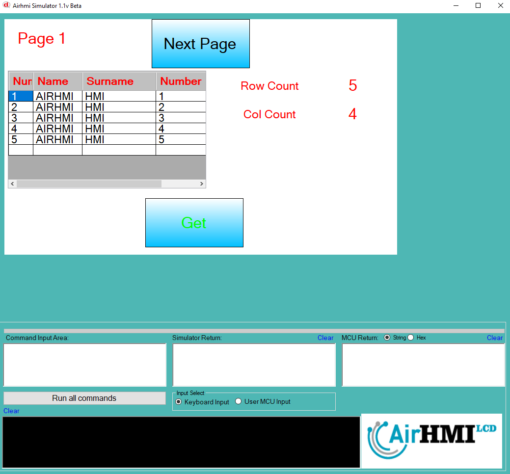

# ListViewGet ROWCOUNT ve COLCOUNT Özelliği

ListView airhmi de veri tabanı olarak kullanılır. 
ListView de listedeki kolon sayısı ve row sayısınını alibiliyoruz. 

```
char data[20];

ListViewGet("ListView1" ,"ROWCOUNT", data);
LabelSet("ELabelBox9" ,"Text" , data );

ListViewGet("ListView1" ,"COLCOUNT", data);
LabelSet("ELabelBox10" ,"Text" , data );

```

ListView nesnesi statik dir. Her sayfadan erişilibilinir. 

## Program İlk Açılış Görüntüsü

## ListView den verileri alıp label a set ediyoruz. 

## Sonraki Sayfaya geçiyoruz. 

## Listview den verileri 2. sayfadan da alıyoruz. 


