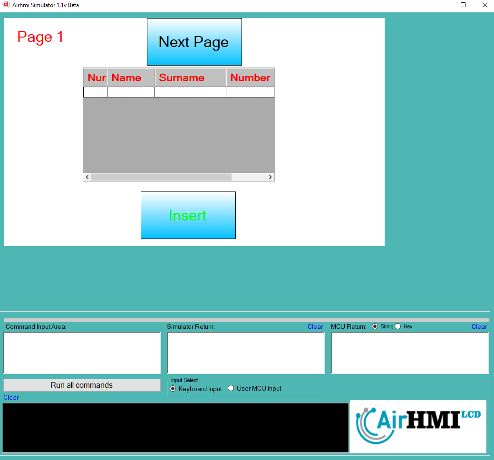
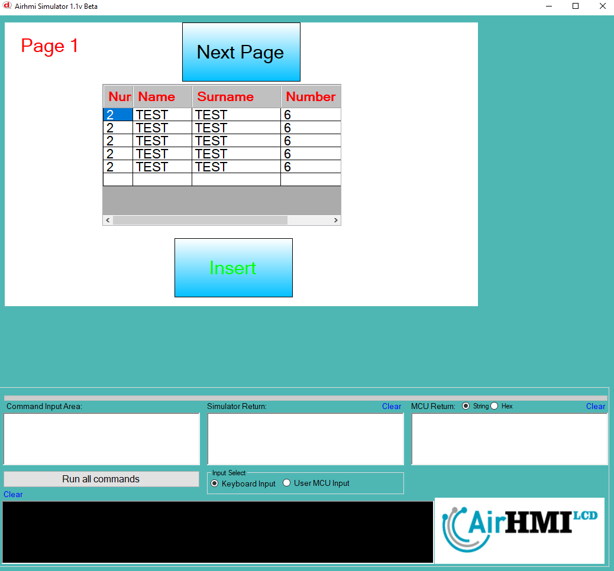
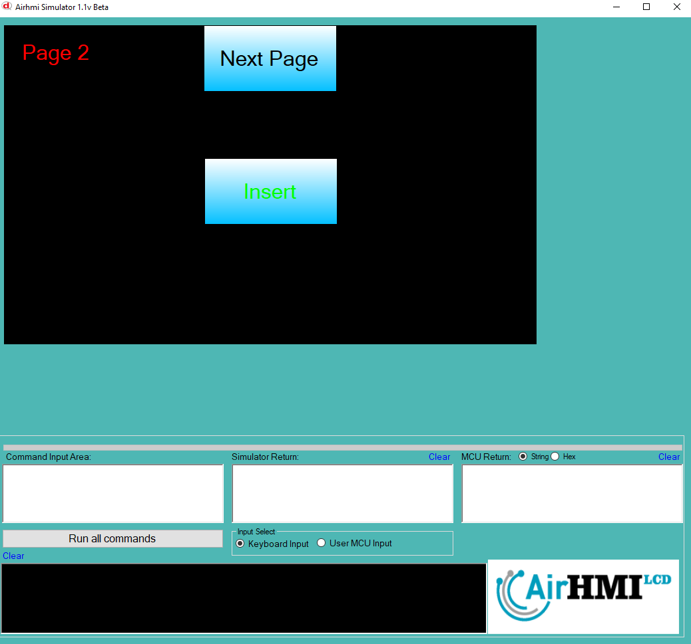
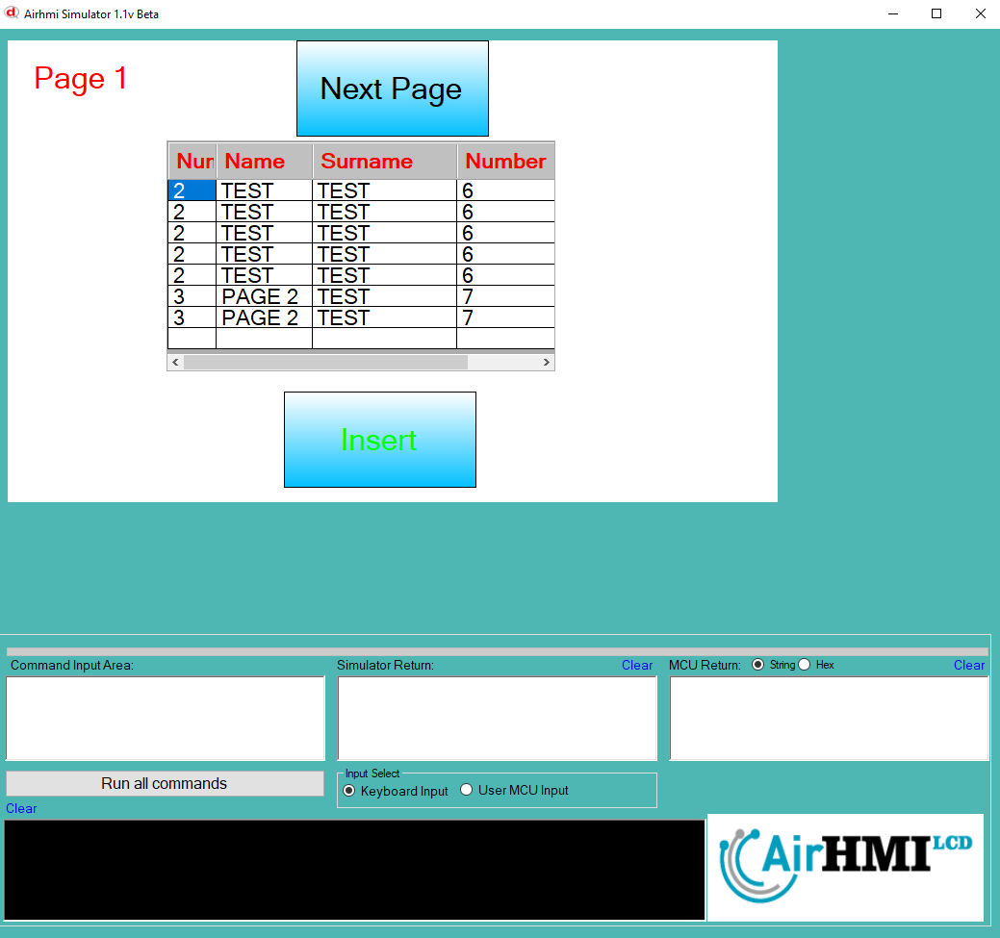

# ListView Insert Özelliği

ListView e veri girmek için kullanılır. Kolonar arasındaki ifade için ^ işareti kullanılır. 

```
ListViewSet("ListView1" ,"Insert" , "3^PAGE 2^TEST^7");
```

ListView nesnesi statik dir. Her sayfadan erişilibilinir. 

## Program İlk Açılış Görüntüsü

## Herki ListView e birinci sayfadan veri ekliyoruz.

## Sonraki Sayfaya geçiyoruz. ListView e ikinci sayfadan veri ekliyoruz. 

## Birinci sayfaya tekrar dönüyoruz. ListView e eklenen tüm verileri görebiliyoruz. 


