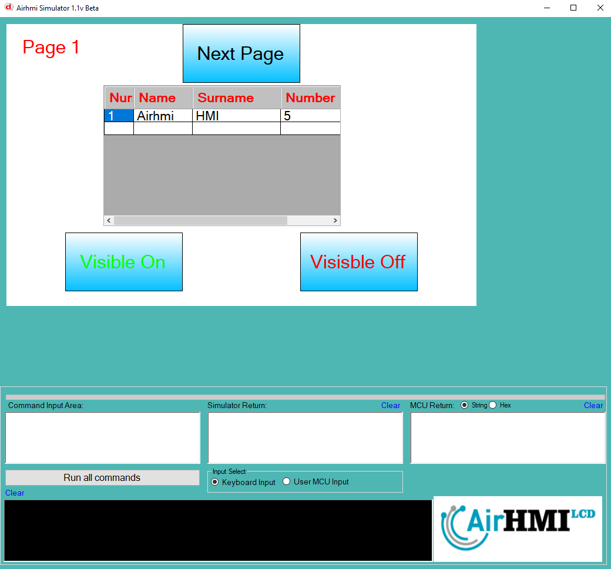
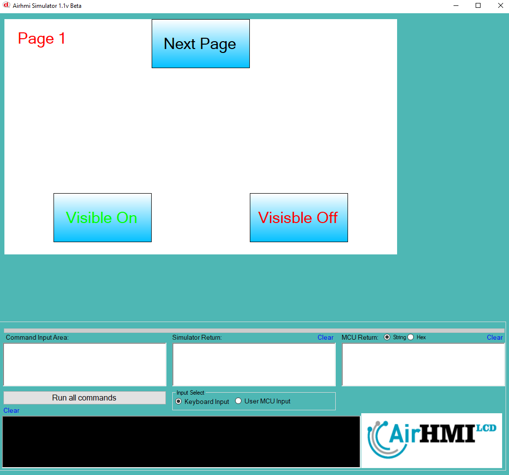
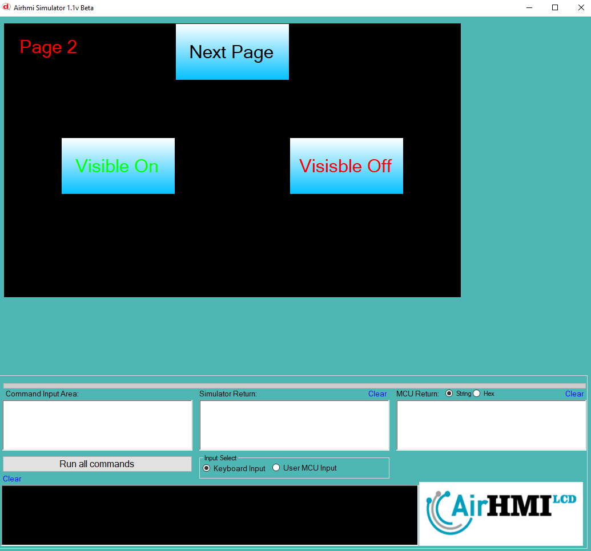

# ListView Görünürlük Özelliği


```
ListViewSet("ListView1" ,"Visible" , "True");
ListViewSet("ListView1" ,"Visible" , "False");
```

ListView nesnesi statik dir. Her sayfadan erişilibilinir. 

## Program İlk Açılış Görüntüsü

## Herki ListView un da visible i false yaplıyor.

## Sonraki Sayfaya geçiyoruz. ListView visible false yapılyoruz.

## Birinci sayfaya tekrar dönüyoruz. 1.Statik olan ListView Visible off , Dinamik olan On olarak geliyor. 


