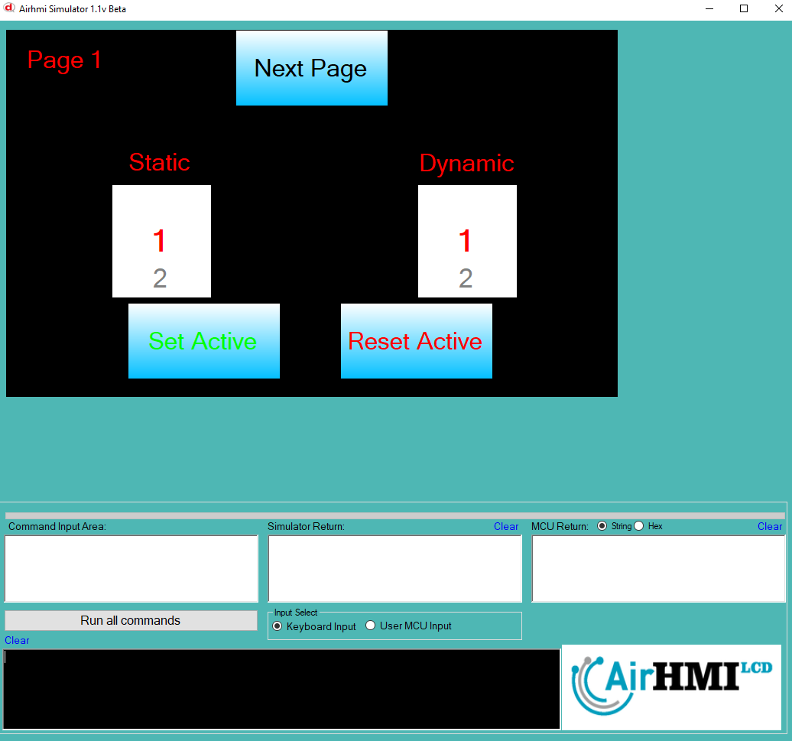
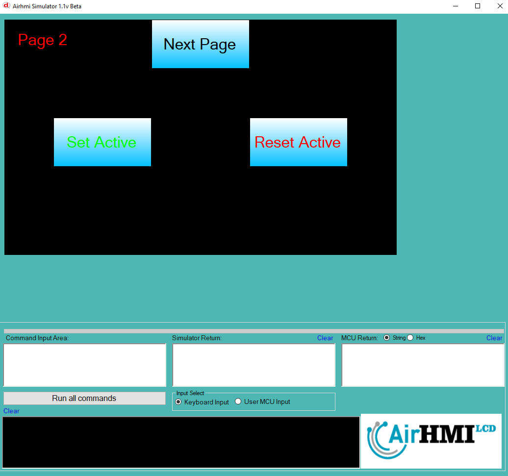

# ListWheel Active Özelliği

Active özelliği ListWheel değerini değiştirme işlemi özelliğine sahip olması anlamına gelir.
Bu dokümanda, statik ve dinamik olmak üzere iki farklı ListWheel Active özelliği üzerinde etkili olan faktörler incelenmiştir.
Statik ListWheellar her sayfadan tüm özelliklerine ulaşılıp değiştirilebilen ListWheellardır. Static(false) yani dinamik ListWheellar ise sayfaya özgüdür.
Sayfa değiştiği zaman hiçbir özelliği tutulmaz. Sayfa değişip tekrar aynı sayfaya gidildiği zaman ListWheel ilk hali ile baştan meydana getirilir. 

## 📌 1. ListWheel Tanımı
- **🟢 Statik ListWheel**: Static özelliği true olan ListWheeldur. Active özelliği **hem aynı sayfadan hem de diğer sayfalardan** değiştirilebilir.
- **🔵 Dinamik ListWheel**: Statik özelliği false olan ListWheeldur. Active  özelliği **yalnızca aynı sayfada** değiştirilebilir, diğer sayfalardan değiştirilemez.

## 🔍 2. ListWheel Active Değiştirme Durumları
### 🏠 Aynı Sayfada Olası Senaryolar
- Kullanıcı **statik ListWheel Active değerini** değiştirebilir.
- Kullanıcı **dinamik ListWheel Active değerini** değiştirebilir.

### 🔄 Farklı Sayfadan Olası Senaryolar
- Kullanıcı **statik ListWheel Active değerini** değiştirebilir.
- Kullanıcı **dinamik ListWheel Active değerini değiştiremez.**
- **Statik ListWheel**, farklı sayfadan Active değerini değiştirirsek, aynı sayfaya dönüldüğünde **yeni değiştirilen Active değeri gelir.**
- **Dinamik ListWheel Active değerini değiştirsek bile etki etmez.**

## 🎯 4. Sonuç
✔️ Aynı sayfada **her iki ListWheel Active değerini değiştirilebilir**.  
✔️ **Statik ListWheel Active değerini** diğer sayfalardan değiştirilebilir.  
✔️ **Dinamik ListWheel Active değerini** yalnızca oluşturulduğu sayfada değiştirilebilir.  

