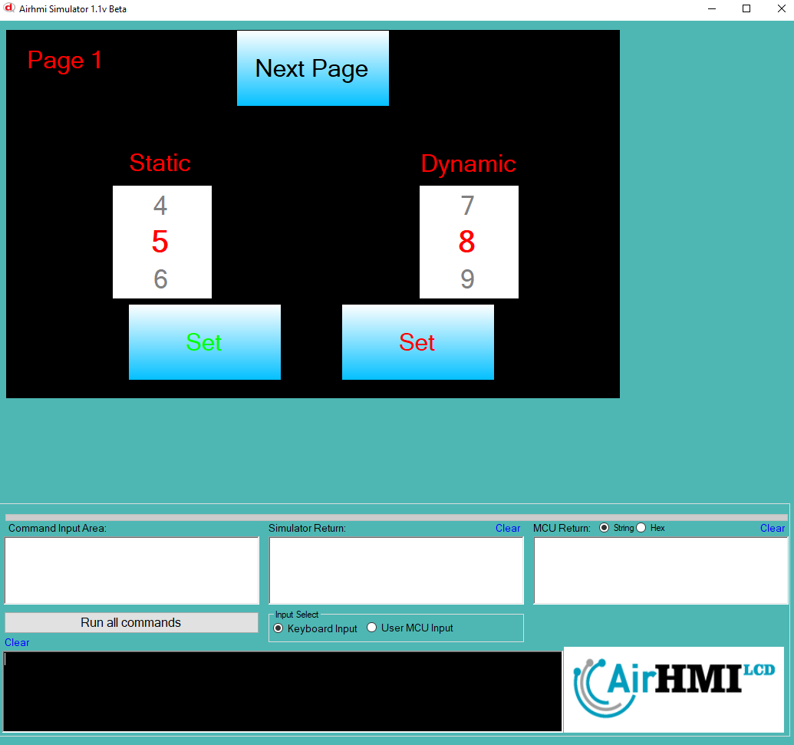
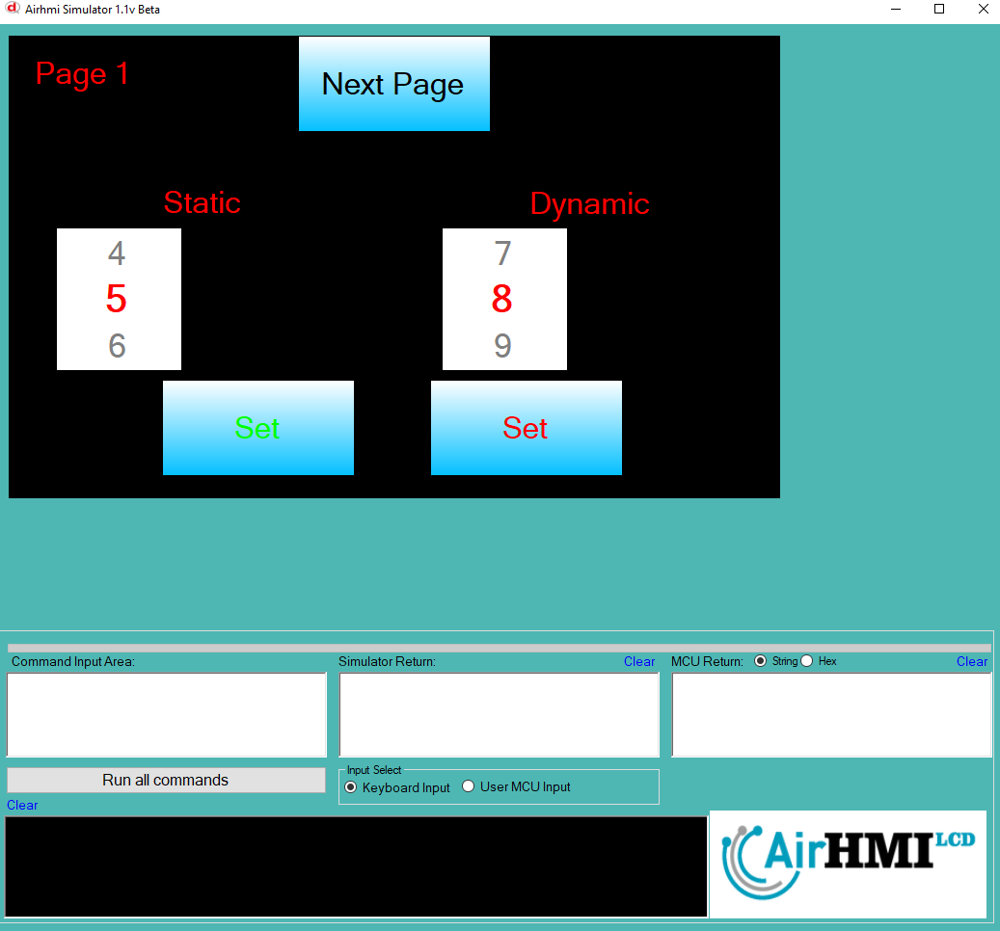
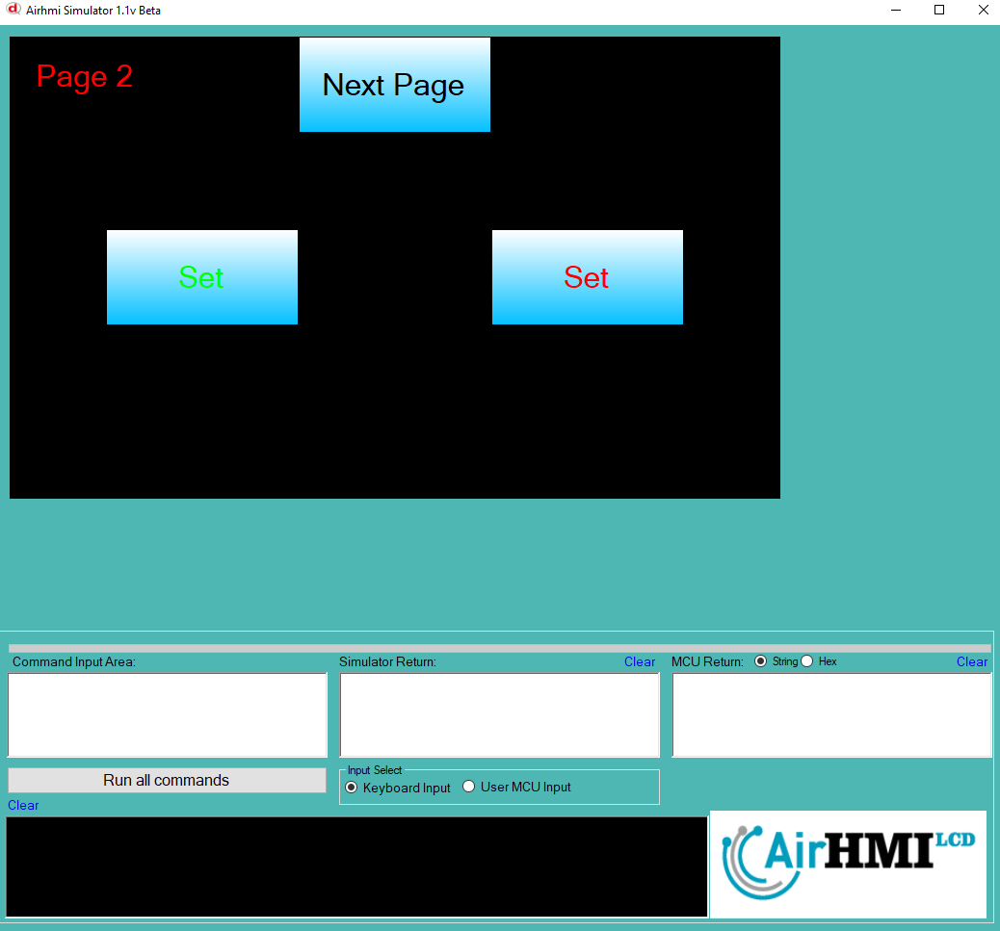
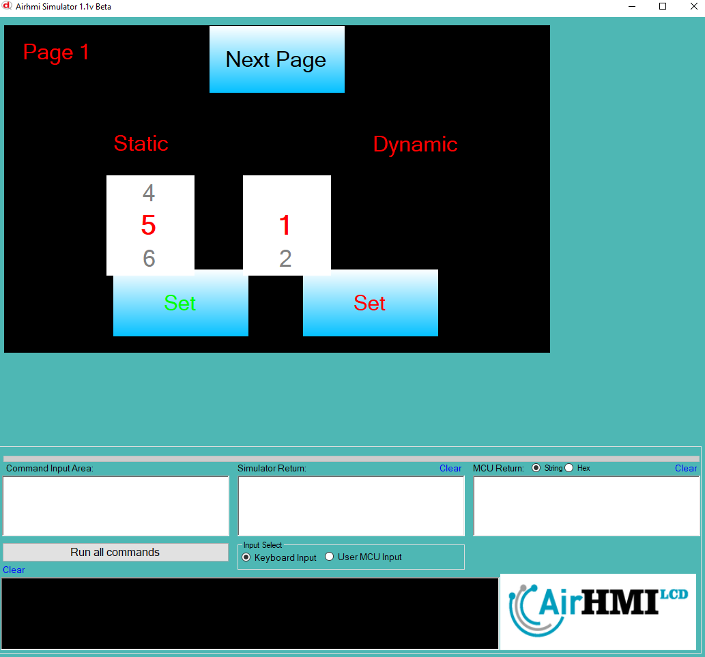

# ListWheel Left Top Özelliği

ListWheel ekran üzerindeki konumunu değiştirme işlemdir. 
Bu dokümanda, statik ve dinamik olmak üzere iki farklı ListWheel Text özelliği üzerinde etkili olan faktörler incelenmiştir.
Statik ListWheellar her sayfadan tüm özelliklerine ulaşılıp değiştirilebilen ListWheellardır. Static(false) yani dinamik ListWheellar ise sayfaya özgüdür.
Sayfa değiştiği zaman hiçbir özelliği tutulmaz. Sayfa değişip tekrar aynı sayfaya gidildiği zaman ListWheel ilk hali ile baştan meydana getirilir. 

## 📌 1. ListWheelların Tanımı
- **🟢 Statik ListWheel**: Static özelliği true olan ListWheeldur. Left ve Top özelliği **hem aynı sayfadan hem de diğer sayfalardan** değiştirilebilir.
- **🔵 Dinamik ListWheel**: Statik özelliği false olan ListWheeldur. Left ve Top özelliği **yalnızca aynı sayfada** değiştirilebilir, diğer sayfalardan değiştirilemez.

## 🔍 2. ListWheel Left ve Top Değiştirme Durumları
### 🏠 Aynı Sayfada Olası Senaryolar
- Kullanıcı **statik ListWheel Left ve Top değerini** değiştirebilir.
- Kullanıcı **dinamik ListWheel Left ve Top değerini** değiştirebilir.

### 🔄 Farklı Sayfadan Olası Senaryolar
- Kullanıcı **statik ListWheel Left ve Top değerini** değiştirebilir.
- Kullanıcı **dinamik ListWheel Left ve Top değerini değiştiremez.**
- **Statik ListWheel**, farklı sayfadan Left ve Top değerini değiştirirsek, aynı sayfaya dönüldüğünde **yeni değiştirilen text değeri gelir.**
- **Dinamik ListWheel Left ve Top değerini değiştirsek bile etki etmez.**

## 🎯 4. Sonuç
✔️ Aynı sayfada **her iki ListWheel Left ve Top değerini değiştirilebilir**.  
✔️ **Statik ListWheel Left ve Top değerini** diğer sayfalardan değiştirilebilir.  
✔️ **Dinamik ListWheel Left ve Top değerini** yalnızca oluşturulduğu sayfada değiştirilebilir.  

